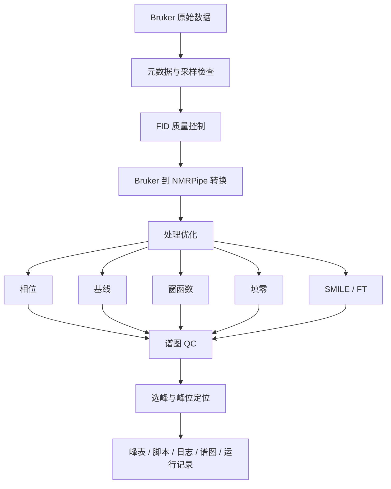

# nmrForge

[](https://github.com/RociferX/nmrforge/actions/workflows/ci.yml)

**面向 Bruker 多维 NMR 数据的自动化处理、参数优化与质量控制平台。**

> ### 语言说明
>
> 这是**中文文档版**:代码注释与仓库根目录的 [README](../README.md) 是英文,这里的中文文档树
> (`Chinese_version/`)与英文文档一一对应。界面不必挑版本 —— 同一份产物按系统区域自动选择语言,
> 也可以用 `NMRFORGE_LANG=zh|en` 临时钉死,或在「设置 → 软件设置 → 界面语言」里长期指定;
> 中文界面文案在 [`ui_support/locales/zh.json`](../ui_support/locales/zh.json),运行时从同一份代码里取。

nmrForge 读取一个 Bruker 数据集,判定它是什么实验、用了哪种采样方式,规划处理方案,
驱动 NMRPipe 执行,并把过程中产生的每一个参数、每一条告警和每一份产物都记录下来,
使结果可复现、可审计。

> 目标不是做一个套在 NMRPipe 外面的图形界面。nmrForge 先*理解*实验与采样方式,
> 再生成可解释的处理方案,并把证据(质量指标、解析后的参数、运行记录)与谱图放在一起。

当前开发版本:**1.0.0** · 状态:**活跃开发中**
作者:**李宣锋(Xuanfeng Li),中国科学技术大学** · 源码许可:Apache-2.0(见 [LICENSE](../LICENSE) 与 [NOTICE](../NOTICE))
分发方式:源码 + Linux AppImage(一份产物,界面语言运行时切换)
发布页:<https://github.com/RociferX/nmrforge/releases>
仓库:<https://github.com/RociferX/nmrforge>
归档与 DOI:Zenodo [10.5281/zenodo.22909416](https://doi.org/10.5281/zenodo.22909416)(全部版本 [10.5281/zenodo.22909415](https://doi.org/10.5281/zenodo.22909415))

> **nmrForge 仍在活跃开发中,接口与处理默认值在 v1.0 之前仍可能变化。** 这里写明的行为都有
> 测试覆盖(见测试套件),但 Python/CLI 接口与处理默认值尚未冻结。

> ### 两条线:桌面程序与 Python/CLI 接口
>
> - **A 线 —— 桌面程序(成熟)**:GUI 把整条链路走完 —— 从 Bruker 数据集到处理好的谱、峰表、
>   质量控制与溯源记录;Linux AppImage 由它构建,日常使用推荐这条;
> - **B 线 —— Python/CLI 接口(`nmrforge_api`,仍在变)**:参数研究接口(`StudySession`、参数扫描、
>   目标峰清单、QC 记录、行为指纹)在活跃开发中:名字、默认值与它写出的记录都可能随版本变化。
>   要把一批数字当作可比较的,请先钉住 commit,并查 `nmrforge_api.compat_manifest()`
>   (`behavior_digest`、`compat_level`、`affected`)。
>
> 两者同在一个仓库,但成熟度不同:桌面程序的默认值可以信任,接口请拿你自己的数据核对。

> ### 支持边界
>
> nmrForge 是单人维护的研究工具,不是受支持的产品。问题通过 GitHub 尽力答复,不承诺
> 响应时间或兼容性;改动过的分支只以本仓库自带的测试套件为准。真机数据上的科学验证
> 仍在积累中,依赖处理结果之前请先读[已知边界](#已知边界)。

## 它能做什么

- **数据理解** —— 解析 Bruker `acqus`/`acqu2s`/`acqu3s` 元数据、分离逻辑维度与物理维度、
  按脉冲程序与核组合判定实验类型、识别 uniform 与 NUS 采样。
- **处理** —— Bruker 转 NMRPipe、自动与人工相位校正、基线优化、窗函数(切趾)优化、
  填零、常规傅里叶变换,以及用 SMILE 做 2D/3D NUS 重构。
- **质量控制** —— FID 层诊断(直流偏置、坏点、非有限值、异常迹线)、采样一致性校验,
  以及谱图层质量指标(信噪比、相位质量、基线质量、伪影)。
- **峰分析** —— 自动选峰,支持抛物线或 2D 高斯亚格点定位;峰表按 POKY 风格导入导出。
- **带留档的自动化** —— GUI、命令行与 Python API 三种入口;批量运行;保留脚本与候选谱;
  每次运行都存下解析后的参数,以及产生它的软件/工具版本。
- **查看** —— 独立的 1D/2D/3D 谱图查看器,支持投影与峰位叠加。

## 工作流



## 架构

```text
GUI / Viewer
    |
Workflow 层:理解 -> 规划 -> 处理 -> 优化 -> QC -> 产物
    |
ProcessingBackend(NMRPipeBackend 是唯一的生产后端)
    |
core:项目模型、数据读取、实验判定、规划、处理原语、优化、QC
```

`core/`、`backend/`、`workflow/` 与 `nmrforge_api/` 四层不依赖 Qt,
因此处理可以在服务器上无界面运行;`gui/` 与 `viewer/` 提供桌面界面。

## 仓库结构

| 路径 | 内容 |
| --- | --- |
| [`core/`](../core/README.md) | 数据模型、Bruker 读取器、实验判定、采样识别、峰定位、QC 与优化原语(不依赖 Qt) |
| [`backend/`](../backend/README.md) | NMRPipe/SMILE 边界:脚本生成与子进程执行 |
| [`workflow/`](../workflow/README.md) | 流程编排 —— 导入、分步处理、相位路径、选峰、批量、诊断 |
| [`gui/`](../gui/README.md) | PySide6 桌面应用 |
| [`viewer/`](../viewer/README.md) | 1D/2D/3D 谱图查看器,GUI 内嵌使用 |
| [`ui_support/`](../ui_support/README.md) | GUI 与查看器共用的界面辅助 |
| [`qtcompat/`](../qtcompat/README.md) | 唯一指定 Qt 绑定的模块 |
| [`nmrforge_api/`](../nmrforge_api/README.md) | 可脚本化的参数研究 API 及其命令行 |
| [`nmrforge_data/config/`](../nmrforge_data/config/README.md) | 随包默认值与机器本地覆盖 |
| [`nmrforge_data/presets/`](../nmrforge_data/presets/README.md) | 实验模板;YAML 文件是唯一数据源 |
| [`tests/`](../tests/README.md) | pytest 测试套件:unit / integration / regression |
| [`examples/`](../examples/README.md) | 可运行的合成数据集与走查脚本 |
| [`packaging/`](../packaging/README.md) | AppImage 构建素材(v1.0.0 已发布) |
| [`scripts/`](../scripts/README.md) | 独立命令行工具与校验脚本 |
| [`docs/`](docs/README.md) | 中文文档索引(英文原文在 [`docs/`](../docs/README.md)) |
| [`.github/`](../.github/) | CI 工作流与 issue/PR 模板 |

依赖是单向的:`gui/` 与 `viewer/` 在最上层,然后是 `workflow/`,再是 `backend/`,
`core/` 在底层。[`tests/test_ownership.py`](../tests/test_ownership.py) 与
[`tests/test_qt_independence.py`](../tests/test_qt_independence.py) 强制维持这条分界。

## 依赖要求

| 依赖 | 说明 |
| --- | --- |
| Python | 当前源码发布要求 3.12 或更高 |
| NMRPipe | 真实处理(转换、FT、基线、相位)必需。不随本软件分发 —— 请自行安装,确保可执行文件在 `PATH` 上,或让 nmrForge 指向安装目录。 |
| SMILE | NUS 重构必需。随 NMRPipe 提供,查找方式相同。 |
| Python 包 | 见 `pyproject.toml`;`pip install -e .` 会安装。 |
| 显示器(仅 GUI) | 主窗口与查看器需要桌面会话。无头机器可以用 Python API 或命令行。 |

nmrForge 不会替你分发、下载或安装 NMRPipe/SMILE。它在运行时探测两者,并告诉你缺什么。
完整的依赖与许可清单见 [THIRD_PARTY.md](../THIRD_PARTY.md)。

## 安装

v1.0.0 提供两样东西:**Linux AppImage**与**源码**。AppImage 自带 Python 与 Qt,
不需要先装环境([发布页](https://github.com/RociferX/nmrforge/releases));用源码则克隆仓库
并做可编辑安装,这样仓库根目录的运行时资源才仍然可用:

```bash
git clone https://github.com/RociferX/nmrforge.git
cd nmrforge
python -m venv .venv
source .venv/bin/activate        # Windows: .venv\Scripts\activate
python -m pip install -e ".[test]"
python main.py
```

真实处理还需要 NMRPipe;NUS 重构需要 SMILE。它们是外部程序,nmrForge 从不下载或捆绑它们。
`pip install .` 与 wheel 自 2026-09-21 起同样可用:运行期资源随数据包 `nmrforge_data` 分发
(见 [docs/packaging.md](docs/packaging.md));日常开发仍推荐上面的可编辑安装。

AppImage 的构建配方在 [`packaging/linux/build_appimage.sh`](../packaging/linux/build_appimage.sh):
**只构建一个产物**,界面语言在运行时决定(`NMRFORGE_LANG`/`NMRFORGE_LANGUAGE` → 设置里的偏好
→ 系统区域 → 本树 [`ui_support/locales/default.json`](../ui_support/locales/default.json) 声明的
默认语言);`BUILD_INFO.txt` 记录版本、完整 commit、默认语言与捆绑的依赖版本。它会捆绑
PySide6/Qt,这些库按 LGPL-3.0 随产物分发,许可正文与声明都在产物内
(`./NMRForge-<版本>-x86_64.AppImage --licenses` 可查);每次发布前按维护者私有仓库里的发布
检查清单逐项验收。构建脚本本身不构成「已发布」或「已获批准」的二进制。

## 快速上手

**本次发布从源码安装。** 用 `python main.py` 启动 GUI。下面的步骤也演示了在没有安装
NMRPipe 的情况下能走通哪些环节。

下面这个例子只需要一个 Bruker 数据集目录、不需要 NMRPipe,就能走通数据理解与质量控制:

```bash
python examples/quickstart.py <bruker_dataset_directory>
```

想先造一个小合成数据集来试:

```bash
python examples/make_synthetic_dataset.py --out ./example_data/hsqc_2d --ndim 2 --nuclei 15N,1H
python examples/quickstart.py ./example_data/hsqc_2d
```

完整处理路径还需要 NMRPipe:

```bash
# 1. 描述数据集:实验类型、采样方式、维度
python -m nmrforge_api init --study ./study --dataset /path/to/bruker/dataset

# 2. 构建并冻结参考谱(需要 NMRPipe)
python -m nmrforge_api reference --study ./study

# 3. 挑选参考峰表
python -m nmrforge_api peaks --study ./study

# 4. 跑一组参数
python -m nmrforge_api sweep --study ./study --grid grid.yaml
```

## GUI 用法(A 线 —— 成熟)

```bash
python main.py    # 源码发布的 GUI 入口;会创建/复用本地 venv
```

主窗口的布局是:左侧项目/实验/数据集树,中间是所选数据集的处理流水线,右侧按范围分开的日志:

1. **导入**一个 Bruker 数据集目录(实验与样品元数据会自动填好,且可以编辑);
2. **查看**判定出的实验类型、采样方式与维度布局;
3. **处理** —— 自动路径(诊断、优化、终谱)或人工路径(编辑生成的脚本,再运行它);
4. **质量检查** —— 运行报告列出谱图质量、数据诊断与解析后的处理参数,凡是自动改动过的地方都会告警;
5. **选峰**并导出峰表;需要时把谱图导出成 UCSF。

独立查看器可以单独打开:

```bash
nmrforge-viewer                 # 可编辑安装之后
python -m viewer
```

## 命令行用法(B 线 —— 仍在变)

```bash
python -m nmrforge_api --help
python -m nmrforge_api init       --study DIR --dataset BRUKER_DIR
python -m nmrforge_api reference  --study DIR
python -m nmrforge_api peaks      --study DIR
python -m nmrforge_api sweep      --study DIR --grid grid.yaml
python -m nmrforge_api report     --study DIR
python -m nmrforge_api status     --study DIR
```

## Python API(B 线 —— 仍在变)

```python
from nmrforge_api import (
    position_uncertainty,
    run_parameter_study,
    uncertainty_summary,
)

result = run_parameter_study(
    "~/studies/hsqc_params",       # 研究根(可断点续跑)
    "~/data/bmr12345/1",           # 解压后的 Bruker 数据集目录
    axes={"zero_fill": [1, 2, 4], "window.F1.off": [0.35, 0.45, 0.55]},
)
print(result.summary["status_counts"])      # 这次运行做了什么(执行摘要)

# 统计量是**独立**的一步:把一个 workflow 各次运行里的同一个峰配起来,
# 得到峰位不确定度(CSP 判据下限)。
# ``StudyResult.summary`` 只报执行结果,不含统计量。
by_run = {run.workflow_id: run.measurements for run in result.runs}
print(uncertainty_summary(position_uncertainty(by_run))["delta_std_ppm"])
```

脚本化 API 另有独立文档:[docs/external-api/README.md](docs/external-api/README.md);
它自成体系,不需要内部管理文档。

## Example workflow(示例工作流)

`examples/` 里有一个生成最小合成 Bruker 数据集的脚本,以及一个对它做数据理解、
采样检查与 FID 诊断的走查脚本:

```bash
python examples/make_synthetic_dataset.py --out ./example_data/hsqc_2d --ndim 2 --nuclei 15N,1H
python examples/quickstart.py ./example_data/hsqc_2d
```

合成数据集只含文件头加一小段合成 FID,不是真实谱学数据,不能用来得出科学结论。

## 质量控制

自动行为应当可见,而不是悄无声息:

- FID 诊断会报出直流偏置、非有限点、全零迹线与能量异常偏高的迹线,并给出受影响的索引与判定规则;
- 凡施加过修正的地方,受影响的点与采取的动作都会写进那一次运行的处理日志;
- 谱图层 QC 报出信噪比、相位质量、基线质量与伪影分数,并且拒绝把一次失败的运行悄悄降级成「成功」;
- 采样元数据冲突(例如元数据声称是 NUS,而采样表其实覆盖了完整网格)一律按冲突报出,
  而不是悄悄替它决定。

已知缺口:这些记录目前写成结构化日志行与运行参数,还没有做到每次运行一份机器可读的质量审计记录。
这条缺口登记在维护者的私有发布审计记录里。

## 可复现性与溯源

每次处理都会生成一份运行记录,包含运行 id、输入引用、解析后的参数、引用的脚本、
产物、软件版本、外部工具版本、时间戳与告警。参数扫描 API 还会在研究目录下写
`manifest.json`、`runs.json`、`peak_positions.csv` 与 `uncertainty.csv`。

`core.__version__` 是版本号的唯一来源;`pyproject.toml` 动态读取它,
因此包版本与写进运行记录的版本不会各说各话。

## 已知边界

以下是有意为之、并且写进文档的边界,不是没做完的功能:

- 批量处理**只支持 2D**;非 2D 数据集会被跳过并给出说明;
- SMILE 参数扫描与按名次重跑**只对 2D NUS** 开放;3D NUS 处理可用,但 3D SMILE 优化界面是隐藏的;
- 真实处理需要外部安装的 NMRPipe/SMILE;没有它们时只能做数据理解、规划与 QC;
- **本工具会改写项目自己那份 raw 数据(不是你手上的原始数据集)**:检出 NUS 坏点时,
  `<项目>/<exp>/<data>/raw/` 下的 `ser` 与 `nuslist` 会按整行重写,备份 `ser.bak` /
  `nuslist.bak` 就放在旁边;写入走临时文件 + `os.replace`,会打断硬链接/软链接,因此被链接的
  原始数据集不会被改动;行布局推不出来时回退为清理生成的 FID,且该清理只在真的检出坏点时才执行;
- **公开仓的历史是重启过的**:早期公开历史里含真实样品名与开发机路径,所以是替换而不是重写;
  公开提交记录因此刻意不保留演进轨迹,版本历史见[发布说明](https://github.com/RociferX/nmrforge/releases);
- **静态门禁是 `ruff check .`**;`ruff format` 只是提示:既有代码刻意没有按 format 重排版,
  所以 `ruff format --check .` 会报出一大批文件,这是预期行为,重排版不属于贡献流程;
- 本机 wheel/AppImage 构建留下的 `build/` 目录不进仓库(已被 .gitignore 忽略),
  不要在 `build/` 里跑测试;
- 早期版本里 MATLAB 风格的分析功能(HSQC CSP 分析)已在 2026-09 移除;
- Python API 尚未冻结;破坏性变更记录在[发布说明](https://github.com/RociferX/nmrforge/releases)里。

## 文档

- [中文文档索引](docs/README.md)(英文原文见 [docs/](../docs/README.md))
- [快速开始](docs/getting-started.md) | [安装](docs/installation.md)
- [GUI 指南](docs/gui.md) | [命令行参考](docs/cli.md) | [Python API](docs/python-api.md)
- [处理模型](docs/processing-model.md) | [QC 体系](docs/qc-system.md) | [选峰](docs/peak-picking.md) | [批量处理](docs/batch-processing.md)
- [外部依赖](docs/external-dependencies.md) | [故障排查](docs/troubleshooting.md) | [常见问题](docs/faq.md)
- [架构](docs/architecture.md) | [脚本 API](docs/external-api/README.md) | [发布说明](https://github.com/RociferX/nmrforge/releases)

## 引用

引用元数据见 [CITATION.cff](../CITATION.cff)。1.0.0 起每个发布版本都有 DOI:

- 本版本:`10.5281/zenodo.22909416`(<https://doi.org/10.5281/zenodo.22909416>)
- 全部版本(始终指向最新版):`10.5281/zenodo.22909415`(<https://doi.org/10.5281/zenodo.22909415>)

作者:李宣锋,中国科学技术大学(University of Science and Technology of China);仓库地址见上。

如果你发表的工作用到了本软件的处理或重构引擎,请同时引用 NMRPipe 与 SMILE ——
见 [THIRD_PARTY.md](../THIRD_PARTY.md)。

## 实测证据

- [真实数据实测证据(公开数据)](docs/evidence/real-data-comparison.md) —— 用**一套公开数据**
  (BMRB timedomain 条目 53374 的原始 Bruker 数据)做的**外部真值对照**:自动处理终谱与已发表沉积
  化学位移叠加、逐峰一对一回收率(紧容差 1H 0.01 / 15N 0.05 ppm 下 **84.1%**,中容差 93.5%)、
  同口径的偶然匹配背景(**2.0%**)、QC 评分与真机重复性快照。判据在软件之外,不是自己跟自己比;它
  证明的是**软件自动处理的结果可用**,与用哪个入口(桌面程序 / 命令行 / 脚本接口)无关。
- [验证边界:工程回归 vs 科学验证](docs/external-api/09-limitations-and-roadmap.md) §9.5 ——
  每类证据在哪跑、产物落在哪,以及科学结论为什么由使用者自己的分析给出(含维护者做过的这层真值对照)。
- 页内那套数据的**原始文件是公开的**,按条目编号即可自行下载、按页内命令复算;逐 run 的 JSON 与日志
  留在装有 NMRPipe 的机器上。其它数据集的聚合数字**无法仅凭本仓库复算**,页面里给出了输入指纹
  (SHA-256),数据持有者可以据此重跑。

## 测试

测试套件不需要 NMRPipe:引擎边界被打桩,因此任何装有 Python >= 3.12 的机器克隆下来即可自验。

```bash
python -m pip install -e ".[test]"
python -m pytest -q                  # 全量(约 1.3k 条)
python -m pytest -m unit             # 快速子集(纯逻辑;约 45 秒,主要是收集开销)
python -m ruff check .               # 静态检查
```

CI(GitHub Actions)会跑静态检查、Python 3.12 与 3.13 上的全量测试,以及发布就绪检查。
另有一个自托管作业 `external-engine`:它在装有 NMRPipe 的机器上**再跑一遍同一套打桩测试**
并把日志作为 artifact 发布 —— 它不调用引擎,性质是「对这台机器的漂移检测 + 发布时的门」,
不是引擎测试;该作业只在注册了自托管 runner 且仓库变量 `NMRFORGE_SELF_HOSTED_CI` 为 `true`
时才会跑,**变量未设时连打发布 tag 也不会触发它**。引擎层面的事情一律手工做:在装有 NMRPipe
的机器上跑 `scripts/vm_test.sh`,以及在实验室数据上跑 `scripts/vm_realdata_report.py`
(它的聚合报告只在配置了 `NMRFORGE_REAL_DATA_TARGETS` 时才作为 CI artifact 发布)。
测试文件刻意保持扁平,用 `unit` / `integration` / `regression` 标记分类
(`tests/categories.py` 是唯一来源)。

## 贡献

见 [CONTRIBUTING.md](../CONTRIBUTING.md)。简而言之:从 `main` 开分支,保持测试全绿(`pytest`)、
静态检查干净(`ruff check .`),并在 pull request 里说明改了什么、为什么。

## 许可

**源码以 Apache License 2.0 发布**:[LICENSE](../LICENSE) 是逐字的 Apache-2.0 正文(SPDX
`Apache-2.0`),[NOTICE](../NOTICE) 记录版权人「李宣锋(Xuanfeng Li)」与许可范围。两者分开
是为了让许可识别工具正确识别为 Apache-2.0。

**AppImage 另有一条分发边界。** 它捆绑 PySide6/Qt 与其他第三方库,这些组件按各自的许可
(含 LGPL-3.0)随产物分发。v1.0.0 的产物完成了维护者私有仓库里的发布检查清单
(许可正文与声明在产物内、可替换/重链接、干净机器验收、记录 SHA-256)。2026-09-21 起 Release 上
只有**一份**产物(界面语言运行时切换),它由已发布源码的提交构建,提交号记在产物的
`usr/share/doc/NMRForge/BUILD_INFO.txt` 里。这不改变 nmrForge 自身源码的 Apache-2.0 条款。

实际含义:

- **从源码使用 nmrforge**:Apache-2.0,包括专利授权、保留署名声明的要求,以及再分发修改过的
  文件时说明改动的要求;
- **AppImage**:v1.0.0 的产物已完成上述验收;再分发前按同一清单复核;
- 第三方组件各自保留其许可;见 [THIRD_PARTY.md](../THIRD_PARTY.md),
  二进制的声明见 `packaging/linux/THIRD_PARTY_LICENSES/NOTICE.md`。

这样切的理由记录在 [LICENSE_OPTIONS.md](../LICENSE_OPTIONS.md)。以上不构成法律意见。
