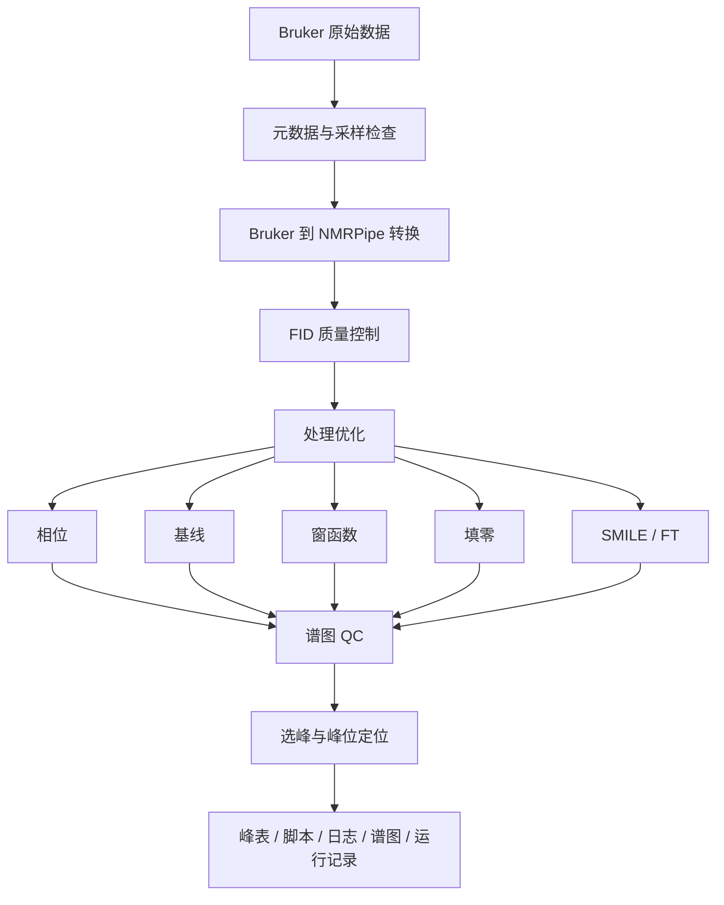

# nmrForge

[](https://github.com/RociferX/nmrforge/actions/workflows/ci.yml)

**面向 Bruker 多维 NMR 数据的自动化处理、参数优化与质量控制平台。**


nmrForge读取Bruker数据集，识别实验类型与采样方式，规划处理方案，驱动NMRPipe与SMILE生成谱图。
数据检查、自动与人工处理、参数优化、质量控制、选峰和查看在同一工作流中完成，
实际采用的参数、脚本、告警和输出与结果一同留档，便于复现和核查。

**软件版本：1.0.5 · Python/CLI API：1.1.1 · 目标平台：Linux**

**Linux桌面用户最简单的使用方式是AppImage。**
下载[1.0.5 AppImage](https://github.com/RociferX/nmrforge/releases/download/v1.0.5/NMRForge-1.0.5-x86_64.AppImage)
及[校验文件](https://github.com/RociferX/nmrforge/releases/download/v1.0.5/SHA256SUMS-v1.0.5.txt)，
按[安装步骤](#安装)校验、赋予执行权限并启动，无需自行配置Python或Qt。
真实谱图处理仍需单独安装NMRPipe，NUS重构还需要SMILE。

桌面程序可通过AppImage或源码安装使用，Python/CLI API通过源码或Python包安装提供。
API **v1.1.1**输出**38列**峰表；二进制的`BUILD_INFO.txt`记录版本、源码修订与依赖。

作者：**李宣锋（Xuanfeng Li），中国科学技术大学**。
源码许可：[Apache-2.0](../LICENSE)，署名见[NOTICE](../NOTICE)。
仓库：[RociferX/nmrforge](https://github.com/RociferX/nmrforge)。

> **语言：**这是[英文项目首页](../README.md)的中文文档版，公开代码的注释为英文。
> 同一份程序支持中英文，默认跟随系统语言；单次运行可设置`NMRFORGE_LANG=en|zh`，
> 也可在「设置 → 软件设置 → 界面语言」中长期指定。

桌面程序与不依赖Qt的Python/CLI API使用同一处理后端。API可生成参考、执行显式参数组合或网格，
为每张候选谱独立输出峰表，并保存处理记录；不同条件间的峰匹配和统计推断由下游分析负责。
详见[API指南](docs/external-api/README.md)。

## 它能做什么

- **数据理解** —— 解析 Bruker `acqus`/`acqu2s`/`acqu3s` 元数据、分离逻辑维度与物理维度、
  按脉冲程序与核组合判定实验类型、识别 uniform 与 NUS 采样。
- **处理** —— Bruker 转 NMRPipe、自动与人工相位校正、基线优化、窗函数(切趾)优化、
  填零、常规傅里叶变换,以及用 SMILE 做 2D/3D NUS 重构。
- **质量控制** —— FID 层诊断(直流偏置、坏点、非有限值、异常迹线)、采样一致性校验,
  以及谱图层质量指标(信噪比、相位质量、基线质量、伪影)。
- **峰分析** —— 自动选峰,使用三点抛物线估算亚格点位置;峰表按 POKY 风格导入导出。
- **带留档的自动化** —— GUI、命令行与 Python API 三种入口;2D批量运行;保留脚本与候选谱;
  每次运行都存下解析后的参数,以及产生它的软件/工具版本。
- **查看** —— 独立的 1D/2D/3D 谱图查看器,支持投影与峰位叠加。

## 工作流


```mermaid
flowchart TD
    A[Bruker 原始数据] --> B[元数据与采样检查]
    B --> D[Bruker 到 NMRPipe 转换]
    D --> C[FID 质量控制]
    C --> E[处理优化]
    E --> E1[相位]
    E --> E2[基线]
    E --> E3[窗函数]
    E --> E4[填零]
    E --> E5[SMILE / FT]
    E1 --> F[谱图 QC]
    E2 --> F
    E3 --> F
    E4 --> F
    E5 --> F
    F --> G[选峰与峰位定位]
    G --> H[峰表 / 脚本 / 日志 / 谱图 / 运行记录]
```

## 架构

```text
GUI / Viewer
    |
Workflow 层:理解 -> 规划 -> 处理 -> 优化 -> QC -> 产物
    |
ProcessingBackend(NMRPipeBackend 是唯一的生产后端)
    |
core:项目模型、数据读取、实验判定、规划、处理原语、优化、QC
```

`core/`、`backend/`、`workflow/` 与 `nmrforge_api/` 四层不依赖 Qt,
因此处理可以在服务器上无界面运行;`gui/` 与 `viewer/` 提供桌面界面。

## 仓库结构

| 路径 | 内容 |
| --- | --- |
| [`core/`](../core/README.md) | 数据模型、Bruker 读取器、实验判定、采样识别、峰定位、QC 与优化原语(不依赖 Qt) |
| [`backend/`](../backend/README.md) | NMRPipe/SMILE 边界:脚本生成与子进程执行 |
| [`workflow/`](../workflow/README.md) | 流程编排 —— 导入、分步处理、相位路径、选峰、批量、诊断 |
| [`gui/`](../gui/README.md) | PySide6 桌面应用 |
| [`viewer/`](../viewer/README.md) | 1D/2D/3D 谱图查看器,GUI 内嵌使用 |
| [`ui_support/`](../ui_support/README.md) | GUI 与查看器共用的界面辅助 |
| [`qtcompat/`](../qtcompat/README.md) | 唯一指定 Qt 绑定的模块 |
| [`nmrforge_api/`](../nmrforge_api/README.md) | 可脚本化的参数研究 API 及其命令行 |
| [`nmrforge_data/config/`](../nmrforge_data/config/README.md) | 随包默认值与机器本地覆盖 |
| [`nmrforge_data/presets/`](../nmrforge_data/presets/README.md) | 实验模板;YAML 文件是唯一数据源 |
| [`tests/`](../tests/README.md) | pytest 测试套件:unit / integration / regression |
| [`examples/`](../examples/README.md) | 可运行的合成数据集与走查脚本 |
| [`packaging/`](../packaging/README.md) | AppImage 构建素材与发布验收要求 |
| [`scripts/`](../scripts/README.md) | 独立命令行工具与校验脚本 |
| [`docs/`](docs/README.md) | 中文文档索引(英文原文在 [`docs/`](../docs/README.md)) |
| [`.github/`](../.github/) | CI 工作流与 issue/PR 模板 |

依赖是单向的:`gui/` 与 `viewer/` 在最上层,然后是 `workflow/`,再是 `backend/`,
`core/` 在底层。[`tests/test_ownership.py`](../tests/test_ownership.py) 与
[`tests/test_qt_independence.py`](../tests/test_qt_independence.py) 强制维持这条分界。

## 依赖要求

| 依赖 | 说明 |
| --- | --- |
| Python | 当前源码发布要求 3.12 或更高 |
| NMRPipe | 真实处理(转换、FT、基线、相位)必需。不随本软件分发 —— 请自行安装,确保可执行文件在 `PATH` 上,或让 nmrForge 指向安装目录。 |
| SMILE | NUS 重构必需。随 NMRPipe 提供,查找方式相同。 |
| Python 包 | 见 `pyproject.toml`;`pip install -e .` 会安装。 |
| 显示器(仅 GUI) | 主窗口与查看器需要桌面会话。无头机器可以用 Python API 或命令行。 |

nmrForge 不会替你分发、下载或安装 NMRPipe/SMILE。它在运行时探测两者,并告诉你缺什么。
完整的依赖与许可清单见 [THIRD_PARTY.md](../THIRD_PARTY.md)。

## 安装

### Linux AppImage：最简单的桌面使用方式

从[1.0.5发行页](https://github.com/RociferX/nmrforge/releases/tag/v1.0.5)下载
`NMRForge-1.0.5-x86_64.AppImage`与`SHA256SUMS-v1.0.5.txt`，然后运行：

```bash
sha256sum -c SHA256SUMS-v1.0.5.txt
chmod +x NMRForge-1.0.5-x86_64.AppImage
./NMRForge-1.0.5-x86_64.AppImage
```

AppImage包含Python、Qt和桌面程序，无需自行创建Python环境或安装Python依赖；
NMRPipe与SMILE仍需单独安装。
一份产物支持中英文界面，随包`BUILD_INFO.txt`记录源码提交及依赖版本；
使用`--licenses`可查看随包许可声明。

### 源码安装

使用Python/CLI API或需要修改源码时，可选择源码安装。
需要Python 3.12或更高版本。在Linux终端运行：

```bash
git clone https://github.com/RociferX/nmrforge.git
cd nmrforge
python -m venv .venv
source .venv/bin/activate
python -m pip install -e .
python main.py
```

普通`pip install .`及wheel安装同样包含运行资源。真实处理需要另行安装NMRPipe，
NUS重构还需要SMILE；nmrForge不捆绑、下载或安装这两个工具。
详见[安装说明](docs/installation.md)、[外部依赖](docs/external-dependencies.md)和[打包说明](docs/packaging.md)。
维护者可使用随源码提供的[AppImage构建配方](../packaging/linux/build_appimage.sh)。

## 快速上手

不运行NMRPipe，也可以检查已有Bruker数据集：

```bash
python examples/quickstart.py /path/to/bruker/dataset
```

也可以生成小型合成数据，查看元数据、采样判定和时域布局：

```bash
python examples/make_synthetic_dataset.py --out ./example_data/hsqc_2d --ndim 2 --nuclei 15N,1H
python examples/quickstart.py ./example_data/hsqc_2d
```

此走查停在需要外部引擎的处理之前，合成数据只用于软件检查和演示。
生成真实谱图时，安装NMRPipe后使用下述GUI步骤或Python/CLI API。
[入门指南](docs/getting-started.md)说明外部引擎配置。

## GUI 用法

```bash
python main.py    # 源码发布的 GUI 入口;会创建/复用本地 venv
```

主窗口的布局是:左侧项目/实验/数据集树,中间是所选数据集的处理流水线,右侧按范围分开的日志:

1. **导入**一个 Bruker 数据集目录(实验与样品元数据会自动填好,且可以编辑);
2. **查看**判定出的实验类型、采样方式与维度布局;
3. **处理** —— 自动路径(诊断、优化、终谱)或人工路径(编辑生成的脚本,再运行它);
4. **质量检查** —— 运行报告列出谱图质量、数据诊断与解析后的处理参数,凡是自动改动过的地方都会告警;
5. **选峰**并导出峰表;需要时把谱图导出成 UCSF。

独立查看器可以单独打开:

```bash
nmrforge-viewer                 # 可编辑安装之后
python -m viewer
```

## 命令行用法

先注册数据，生成并冻结参考，再选参考峰并运行显式参数组合。
参考和组合处理需要NMRPipe，NUS还需要SMILE。

```bash
python -m nmrforge_api --help
python -m nmrforge_api init --study ./study --dataset /path/to/bruker/dataset
python -m nmrforge_api reference --study ./study
python -m nmrforge_api peaks --study ./study

cat > combinations.csv <<'CSV'
zero_fill
1
2
4
CSV
python -m nmrforge_api sweep --study ./study --reference ./study --combos combinations.csv
python -m nmrforge_api report --study ./study
python -m nmrforge_api status --study ./study
```

参数网格、多条件和其它选项见[CLI参考](docs/external-api/04-cli-reference.md)。

## Python API 用法

```python
from nmrforge_api import run_reference_study, run_combination_study

run_reference_study(
    "~/studies/hsqc_params",
    datasets={"A": "~/data/bruker/1"},
)
result = run_combination_study(
    "~/studies/hsqc_params",
    combos=[{"zero_fill": 1}, {"zero_fill": 2}, {"zero_fill": 4}],
)
print(result.summary["workflow_ids"])
for run in result.runs:
    print(run.workflow_id, run.condition, run.status)
```

每个条件有自己的参考，每张候选谱独立检测并输出峰表。API不匹配不同条件的峰身份，
也不计算下游统计。参考阶段转换原始输入，组合只读复用冻结FID。
显式多段导入通过`segmented=True`开启；参考证据缺失或不兼容时需用`force=True`重建。

API单独版本化，当前为**v1.1.1**。跨版本比较前可检查`compat_manifest()`；
统一峰表为38列。详见[API指南](docs/external-api/README.md)、
[Python参考](docs/python-api.md)及[输出与记录](docs/external-api/06-outputs-and-records.md)。

## Example workflow(示例工作流)

`examples/` 里有一个生成最小合成 Bruker 数据集的脚本,以及一个对它做数据理解、
采样检查与 FID 诊断的走查脚本:

```bash
python examples/make_synthetic_dataset.py --out ./example_data/hsqc_2d --ndim 2 --nuclei 15N,1H
python examples/quickstart.py ./example_data/hsqc_2d
```

合成数据集只含文件头加一小段合成 FID,不是真实谱学数据,不能用来得出科学结论。

## 质量控制

自动行为应当可见,而不是悄无声息:

- FID 诊断会报出直流偏置、非有限点、全零迹线与能量异常偏高的迹线,并给出受影响的索引与判定规则;
- 凡施加过修正的地方,受影响的点与采取的动作都会写进那一次运行的处理日志;
- 谱图层 QC 报出信噪比、相位质量、基线质量与伪影分数,并且拒绝把一次失败的运行悄悄降级成「成功」;
- 采样依据结合标准采样表、采集参数和网格顺序；不能还原 NUS 位置时会在导入时报错，不编造坐标。

自动修正会另外写入追加式机器可读审计 `qc_audit.jsonl`；该文件记录已执行的修正，并非每次运行的完整 QC 快照。

## 可复现性与溯源

每次处理都会生成一份运行记录,包含运行 id、输入引用、解析后的参数、引用的脚本、
产物、软件版本、外部工具版本、时间戳与告警。参数扫描API保存manifest、workflow/run记录，
以及统一38列峰表`peak_table_parabolic.csv`；实际结构见[输出与记录](docs/external-api/06-outputs-and-records.md)。

`core.__version__` 是版本号的唯一来源;`pyproject.toml` 动态读取它,
因此包版本与写进运行记录的版本不会各说各话。

## 已知边界

- 处理覆盖**2D、3D的uniform与NUS**；批量处理目前**仅支持2D**。
- SMILE参数扫描与按排名重跑用于**2D NUS**；3D NUS重构可用，但3D SMILE优化界面隐藏。
- 真实处理需要外部NMRPipe，NUS重构还需要SMILE；无引擎时仍可检查数据和运行合成走查。
- 坏点校正可能按整行改写项目副本中的`ser`与`nuslist`，并保留`ser.bak`与`nuslist.bak`。
  临时文件加替换的写法会断开链接，保持原始输入不变；不能确定行布局时改为清理生成FID。
  校正动作和受影响的数据会写入日志。
- 自动选峰与QC受实验类型、信号质量和处理选择影响。证据页的候选匹配率不是已指认真峰回收率，
  也不保证其它数据集的结果。
- Python API负责处理与留档，不提供跨谱峰匹配、化学位移扰动分析或统计推断。
- Linux是目标运行平台，问题通过[GitHub](https://github.com/RociferX/nmrforge/issues)报告。

输入、缓存和处理范围详见[API边界](docs/external-api/09-limitations-and-roadmap.md)与[FAQ](docs/faq.md)。

## 文档

- [中文文档索引](docs/README.md)(英文原文见 [docs/](../docs/README.md))
- [快速开始](docs/getting-started.md) | [安装](docs/installation.md)
- [GUI 指南](docs/gui.md) | [命令行参考](docs/cli.md) | [Python API](docs/python-api.md)
- [处理模型](docs/processing-model.md) | [QC 体系](docs/qc-system.md) | [选峰](docs/peak-picking.md) | [批量处理](docs/batch-processing.md)
- [外部依赖](docs/external-dependencies.md) | [故障排查](docs/troubleshooting.md) | [常见问题](docs/faq.md)
- [架构](docs/architecture.md) | [脚本 API](docs/external-api/README.md) | [发布说明](https://github.com/RociferX/nmrforge/releases)

## 引用

软件引用元数据见[CITATION.cff](../CITATION.cff)，包含作者、软件版本和发布日期。
概念DOI [10.5281/zenodo.22909415](https://doi.org/10.5281/zenodo.22909415)标识全部归档版本；
引用某一归档发行时，如已有版本专用DOI，应使用该记录，并注明实际使用的软件版本或提交。

工作中使用了NMRPipe或SMILE时，请同时引用这些处理与重构引擎，参考条目见
[THIRD_PARTY.md](../THIRD_PARTY.md)。

## 实测证据

[四路径对照报告](docs/evidence/real-data-comparison.md)展示按当前数据处理流程得到的结果，提供谱图、处理脚本、参数对照、候选统计及限制：

| 处理路径 | 输入与参考 | 参考候选匹配 |
| --- | --- | --- |
| 2D uniform | BMRB 27493 HSQC；作者提供的Bruker处理谱 | 125/126（99.21%） |
| 受控2D NUS | BMRB 27493 uniform原始数据下采样，请求75%、实际68/90（75.56%）；对应NMRForge uniform结果 | 123/127（96.85%） |
| 3D uniform | BMRB 15750 HNCO；按作者脚本重建的完整3D参考 | HN 80/84；HC 72/81；NC 64/71 |
| 实采3D NUS | BMRB 52533 HNCO，实采25%；沉积的完整3D参考 | HN 89/89；HC 93/93；NC 79/79 |

报告比较主要信号位置、相位残差、ALT/NEG编码、谱宽解析，以及自动与参考处理所用脚本。

2D NUS案例明确为**uniform原始数据的受控人工下采样**，不是实采NUS；
其参考用于检查与对应自动uniform结果的一致性。三维先裁共同完整3D窗口，
再在有符号HN、HC、NC投影上独立匹配。匹配率为匹配对数/参考候选数，
不是已指认真峰回收率；重叠、弱信号及旁瓣需结合图判断。

方法、结果与限制详见完整报告。

## 测试

工程测试使用模拟引擎边界，不需要NMRPipe或SMILE。在Linux安装开发依赖后运行：

```bash
python -m pip install -e ".[dev]"
QT_QPA_PLATFORM=offscreen python -m pytest -q
QT_QPA_PLATFORM=offscreen python -m pytest -m unit
python -m ruff check .
```

CI运行仓库配置的检查。模拟测试通过说明被覆盖的软件行为符合断言；
真实引擎证据另有记录，不能把测试全绿视为全面科学验证。测试分类见`tests/categories.py`。

## 贡献

见 [CONTRIBUTING.md](../CONTRIBUTING.md)。简而言之:从 `main` 开分支,保持测试全绿(`pytest`)、
静态检查干净(`ruff check .`),并在 pull request 里说明改了什么、为什么。

## 许可

**源码以 Apache License 2.0 发布**:[LICENSE](../LICENSE) 是逐字的 Apache-2.0 正文(SPDX
`Apache-2.0`),[NOTICE](../NOTICE) 记录版权人「李宣锋(Xuanfeng Li)」与许可范围。两者分开
是为了让许可识别工具正确识别为 Apache-2.0。

**AppImage 另有一条分发边界。** 它捆绑 PySide6/Qt 与其他第三方库,这些组件按各自的许可
(含 LGPL-3.0)随产物分发。发布的 AppImage 对应特定发布版本与源码提交；源码更新不会自动
更新它。二进制的许可声明和构建来源随发布产物提供。这不改变 nmrForge 自身源码的 Apache-2.0 条款。

第三方库的许可与再分发说明见[LICENSE_OPTIONS.md](../LICENSE_OPTIONS.md)。

实际含义:

- **从源码使用 nmrforge**:Apache-2.0,包括专利授权、保留署名声明的要求,以及再分发修改过的
  文件时说明改动的要求;
- **AppImage**:再分发前核对该二进制随附的声明和许可要求;
- 第三方组件各自保留其许可;见 [THIRD_PARTY.md](../THIRD_PARTY.md),
  二进制的声明见 `packaging/linux/THIRD_PARTY_LICENSES/NOTICE.md`。

以上不构成法律意见。
