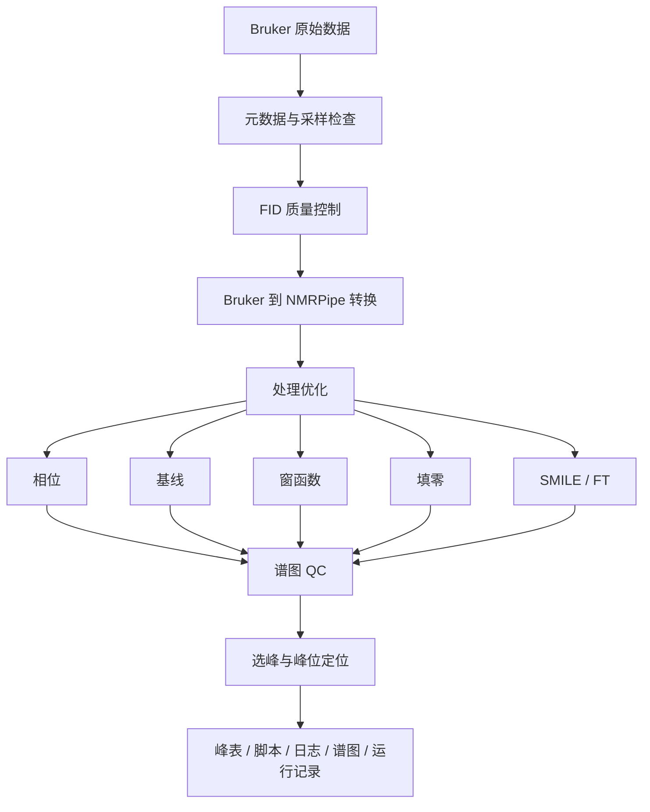

# nmrForge

[](https://github.com/RociferX/nmrforge/actions/workflows/ci.yml)

**面向 Bruker 多维 NMR 数据的自动化处理、参数优化与质量控制平台。**

> ### 语言说明
>
> 这是**中文文档版**:代码注释与仓库根目录的 [README](../README.md) 是英文,这里的中文文档树
> (`Chinese_version/`)与英文文档一一对应。界面不必挑版本 —— 同一份产物按系统区域自动选择语言,
> 也可以用 `NMRFORGE_LANG=zh|en` 临时钉死,或在「设置 → 软件设置 → 界面语言」里长期指定;
> 中文界面文案在 [`ui_support/locales/zh.json`](../ui_support/locales/zh.json),运行时从同一份代码里取。

nmrForge 读取一个 Bruker 数据集,判定它是什么实验、用了哪种采样方式,规划处理方案,
驱动 NMRPipe 执行,并把过程中产生的每一个参数、每一条告警和每一份产物都记录下来,
使结果可复现、可审计。

> 目标不是做一个套在 NMRPipe 外面的图形界面。nmrForge 先*理解*实验与采样方式,
> 再生成可解释的处理方案,并把证据(质量指标、解析后的参数、运行记录)与谱图放在一起。

源码版本:**1.0.3** · 发布通道:**稳定版（Stable）**
作者:**李宣锋(Xuanfeng Li),中国科学技术大学** · 源码许可:Apache-2.0(见 [LICENSE](../LICENSE) 与 [NOTICE](../NOTICE))
随包第三方库的许可与再分发说明：[LICENSE_OPTIONS.md](../LICENSE_OPTIONS.md)。
分发方式:当前 1.0.3 为源码发布；Linux AppImage 仍为 1.0.2（一份产物，界面语言运行时切换）
发布页:<https://github.com/RociferX/nmrforge/releases>
仓库:<https://github.com/RociferX/nmrforge>
Zenodo 概念 DOI（全部归档版本）：[10.5281/zenodo.22909415](https://doi.org/10.5281/zenodo.22909415)。版本专用 DOI 只对应其归档快照。

> 本页说明 **1.0.3 源码**与桌面/Python/CLI 接口（`nmrforge_api`，当前源码契约版本 1.1，2026-10-03）。
> 已发布的二进制以 GitHub Releases 为准。回归覆盖见测试套件，行为变化按 compat 流程声明
> (`same/additive/behavior_changed/contract_changed` 四级)。

> ### 桌面程序与 Python/CLI 接口
>
> 桌面程序与 `nmrforge_api` 是同一源码树中的受支持接口。Python API 单独版本化
> (`API_VERSION = "1.1"`)，并提供兼容清单识别行为与契约变化。旧 AppImage 1.0.2 不包含 v1.1 契约。GitHub Releases 中的
> AppImage 对应特定版本和源码提交；更新源码不会自动更新已发布的二进制。
>
> 跨版本比较数值前，请查看兼容清单和发布说明，并结合自己的数据与实验验证结果。

> ### 支持边界
>
> nmrForge 是单人维护的研究工具,不是受支持的产品。问题通过 GitHub 尽力答复,不承诺
> 响应时间或兼容性;改动过的分支只以本仓库自带的测试套件为准。真机数据上的科学验证
> 仍在积累中,依赖处理结果之前请先读[已知边界](#已知边界)。

## 它能做什么

- **数据理解** —— 解析 Bruker `acqus`/`acqu2s`/`acqu3s` 元数据、分离逻辑维度与物理维度、
  按脉冲程序与核组合判定实验类型、识别 uniform 与 NUS 采样。
- **处理** —— Bruker 转 NMRPipe、自动与人工相位校正、基线优化、窗函数(切趾)优化、
  填零、常规傅里叶变换,以及用 SMILE 做 2D/3D NUS 重构。
- **质量控制** —— FID 层诊断(直流偏置、坏点、非有限值、异常迹线)、采样一致性校验,
  以及谱图层质量指标(信噪比、相位质量、基线质量、伪影)。
- **峰分析** —— 自动选峰,使用三点抛物线估算亚格点位置;峰表按 POKY 风格导入导出。
- **带留档的自动化** —— GUI、命令行与 Python API 三种入口;批量运行;保留脚本与候选谱;
  每次运行都存下解析后的参数,以及产生它的软件/工具版本。
- **查看** —— 独立的 1D/2D/3D 谱图查看器,支持投影与峰位叠加。

## 工作流


```mermaid
flowchart TD
    A[Bruker 原始数据] --> B[元数据与采样检查]
    B --> C[FID 质量控制]
    C --> D[Bruker 到 NMRPipe 转换]
    D --> E[处理优化]
    E --> E1[相位]
    E --> E2[基线]
    E --> E3[窗函数]
    E --> E4[填零]
    E --> E5[SMILE / FT]
    E1 --> F[谱图 QC]
    E2 --> F
    E3 --> F
    E4 --> F
    E5 --> F
    F --> G[选峰与峰位定位]
    G --> H[峰表 / 脚本 / 日志 / 谱图 / 运行记录]
```

## 架构

```text
GUI / Viewer
    |
Workflow 层:理解 -> 规划 -> 处理 -> 优化 -> QC -> 产物
    |
ProcessingBackend(NMRPipeBackend 是唯一的生产后端)
    |
core:项目模型、数据读取、实验判定、规划、处理原语、优化、QC
```

`core/`、`backend/`、`workflow/` 与 `nmrforge_api/` 四层不依赖 Qt,
因此处理可以在服务器上无界面运行;`gui/` 与 `viewer/` 提供桌面界面。

## 仓库结构

| 路径 | 内容 |
| --- | --- |
| [`core/`](../core/README.md) | 数据模型、Bruker 读取器、实验判定、采样识别、峰定位、QC 与优化原语(不依赖 Qt) |
| [`backend/`](../backend/README.md) | NMRPipe/SMILE 边界:脚本生成与子进程执行 |
| [`workflow/`](../workflow/README.md) | 流程编排 —— 导入、分步处理、相位路径、选峰、批量、诊断 |
| [`gui/`](../gui/README.md) | PySide6 桌面应用 |
| [`viewer/`](../viewer/README.md) | 1D/2D/3D 谱图查看器,GUI 内嵌使用 |
| [`ui_support/`](../ui_support/README.md) | GUI 与查看器共用的界面辅助 |
| [`qtcompat/`](../qtcompat/README.md) | 唯一指定 Qt 绑定的模块 |
| [`nmrforge_api/`](../nmrforge_api/README.md) | 可脚本化的参数研究 API 及其命令行 |
| [`nmrforge_data/config/`](../nmrforge_data/config/README.md) | 随包默认值与机器本地覆盖 |
| [`nmrforge_data/presets/`](../nmrforge_data/presets/README.md) | 实验模板;YAML 文件是唯一数据源 |
| [`tests/`](../tests/README.md) | pytest 测试套件:unit / integration / regression |
| [`examples/`](../examples/README.md) | 可运行的合成数据集与走查脚本 |
| [`packaging/`](../packaging/README.md) | AppImage 构建素材与发布验收要求 |
| [`scripts/`](../scripts/README.md) | 独立命令行工具与校验脚本 |
| [`docs/`](docs/README.md) | 中文文档索引(英文原文在 [`docs/`](../docs/README.md)) |
| [`.github/`](../.github/) | CI 工作流与 issue/PR 模板 |

依赖是单向的:`gui/` 与 `viewer/` 在最上层,然后是 `workflow/`,再是 `backend/`,
`core/` 在底层。[`tests/test_ownership.py`](../tests/test_ownership.py) 与
[`tests/test_qt_independence.py`](../tests/test_qt_independence.py) 强制维持这条分界。

## 依赖要求

| 依赖 | 说明 |
| --- | --- |
| Python | 当前源码发布要求 3.12 或更高 |
| NMRPipe | 真实处理(转换、FT、基线、相位)必需。不随本软件分发 —— 请自行安装,确保可执行文件在 `PATH` 上,或让 nmrForge 指向安装目录。 |
| SMILE | NUS 重构必需。随 NMRPipe 提供,查找方式相同。 |
| Python 包 | 见 `pyproject.toml`;`pip install -e .` 会安装。 |
| 显示器(仅 GUI) | 主窗口与查看器需要桌面会话。无头机器可以用 Python API 或命令行。 |

nmrForge 不会替你分发、下载或安装 NMRPipe/SMILE。它在运行时探测两者,并告诉你缺什么。
完整的依赖与许可清单见 [THIRD_PARTY.md](../THIRD_PARTY.md)。

## 安装

仓库提供源码；[发布页](https://github.com/RociferX/nmrforge/releases)可能另有对应版本的
Linux AppImage。每份 AppImage 对应其标注的版本与源码提交；更新源码不会自动更新已发布的二进制。
使用当前源码时，请克隆仓库并做可编辑安装:

```bash
git clone https://github.com/RociferX/nmrforge.git
cd nmrforge
python -m venv .venv
source .venv/bin/activate        # Windows: .venv\Scripts\activate
python -m pip install -e ".[test]"
python main.py
```

真实处理还需要 NMRPipe;NUS 重构需要 SMILE。它们是外部程序,nmrForge 从不下载或捆绑它们。
`pip install .` 与 wheel 自 2026-09-21 起同样可用:运行期资源随数据包 `nmrforge_data` 分发
(见 [docs/packaging.md](docs/packaging.md));日常开发仍推荐上面的可编辑安装。

AppImage 的构建配方在 [`packaging/linux/build_appimage.sh`](../packaging/linux/build_appimage.sh):
**只构建一个产物**,界面语言在运行时决定(`NMRFORGE_LANG`/`NMRFORGE_LANGUAGE` → 设置里的偏好
→ 系统区域 → 本树 [`ui_support/locales/default.json`](../ui_support/locales/default.json) 声明的
默认语言);`BUILD_INFO.txt` 记录版本、完整 commit、默认语言与捆绑的依赖版本。它会捆绑
PySide6/Qt,这些库按 LGPL-3.0 随产物分发,许可正文与声明都在产物内
(`./NMRForge-<版本>-x86_64.AppImage --licenses` 可查)。构建脚本是源码；只有附在正式发布中的
AppImage 才是已发布的二进制。

## 快速上手

**从源码安装时**用 `python main.py` 启动 GUI。下面的步骤也演示了在没有安装
NMRPipe 的情况下能走通哪些环节。

下面这个例子只需要一个 Bruker 数据集目录、不需要 NMRPipe,就能走通数据理解与质量控制:

```bash
python examples/quickstart.py <bruker_dataset_directory>
```

想先造一个小合成数据集来试:

```bash
python examples/make_synthetic_dataset.py --out ./example_data/hsqc_2d --ndim 2 --nuclei 15N,1H
python examples/quickstart.py ./example_data/hsqc_2d
```

完整处理路径还需要 NMRPipe:

```bash
# 1. 描述数据集:实验类型、采样方式、维度
python -m nmrforge_api init --study ./study --dataset /path/to/bruker/dataset

# 2. 构建并冻结参考谱(需要 NMRPipe)
python -m nmrforge_api reference --study ./study

# 3. 挑选参考峰表
python -m nmrforge_api peaks --study ./study

# 4. 跑一组参数
python -m nmrforge_api sweep --study ./study --reference ./study --grid grid.yaml
```

## GUI 用法(A 线 —— 成熟)

```bash
python main.py    # 源码发布的 GUI 入口;会创建/复用本地 venv
```

主窗口的布局是:左侧项目/实验/数据集树,中间是所选数据集的处理流水线,右侧按范围分开的日志:

1. **导入**一个 Bruker 数据集目录(实验与样品元数据会自动填好,且可以编辑);
2. **查看**判定出的实验类型、采样方式与维度布局;
3. **处理** —— 自动路径(诊断、优化、终谱)或人工路径(编辑生成的脚本,再运行它);
4. **质量检查** —— 运行报告列出谱图质量、数据诊断与解析后的处理参数,凡是自动改动过的地方都会告警;
5. **选峰**并导出峰表;需要时把谱图导出成 UCSF。

独立查看器可以单独打开:

```bash
nmrforge-viewer                 # 可编辑安装之后
python -m viewer
```

## 命令行用法(B 线 —— 当前 API 契约 v1.1)

```bash
python -m nmrforge_api --help
python -m nmrforge_api init       --study DIR --dataset BRUKER_DIR
python -m nmrforge_api reference  --study DIR
python -m nmrforge_api peaks      --study DIR
python -m nmrforge_api sweep      --study DIR --reference DIR --grid grid.yaml
python -m nmrforge_api report     --study DIR
python -m nmrforge_api status     --study DIR
```

## Python API(B 线 —— 当前契约 v1.1)

```python
from nmrforge_api import run_reference_study, run_combination_study

run_reference_study(
    "~/studies/hsqc_params",       # 研究根(可断点续跑)
    "~/data/bmr12345/1",           # 解压后的 Bruker 数据集目录
)
result = run_combination_study(
    "~/studies/hsqc_params",
    axes={"zero_fill": [1, 2, 4], "window.F1.off": [0.35, 0.45, 0.55]},
)
print(result.summary["status_counts"])      # 这次运行做了什么(执行摘要)

# API 不匹配不同条件或不同谱的峰，也不计算统计量。
# 下游分析应先按用户定义的标准完成峰匹配，再独立进行统计；
# 不要把独立选峰的 runs 直接解释为 CSP 检测下限。
```

脚本化 API 另有独立文档:[docs/external-api/README.md](docs/external-api/README.md);
它自成体系,不需要内部管理文档。

## Example workflow(示例工作流)

`examples/` 里有一个生成最小合成 Bruker 数据集的脚本,以及一个对它做数据理解、
采样检查与 FID 诊断的走查脚本:

```bash
python examples/make_synthetic_dataset.py --out ./example_data/hsqc_2d --ndim 2 --nuclei 15N,1H
python examples/quickstart.py ./example_data/hsqc_2d
```

合成数据集只含文件头加一小段合成 FID,不是真实谱学数据,不能用来得出科学结论。

## 质量控制

自动行为应当可见,而不是悄无声息:

- FID 诊断会报出直流偏置、非有限点、全零迹线与能量异常偏高的迹线,并给出受影响的索引与判定规则;
- 凡施加过修正的地方,受影响的点与采取的动作都会写进那一次运行的处理日志;
- 谱图层 QC 报出信噪比、相位质量、基线质量与伪影分数,并且拒绝把一次失败的运行悄悄降级成「成功」;
- 采样依据结合标准采样表、采集参数和网格顺序；不能还原 NUS 位置时会在导入时报错，不编造坐标。

自动修正会另外写入追加式机器可读审计 `qc_audit.jsonl`；该文件记录已执行的修正，并非每次运行的完整 QC 快照。

## 可复现性与溯源

每次处理都会生成一份运行记录,包含运行 id、输入引用、解析后的参数、引用的脚本、
产物、软件版本、外部工具版本、时间戳与告警。参数扫描 API 还会在研究目录下写
`manifest.json`、`runs.json` 与统一峰表 `peak_table_parabolic.csv`；峰位不确定度统计是独立的分析辅助步骤。

`core.__version__` 是版本号的唯一来源;`pyproject.toml` 动态读取它,
因此包版本与写进运行记录的版本不会各说各话。

## 已知边界

以下是有意为之、并且写进文档的边界,不是没做完的功能:

- 批量处理**只支持 2D**;非 2D 数据集会被跳过并给出说明;
- SMILE 参数扫描与按名次重跑**只对 2D NUS** 开放;3D NUS 处理可用,但 3D SMILE 优化界面是隐藏的;
- 真实处理需要外部安装的 NMRPipe/SMILE;没有它们时只能做数据理解、规划与 QC;
- **本工具会改写项目自己那份 raw 数据(不是你手上的原始数据集)**:检出 NUS 坏点时,
  `<项目>/<exp>/<data>/raw/` 下的 `ser` 与 `nuslist` 会按整行重写,备份 `ser.bak` /
  `nuslist.bak` 就放在旁边;写入走临时文件 + `os.replace`,会打断硬链接/软链接,因此被链接的
  原始数据集不会被改动;行布局推不出来时回退为清理生成的 FID,且该清理只在真的检出坏点时才执行;
- **公开仓的历史是重启过的**:早期公开历史里含真实样品名与开发机路径,所以是替换而不是重写;
  公开提交记录因此刻意不保留演进轨迹,版本历史见[发布说明](https://github.com/RociferX/nmrforge/releases);
- **静态门禁是 `ruff check .`**;`ruff format` 只是提示:既有代码刻意没有按 format 重排版,
  所以 `ruff format --check .` 会报出一大批文件,这是预期行为,重排版不属于贡献流程;
- 本机 wheel/AppImage 构建留下的 `build/` 目录不进仓库(已被 .gitignore 忽略),
  不要在 `build/` 里跑测试;
- 早期版本里 MATLAB 风格的分析功能(HSQC CSP 分析)已在 2026-09 移除;
- Python API 当前契约为 v1.1;破坏性变更记录在[发布说明](https://github.com/RociferX/nmrforge/releases)里。

## 文档

- [中文文档索引](docs/README.md)(英文原文见 [docs/](../docs/README.md))
- [快速开始](docs/getting-started.md) | [安装](docs/installation.md)
- [GUI 指南](docs/gui.md) | [命令行参考](docs/cli.md) | [Python API](docs/python-api.md)
- [处理模型](docs/processing-model.md) | [QC 体系](docs/qc-system.md) | [选峰](docs/peak-picking.md) | [批量处理](docs/batch-processing.md)
- [外部依赖](docs/external-dependencies.md) | [故障排查](docs/troubleshooting.md) | [常见问题](docs/faq.md)
- [架构](docs/architecture.md) | [脚本 API](docs/external-api/README.md) | [发布说明](https://github.com/RociferX/nmrforge/releases)

## 引用

引用元数据见 [CITATION.cff](../CITATION.cff)。1.0.0 起每个发布版本都有 DOI:

- 本版本:`10.5281/zenodo.22909416`(<https://doi.org/10.5281/zenodo.22909416>)
- 全部版本(始终指向最新版):`10.5281/zenodo.22909415`(<https://doi.org/10.5281/zenodo.22909415>)

作者:李宣锋,中国科学技术大学(University of Science and Technology of China);仓库地址见上。

如果你发表的工作用到了本软件的处理或重构引擎,请同时引用 NMRPipe 与 SMILE ——
见 [THIRD_PARTY.md](../THIRD_PARTY.md)。

## 实测证据

- [真实数据实测证据(公开数据)](docs/evidence/real-data-comparison.md) —— 用**一套公开数据**
  (BMRB timedomain 条目 53374 的原始 Bruker 数据)做的**外部真值对照**:自动处理终谱与已发表沉积
  化学位移叠加、逐峰一对一回收率(紧容差 1H 0.01 / 15N 0.05 ppm 下 **84.1%**,中容差 93.5%)、
  同口径的偶然匹配背景(**2.0%**)、QC 评分与真机重复性快照。判据在软件之外,不是自己跟自己比;它
  证明的是**软件自动处理的结果可用**,与用哪个入口(桌面程序 / 命令行 / 脚本接口)无关。
- [验证边界:工程回归 vs 科学验证](docs/external-api/09-limitations-and-roadmap.md) ——
  区分工程回归、真实引擎验证与科学结论。
- 这些数字是特定日期、特定公开数据集的一次历史快照；不代表当前源码修订已重新验证，
  也不保证其他数据集或参数设置的结果。详见证据页说明。

## 测试

测试套件不需要 NMRPipe:引擎边界被打桩,因此任何装有 Python >= 3.12 的机器克隆下来即可自验。

```bash
python -m pip install -e ".[test]"
python -m pytest -q                  # 全量
python -m pytest -m unit             # 快速子集(纯逻辑;约 45 秒,主要是收集开销)
python -m ruff check .               # 静态检查
```

CI(GitHub Actions)会运行仓库中配置的检查。常规测试使用模拟引擎边界，不会调用 NMRPipe 或
SMILE；测试标记分类见 `tests/categories.py`。模拟测试通过不能视作真实引擎验证或科学验证。

## 贡献

见 [CONTRIBUTING.md](../CONTRIBUTING.md)。简而言之:从 `main` 开分支,保持测试全绿(`pytest`)、
静态检查干净(`ruff check .`),并在 pull request 里说明改了什么、为什么。

## 许可

**源码以 Apache License 2.0 发布**:[LICENSE](../LICENSE) 是逐字的 Apache-2.0 正文(SPDX
`Apache-2.0`),[NOTICE](../NOTICE) 记录版权人「李宣锋(Xuanfeng Li)」与许可范围。两者分开
是为了让许可识别工具正确识别为 Apache-2.0。

**AppImage 另有一条分发边界。** 它捆绑 PySide6/Qt 与其他第三方库,这些组件按各自的许可
(含 LGPL-3.0)随产物分发。发布的 AppImage 对应特定发布版本与源码提交；源码更新不会自动
更新它。二进制的许可声明和构建来源随发布产物提供。这不改变 nmrForge 自身源码的 Apache-2.0 条款。

实际含义:

- **从源码使用 nmrforge**:Apache-2.0,包括专利授权、保留署名声明的要求,以及再分发修改过的
  文件时说明改动的要求;
- **AppImage**:再分发前核对该二进制随附的声明和许可要求;
- 第三方组件各自保留其许可;见 [THIRD_PARTY.md](../THIRD_PARTY.md),
  二进制的声明见 `packaging/linux/THIRD_PARTY_LICENSES/NOTICE.md`。

以上不构成法律意见。
