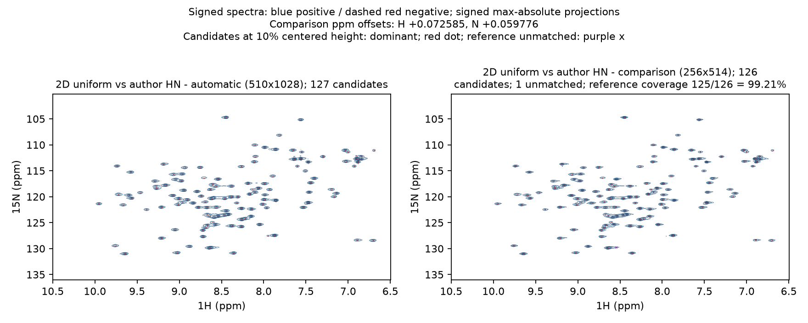
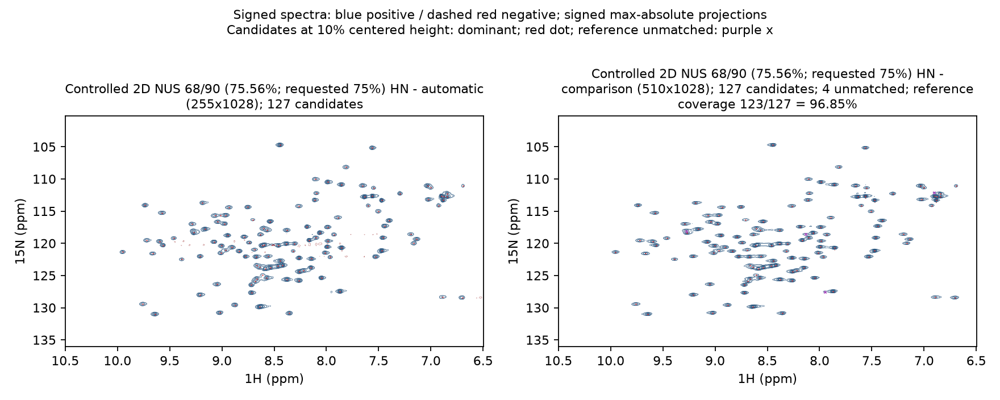

# 四条处理路径：二维谱与三维投影对照

本页展示按当前数据处理流程得到的四条路径终谱，并说明方法、结果与限制。
四组完整对照为2D uniform、受控人工2D NUS、3D uniform及实采3D NUS；
人工下采样的原始数据确实来自采集，但下采样日程不是仪器实采NUS。

## 如何读图

每组左侧是NMRForge终谱，右侧是注明来源的参考谱。蓝实线为正信号，红虚线为负信号。
红色小实点为两侧各自独立检测的候选；只在参考侧以紫色x标出未匹配候选。
两侧使用共同物理窗口，等高线均从各自最大绝对强度的7.5%开始。
三维先裁共同完整三维窗口，再生成H–N、H–C、N–C有符号最大绝对值投影，逐投影独立选峰匹配。

**参考候选覆盖率 = 匹配对数 ÷ 参考候选数**。它不是已指认真峰回收率，
也不能证明完整三维峰身份恢复。额外候选不自动算假峰，未匹配参考候选也不自动算噪声；
需要结合图中的弱结构、旁瓣和重叠判断。两谱分别归一，绝对强度不可直接比较。

## 数据与参考

| 路径 | 数据与实际采样 | 参考对象 |
| --- | --- | --- |
| 2D uniform | BMRB27493，Apo_CBL_0.4mM/2，HSQC；90复增量 | 同目录作者Bruker `pdata/1` |
| 2D NUS | 同一BMRB27493 uniform原始数据受控人工下采样；请求75%，实际68/90＝75.56% | NMRForge对应uniform终谱 |
| 3D uniform | BMRB15750，850 MHz HNCO；32×32完整复网格 | 同一原始数据按作者沉积`fid.com/proc.com`重建的完整3D终谱 |
| 3D NUS | BMRB52533 HNCO；实采441/(42×42)＝25% | 作者沉积`DomainIV_HNCO.ft3` |

二维来源：[BMRB27493](https://bmrb.io/data_library/summary/?bmrbId=27493)。
参考的独立性不同：人工2D对照共享原始数据与软件；15750独立运行作者转换与处理脚本；
52533直接读取沉积终谱。四组均不能代替完整独立真值验证。

## 结果概览

四组对照的主要信号位置和整体谱形一致，当前共同窗口内未观察到明确的主要信号系统性丢失。
未匹配候选主要涉及重叠/肩峰、一对一匹配限制和检测阈值；图中保留的弱负瓣不作为同号主信号回收目标。
候选覆盖率衡量的是检测与对应关系，不能把“未匹配”直接解释为“处理后没有信号”。

处理对照还记录了以下内容：

- **脚本与谱结构。** 无需抄用作者最终相位或实验专用LP/窗函数方案，
  即得到主要信号一致的结果；两组NUS重构也保留了可对应的主要谱结构。
- **相位残差。** 52533统一联合符号等价后H/N/C残差为0.97°/2.50°/0°；
  15750的N/C残差各2.50°，H须按带P1的相位曲线比较，详见下方相位核验。
- **采集编码。** Echo–AntiEcho二维没有机械套用ALT/NEG；15750碳维正确使用FT `-alt`；
  52533的SMILE编码和后续N维`-alt -neg`、C维`-alt`均与作者一致，谱图轴向和整体符号相符。
- **谱宽解析。** 15750碳维谱宽冲突按现有规则解析为3636.364 Hz，与作者转换一致，
  原始参数保持不变，采用值和冲突原因说明均可审计。

作者的实验专用处理改变了分辨率和弱结构表现，相关差异与局部信号一并核对。结论范围是这些实测案例，不代替完整指认真值或全部实验类型的验证。

## 2D uniform：与作者谱比较



本谱127个、作者谱126个候选，匹配125对：**125/126 = 99.21%**，参考候选未匹配1个。
主要信号峰位置与峰形基本一致；紫叉所在的弱结构紧邻主峰，更像被单独选出的旁瓣候选，
这类候选差异具有合理解释，不代表主要信号丢失。

作者谱按整轴常数平移统一参照：H加0.072584594 ppm，N加0.059775701 ppm。
整体谱中心偏移属于参照口径差异，不评价处理好坏；未逐峰移动、拉伸或改写谱。
对齐后匹配候选的中位绝对残差为H 0.00039、N 0.00904 ppm，
峰高相关系数r=0.9751，局部等效线宽本谱/作者谱中位比为H 0.95、N 1.13。

### 本组处理脚本 / 参数对比

参考直接读取作者Bruker `pdata/1`，未提供可作为本组参考的作者NMRPipe脚本。
以下列出沉积`procs/proc2s`中的实际参数，与本次自动终脚本对照；Bruker与NMRPipe的相位、窗口和编码不能仅按数值认定等价。

| 项目 | NMRForge自动处理 | 作者Bruker参考参数 |
| --- | --- | --- |
| H维窗 / 补零 | SP .45/.98/2/.5；ZF 4096 | WDW=4、SSB=2、LB=GB=0；SI=2048 |
| N维窗 / 补零 | SP .45/.95/1/.5；ZF 512 | WDW=4、SSB=2、LB=GB=0；SI=256 |
| H / N相位P0/P1 | 0°/0°；265°/0° | PHC0/PHC1：7.599999°/0°；−2.4°/0° |
| 基线处理 | H时域POLY；H/N频域POLY ord3 auto | BC_mod：H=6、N=0（沉积原码） |
| 处理形态 | H窗10.5～6.5 ppm，完整2D FT2 | 沉积Bruker处理谱；只在共同窗口比较 |


<details>
<summary>展开本组实际自动转换与终处理脚本</summary>

**自动转换**

```csh
#!/bin/csh

bruk2pipe -verb -in ./ser \
  -bad 0.0 -ext -aswap -AMX -decim 2088 -dspfvs 20 -grpdly 67.9876556396484  \
  -xN              2048  -yN               180  \
  -xT              1024  -yT                90  \
  -xMODE            DQD  -yMODE  Echo-AntiEcho  \
  -xSW         9578.544  -ySW         2187.227  \
  -xOBS         599.503  -yOBS          60.754  \
  -xCAR           4.771  -yCAR         118.077  \
  -xLAB 1H  -yLAB             15N  \
  -ndim               2  -aq2D         Complex  \
| nmrPipe -fn MULT -c 9.76562e-01 \
  -out ./d_001.fid -ov
```

**自动终处理**

```csh
#!/bin/csh
# NMRForge processing script
# experiment: d_001
xyz2pipe -in d_001.fid -x \
| nmrPipe -fn POLY -time \
| nmrPipe -fn SP -off 0.45 -end 0.98 -pow 2 -c 0.5 \
| nmrPipe -fn ZF -size 4096 \
| nmrPipe -fn FT \
| nmrPipe -fn PS -p0 0 -p1 0 -di \
| nmrPipe -fn POLY -ord 3 -auto \
| nmrPipe -fn EXT -x1 10.5ppm -xn 6.5ppm -sw -round 2 \
| nmrPipe -fn TP \
| nmrPipe -fn SP -off 0.45 -end 0.95 -pow 1 -c 0.5 \
| nmrPipe -fn ZF -size 512 \
| nmrPipe -fn FT \
| nmrPipe -fn PS -p0 265 -p1 0 -di \
| nmrPipe -fn POLY -ord 3 -auto \
| nmrPipe -fn TP \
| pipe2xyz -out d_001.ft2 -x
```

</details>

作者参数摘录与参数文件哈希见[四组脚本记录](script-comparisons_20261009.json)。

## 受控人工2D NUS：请求75%，实际75.56%

从BMRB27493同一uniform原始`ser`调用`scripts/vm_make_evidence_nus.py`，
`--fraction .75 --seed 20261008`。90个复增量取整保留68个，实际比例为
**68/90＝75.5556%**；请求值75%与实际值分别留档。随机选择完整正交增量，
包含零增量及末端增量，生成新的`ser`、`nuslist`和NUS元数据；保留增量的字节未改。
这是**uniform原始数据的受控人工下采样**，不是实采NUS，也不模拟采集中漂移或时间变化。

新输入经正常导入、生成FID、自动优化及完整SMILE终跑；未人工覆盖相位。
H窗口为10.5～6.5 ppm。右侧是同一原始数据的NMRForge uniform终谱，
不是作者Bruker谱。两谱参照相同，无额外整轴平移。



10%检测门槛下，两侧各127个候选，匹配123对：**123/127＝96.85%**，
未匹配参考候选4个。匹配峰位中位绝对差H 0.00132、N 0.00366 ppm；
峰高相关系数r＝0.9878，等效线宽本谱/参考中位比H 0.90、N 1.22。
主要信号位置与谱形相近，未观察到主要谱结构系统性缺失。4个紫叉附近有近邻或弱结构，
候选分拆及一对一检测差异可解释未匹配，不能据此直接判定信号丢失。
自动谱在N约120 ppm附近仍有额外弱负轮廓，图中照实保留；这些弱瓣不属于本同号谱的主信号匹配目标，
也不因未参与匹配而计为“丢峰”。具体峰身份仍需相应指认信息才能确定。

自动链用时21.458 s，终谱256×1028。H最终PS为173.559°/0°；
N的SMILE `xP0/xP1`与最终PS均为85°/0°，`nSigma=5`、`maxIter=300`。
2D NUS首轮轻量P0初始化仅在门控通过时使用，不推断P1，后续仍精调并完整终跑；
3D不套用此初始化。输入和导入副本的`ser/nuslist`哈希均未变。
[构造、处理和比较记录](controlled-2d-nus75-comparison_20261009.json)记录实际采样数、种子、哈希与全部未匹配坐标；
读取器返回的采样比例0.75是取整后的摘要，实际比例以68/90为准。

### 本组处理脚本对比

本组参考是同源NMRForge uniform终谱，因此对照的是**人工NUS自动脚本与uniform自动脚本**。
不是作者NUS脚本对照。SP参数依次为off/end/pow/c；相位须结合编码与整谱符号解释。

| 项目 | 人工75% NUS自动链 | 对应uniform自动链 |
| --- | --- | --- |
| 输入 / 展开 | 68个复增量；nusExpand yT=90、sampleCount=68 | 完整90复增量；不展开NUS |
| H维窗 / 补零 | SP .45/.98/1/.5；ZF 4096 | SP .45/.98/2/.5；ZF 4096 |
| H维相位 / 裁窗 | 173.559°/0°；10.5～6.5 ppm | 0°/0°；相同窗口 |
| SMILE | nDim2、xT90、sampleCount68、nSigma5、maxIter300；xP0/P1=85/0 | 无SMILE |
| N维窗 / 补零 | SP .45/.9/1/.5；ZF 256 | SP .45/.95/1/.5；ZF 512 |
| N维相位 / 基线 | 85°/0°；POLY ord2 auto | 265°/0°；POLY ord3 auto |
| 终谱形状 | 256×1028 | 512×1028 |

完整自动链另含首轮门控P0初始化和参数搜索；下面是实际最终执行脚本，不把它当作全部优化过程。


<details>
<summary>展开本组NUS与uniform实际脚本</summary>

**NUS转换**

```csh
#!/bin/csh

nusExpand.tcl -yT 90 -mode bruker -sampleCount 68 -avg -off 0 \
 -in ./ser -out ./ser_full -sample ./nuslist

bruk2pipe -verb -in ./ser_full \
  -bad 0.0 -ext -aswap -AMX -decim 2088 -dspfvs 20 -grpdly 67.9876556396484  \
  -xN              2048  -yN               180  \
  -xT              1024  -yT                90  \
  -xMODE            DQD  -yMODE  Echo-AntiEcho  \
  -xSW         9578.544  -ySW         2187.227  \
  -xOBS         599.503  -yOBS          60.754  \
  -xCAR           4.771  -yCAR         118.077  \
  -xLAB 1H  -yLAB             15N  \
  -ndim               2  -aq2D         Complex  \
| nmrPipe -fn MULT -c 9.76562e-01 \
  -out ./d_001.fid -ov
```

**NUS终处理**

```csh
#!/bin/csh
# NMRForge 2D NUS SMILE reconstruction (two-stage)
# experiment: d_001
mkdir -p nus2d
# stage 1: direct dim (F2) FT + EXT + POLY, SMILE reconstruct F1
nmrPipe -in d_001.fid \
| nmrPipe -fn POLY -time \
| nmrPipe -fn SP -off 0.45 -end 0.98 -pow 1 -c 0.5 \
| nmrPipe -fn ZF -zf -size 4096 \
| nmrPipe -fn FT \
| nmrPipe -fn EXT -x1 10.5ppm -xn 6.5ppm -sw -round 2 \
| nmrPipe -fn PS -p0 173.559 -p1 -0 -di \
| nmrPipe -fn POLY -ord 3 -auto \
| nmrPipe -fn TP \
| nmrPipe -fn SMILE -nDim 2 \
           -sample nuslist -nThread 2 \
           -sampleCount 68 -nSigma 5 -off 0 0 -report 1 \
           -maxMem 11.3829 \
           -scaling 1 \
           -maxIter 300 \
           -xT 90 \
           -xP0 85 -xP1 0 \
           -thresh 0.95 \
| pipe2xyz -out nus2d/recon.ft1 -x -ov

# stage 2: indirect dim (F1) window + ZF + FT -alt + PS + POLY
nmrPipe -in nus2d/recon.ft1 \
| nmrPipe -fn SP -off 0.45 -end 0.9 -pow 1 -c 0.5 \
| nmrPipe -fn ZF -size 256 \
| nmrPipe -fn FT \
| nmrPipe -fn PS -p0 85 -p1 0 -di \
| nmrPipe -fn POLY -ord 2 -auto \
| nmrPipe -fn TP \
  -out d_001.ft2 -ov
```

**uniform参考终处理**

```csh
#!/bin/csh
# NMRForge processing script
# experiment: d_001
xyz2pipe -in d_001.fid -x \
| nmrPipe -fn POLY -time \
| nmrPipe -fn SP -off 0.45 -end 0.98 -pow 2 -c 0.5 \
| nmrPipe -fn ZF -size 4096 \
| nmrPipe -fn FT \
| nmrPipe -fn PS -p0 0 -p1 0 -di \
| nmrPipe -fn POLY -ord 3 -auto \
| nmrPipe -fn EXT -x1 10.5ppm -xn 6.5ppm -sw -round 2 \
| nmrPipe -fn TP \
| nmrPipe -fn SP -off 0.45 -end 0.95 -pow 1 -c 0.5 \
| nmrPipe -fn ZF -size 512 \
| nmrPipe -fn FT \
| nmrPipe -fn PS -p0 265 -p1 0 -di \
| nmrPipe -fn POLY -ord 3 -auto \
| nmrPipe -fn TP \
| pipe2xyz -out d_001.ft2 -x
```

</details>

## 3D uniform：BMRB15750 HNCO与作者脚本重建谱

[BMRB15750](https://bmrb.io/data_library/summary/?bmrbId=15750)的
`lkr15_27_hnco_2_7_08.bruker`提供850 MHz Bruker原始HNCO，以及
[作者转换脚本](https://bmrb.io/ftp/pub/bmrb/entry_directories/bmr15750/timedomain_data/nesgLkR15_bmrb15750/lkr15_27_hnco_2_7_08.bruker/fid.com)和
[作者处理脚本](https://bmrb.io/ftp/pub/bmrb/entry_directories/bmr15750/timedomain_data/nesgLkR15_bmrb15750/lkr15_27_hnco_2_7_08.bruker/proc.com)。
`FnTYPE=0`，直接TD=1024，间接TD=64/64、FnMODE=6/5；32×32复网格、每位置4个正交分量，
32×32×4×1024×4＝16,777,216字节，与原始`ser`完全一致，支持完整uniform采样。

右侧在Linux原样运行作者`fid.com`与`proc.com`得到完整三维`hnco.ft3`，形状128×128×274。
它是按作者沉积脚本重建的参考，不是预计算沉积终谱或二维切片；运行前后脚本哈希一致。
左侧使用正常Bruker导入、FID转换、自动优化和完整终跑，不共享作者转换FID，未人工覆盖相位。
H窗口10～6 ppm；自动用时55.800 s，终谱128×128×548，原始及导入副本`ser`哈希未变。

碳维原始`SW_h=2500 Hz`与`SW=17.008620557 ppm × SFO1=213.795329497 MHz`
所得3636.363636 Hz冲突，相对差31.25%。当前逐维规则以该乘积为分母：差≤1%用`SW_h`，
差>1%用`SW×SFO1`并记录冲突；仅一项可用则用该项，人工显式覆盖保留。
自动转换实际采用3636.364 Hz，与作者脚本一致；没有改写原始参数，也不能仅凭元数据确定冲突成因。

作者谱按整轴常数平移统一中心：H +0.018999577、N +0.025001526、C +0.001007080 ppm。
偏移为实际终谱头同核`自动CAR−作者CAR`，在选峰统计前固定，没有逐峰拟合或修改谱。
作者碳维`CS -ls 3.0ppm -sw`同时调整坐标标定，不另把3 ppm当作参照偏移叠加。


先裁共同完整三维窗，再分别检测三个有符号投影：

| 投影 | 本谱 / 参考候选 | 参考候选覆盖率 | 未匹配参考候选 | 峰位中位绝对差（ppm） |
| --- | --- | --- | --- | --- |
| H–N | 82 / 84 | 80/84＝95.24% | 4 | H 0.00090；N 0.01684 |
| H–C | 79 / 81 | 72/81＝88.89% | 9 | H 0.00082；C 0.03196 |
| N–C | 70 / 71 | 64/71＝90.14% | 7 | N 0.01909；C 0.03073 |

主要信号位置可对应，未观察到明确的主要信号系统性丢失。作者的实验专用LP、加窗与相位方案
使部分弱结构和分辨率更好；自动谱仍保留对应局部信号，不能仅按10%门槛下的未匹配数判断丢峰。
自动谱N维更宽、H/C维更窄，弱负轮廓及近邻结构差异仍如实展示。

对20处未匹配参考投影候选（跨投影可能重复，非20个独立三维峰）检查原有自动谱的同号局部响应：
10处局部最大峰高为自身最大峰的8.15%～9.94%，低于10%检测门槛；
8处在匹配容差内已有自动候选，但该候选已分配给另一参考候选，受一对一规则限制；
剩余2处也有约14.42%和32.35%的局部响应，但没有容差内的独立检测候选，需结合肩峰/定位及峰形判断。
这些观察支持“候选未匹配不等于局部信号消失”，不将局部响应或重叠自动当作独立真峰认证。
[局部信号核验](bmrb15750-unmatched-local-signal_20261009.json)保留全部位置与归一化峰高，
处理、阈值、匹配和终谱均未改变。
匹配峰高相关系数HN/HC/NC为0.9695/0.9679/0.9652；
等效线宽本谱/参考中位比HN为H 0.68/N 1.56，HC为H 0.69/C 0.75，NC为N 1.58/C 0.72。
作者使用LP与不同窗函数/相位，不能将线宽差异归因于单一处理步骤。
自动H/N/C相位为15°/0°、267.5°/0°、2.5°/0°；作者最终为−1°/43°、−90°/0°、0°/0°。
这些参数及差异如实留档，不构成单独的非零P1实采验证，也不代表全面科学验收。
[原始布局、谱宽审计、脚本、谱头与全部统计](3d-uniform-bmrb15750-comparison_20261009.json)可核对。
另见[作者与自动处理脚本对比](bmrb15750-script-comparison.md)，含逐维步骤表与实际完整脚本。

### 本组处理脚本对比

| 项目 | NMRForge自动终脚本 | 作者沉积脚本 |
| --- | --- | --- |
| H维 | POLY time；无SP；ZF2048；PS15/0；裁10～6 ppm | POLY time；SP .5/1/2/.5；ZF auto；两次PS最终−1/43；相同裁窗 |
| N维 | SP .3/.98/1/.5；ZF128；FT；PS267.5/0；无LP | LP fb；SP .5/.98/1/1；ZF auto；FT；PS−90/0；频域POLY |
| C维 | 无SP/LP；ZF128；FT alt；PS2.5/0 | 首遍SP/FT；后续HT及逆变换→LP fb→SP hdr→FT；PS0/0；`CS -ls 3.0ppm -sw`；频域POLY |
| H/N/C谱宽 | 12755.102 / 2500 / 3636.364 Hz | 相同 |
| 完整3D输出 | 128×128×548 | 128×128×274 |

两侧分别从原始数据转换；数字滤波选项、CAR、相位、加窗和LP差异的完整表见
[详细脚本对照](bmrb15750-script-comparison.md)。下列代码保留实际命令，包括作者原注释；注释不算已执行操作。


<details>
<summary>展开本组双方实际转换与处理脚本</summary>

**自动转换**

```csh
#!/bin/csh

bruk2pipe -verb -in ./ser \
  -bad 0.0 -ext -aswap -AMX -decim 1568 -dspfvs 20 -grpdly 67.9841461181641  \
  -xN              1024  -yN                64  -zN                64  \
  -xT               512  -yT                32  -zT                32  \
  -xMODE            DQD  -yMODE Echo-AntiEcho  -zMODE States-TPPI  \
  -xSW        12755.102  -ySW         2500.000  -zSW 3636.364  \
  -xOBS         850.104  -yOBS          86.150  -zOBS         213.795  \
  -xCAR           4.819  -yCAR         118.125  -zCAR         178.251  \
  -xLAB 1H  -yLAB             15N  -zLAB             13C  \
  -ndim               3  -aq2D         Complex                         \
| nmrPipe -fn MULT -c 1.95312e+00 \
| pipe2xyz -x -out ./fid/test%03d.fid -ov
```

**作者转换**

```csh
#!/bin/csh

bruk2pipe -in ./ser -bad 0.0 -aswap -DMX -decim 1568 -dspfvs 20 -grpdly 67.9841461181641  \
  -xN              1024  -yN                64  -zN                64  \
  -xT               512  -yT                32  -zT                32  \
  -xMODE            DQD  -yMODE  Echo-AntiEcho  -zMODE    States-TPPI  \
  -xSW        12755.102  -ySW         2500.000  -zSW         3636.364  \
  -xOBS         850.104  -yOBS          86.150  -zOBS         213.795  \
  -xCAR           4.800  -yCAR         118.100  -zCAR         178.250  \
  -xLAB              H1  -yLAB             N15  -zLAB             C13  \
  -ndim               3  -aq2D          States                         \
  -out ./data/test%03d.fid -verb -ov

sleep 5
```

**自动终处理**

```csh
#!/bin/csh
# NMRForge processing script
# experiment: d_001
xyz2pipe -in fid/test%03d.fid -x \
| nmrPipe -fn POLY -time \
| nmrPipe -fn ZF -size 2048 \
| nmrPipe -fn FT \
| nmrPipe -fn PS -p0 15 -p1 0 -di \
| nmrPipe -fn EXT -x1 10ppm -xn 6ppm -sw -round 2 \
| nmrPipe -fn TP \
| nmrPipe -fn SP -off 0.3 -end 0.98 -pow 1 -c 0.5 \
| nmrPipe -fn ZF -size 128 \
| nmrPipe -fn FT \
| nmrPipe -fn PS -p0 267.5 -p1 0 -di \
| nmrPipe -fn ZTP \
| nmrPipe -fn ZF -size 128 \
| nmrPipe -fn FT -alt \
| nmrPipe -fn PS -p0 2.5 -p1 0 -di \
| nmrPipe -fn TP \
| pipe2xyz -out d_001.ft3 -x
```

**作者处理**

```csh
#!/bin/csh

xyz2pipe -in  data/test%03d.fid -x  -verb           \
| nmrPipe  -fn POLY -time                           \
| nmrPipe  -fn SP -size 512 -off 0.5 -end 1.00 -pow 2 -c 0.5  \
| nmrPipe  -fn ZF -auto                             \
| nmrPipe  -fn FT                                   \
| nmrPipe  -fn PS -p0  3.0 -p1 0                    \
| nmrPipe  -fn PS -p0 -4  -p1 43.0 -di               \
| nmrPipe  -fn EXT -x1 10.0ppm -xn 6.0ppm -sw       \
| pipe2xyz -out data/test%03d.ft3 -x -ov

xyz2pipe -in data/test%03d.ft3 -z -verb               \
| nmrPipe  -fn SP -off 0.5 -end 0.98 -pow 1 -c 0.5  \
| nmrPipe  -fn ZF -auto                             \
| nmrPipe  -fn FT -alt                              \
| nmrPipe  -fn PS -p0 0.0 -p1 0.0 -di               \
| pipe2xyz -out data/test%03d.ft3 -z -inPlace

xyz2pipe -in data/test%03d.ft3 -y -verb               \
| nmrPipe  -fn LP -fb                               \
| nmrPipe  -fn SP -off 0.5 -end 0.98 -pow 1 -c 1.0  \
| nmrPipe  -fn ZF -auto                             \
| nmrPipe  -fn FT                                   \
| nmrPipe  -fn PS -p0 -90 -p1 0 -di                   \
| nmrPipe  -fn POLY -auto -ord 0                    \
| nmrPipe  -fn TP                                   \
| nmrPipe  -fn POLY -auto -ord 0                    \
| pipe2xyz -out data/test%03d.ft3 -y -inPlace

xyz2pipe -in data/test%03d.ft3 -z -verb               \
| nmrPipe  -fn HT  -auto                            \
| nmrPipe  -fn PS  -inv -hdr                        \
| nmrPipe  -fn FT  -inv                             \
| nmrPipe  -fn ZF  -inv                             \
#| nmrPipe  -fn LP -pred 32 -ord 8                   \
| nmrPipe  -fn LP -fb                               \
| nmrPipe  -fn SP  -hdr                             \
| nmrPipe  -fn ZF  -auto                            \
| nmrPipe  -fn FT                                   \
| nmrPipe  -fn PS  -hdr -di                         \
| nmrPipe  -fn CS  -ls 3.0ppm   -sw                   \
| nmrPipe  -fn POLY -auto -ord 0                    \
| pipe2xyz -out data/test%03d.ft3 -z -inPlace

xyz2pipe -in ./data/test%03d.ft3  -y -verb  \
  > ./hnco.ft3
```

</details>

## 实采3D NUS：与BMRB作者NMRPipe终谱比较

采用[BMRB52533](https://bmrb.io/data_library/summary/?bmrbId=52533)中的
*Bacillus subtilis* DnaA domain IV HNCO，800 MHz采集。
[原始归档](https://bmrb.io/ftp/pub/bmrb/entry_directories/bmr52533/timedomain_data/4.HNCO.zip)
同时提供原始`ser/nuslist`、作者NMRPipe/SMILE脚本`conv_smile.com`和
作者终谱`DomainIV_HNCO.ft3`。右侧直接读取该沉积终谱，没有重新优化或改写作者谱。

`FnTYPE=2`，两个间接维`NusTD=84`按States–TPPI换算为42×42复网格；
采样表有441个不重复坐标，实际采样率为**441/1764＝25%**。
原始`ser`为14,450,688字节，与441组完整四分量正交编码一致；
不使用归档里已经补零的`ser_full`作为原始输入。
所取ZIP成员均通过CRC检查，并记录各文件SHA256；未宣称校验了未下载的整个归档。


左侧正常导入、生成FID、自动优化并运行完整终脚本，H窗显式设为10～6 ppm，
与作者处理窗一致，没有套用作者相位。两谱CAR字段一致，无需额外平移；
三个投影仍先裁相同完整三维共同窗，再分别独立选峰。

| 投影 | 本谱 / 作者候选 | 参考候选覆盖率 | 未匹配参考候选 | 峰位中位绝对差（ppm） |
| --- | --- | --- | --- | --- |
| H–N | 95 / 89 | 89/89＝100% | 0 | H 0.00033；N 0.00956 |
| H–C | 99 / 93 | 93/93＝100% | 0 | H 0.00028；C 0.00319 |
| N–C | 89 / 79 | 79/79＝100% | 0 | N 0.01019；C 0.00335 |

共同窗内主要信号的位置和整体谱形相符，未见明显氮维色散条纹。
匹配峰高相关系数HN/HC/NC分别为0.9952/0.9945/0.9952。
等效线宽本谱/作者谱中位比：HN为H 0.95/N 0.78，HC为H 0.94/C 0.78，NC为N 0.77/C 0.77。
作者谱间接维128点，本谱256点，窗函数与重构参数也不同；峰形和弱结构并非逐体素一致。
100%仅针对当前10%门槛下的投影参考候选，不证明所有弱峰、重叠峰或完整三维峰身份都被恢复。

本次自动链200.301 s，终谱256×256×1176，作者终谱128×128×588。
最终直接H相位为107.969°/0°，N的SMILE与最终PS均为182.5°/0°，C均为0°/0°。
作者H为−73°、N/C为0°；H和N同时加180°是联合符号等价变换，
不能仅根据单轴度数差判定整谱反号。自动值与作者值接近但并不完全相同。
SMILE日志的“11.1% sparsity”使用外推63×63网格为分母，不是实采42×42网格的25%。
源与导入副本的`ser/nuslist`哈希未变，终脚本相位、网格、谱头及投影统计见
[实采3D留档](acquired-3d-bmrb52533-comparison_20261009.json)。
单次示例与软件QC接受不构成全面科学验收。

### 本组处理脚本对比

作者参考直接读取归档终谱。本表对照沉积`conv_smile.com`与实际自动终脚本；作者脚本在此作为方法记录，
没有用新重跑作者结果替换沉积参考。SP参数依次为off/end/pow/c。

| 项目 | NMRForge自动链 | 作者`conv_smile.com` |
| --- | --- | --- |
| NUS展开 / 网格 | sampleCount441，显式yT=zT=42 | sampleCount441；转换x/y/zT=1024/42/42 |
| H维时域基线 / 加窗 | 无POLY time；SP .45/.98/2/.5 | POLY time；SP .4/.98/2/.5 |
| H维补零 / 相位 / 裁窗 | ZF4096；107.969°/0°；10～6 ppm | ZF auto；−73°/0°；相同窗口 |
| SMILE共同参数 | sampleCount441、nSigma5、xAlt/xNeg/yAlt | 相同 |
| SMILE其它显式参数 | nThread2、maxIter1500、xP0/P1=182.5/0、yP0/P1=0/0 | nThread40、xCT42、xQ3=yQ3=2；未显式写maxIter或相位 |
| N维终处理 | ZF256；FT alt neg；PS182.5/0 | ZF auto；FT alt neg；PS0/0 |
| C维终处理 | ZF256；FT alt；PS0/0 | ZF auto；FT alt；PS0/0 |
| 完整3D终谱 | 256×256×1176 | 128×128×588（沉积参考谱头） |

两侧间接维终脚本均未加SP；H与N同时约差180°是联合符号等价情形，不能按单轴度数判为整谱反号。
显式参数不同不表示某一组被证明最优；参考候选覆盖率也不证明弱峰或完整三维峰身份完全恢复。


<details>
<summary>展开本组自动与作者实际脚本</summary>

**自动转换**

```csh
#!/bin/csh

nusExpand.tcl -zT 42 -yT 42 -mode bruker -sampleCount 441 -avg -off 0 \
 -in ./ser -out ./ser_full -sample ./nuslist

bruk2pipe -verb -in ./ser_full \
  -bad 0.0 -ext -aswap -AMX -decim 1792 -dspfvs 20 -grpdly 67.9841766357422  \
  -xN              2048  -yN                84  -zN                84  \
  -xT              1024  -yT                42  -zT                42  \
  -xMODE            DQD  -yMODE States-TPPI  -zMODE States-TPPI  \
  -xSW        11160.714  -ySW         2269.632  -zSW         2816.901  \
  -xOBS         799.864  -yOBS          81.059  -zOBS         201.160  \
  -xCAR           4.773  -yCAR         117.084  -zCAR         176.207  \
  -xLAB 1H  -yLAB             15N  -zLAB             13C  \
  -ndim               3  -aq2D         Complex  \
| nmrPipe -fn MULT -c 1.95312e+00 \
  -out ./d_001.fid -ov
```

**自动终处理**

```csh
#!/bin/csh
# NMRForge 3D NUS SMILE reconstruction
# experiment: d_001
mkdir -p nus3d_1 nus3d_rc
# step 1: direct dim (F3) FT + EXT + PS
xyz2pipe -in d_001.fid -x \
| nmrPipe -fn SP -off 0.45 -end 0.98 -pow 2 -c 0.5 \
| nmrPipe -fn ZF -zf -size 4096 \
| nmrPipe -fn FT \
| nmrPipe -fn EXT -x1 10ppm -xn 6ppm -sw -round 2 \
| nmrPipe -fn PS -p0 107.969 -p1 -0 -di \
| pipe2xyz -out nus3d_1/test%04d.ft1 -z

# step 2: SMILE reconstruct indirect dims (F2/F1)
xyz2pipe -in nus3d_1/test%04d.ft1 -x \
| nmrPipe -fn SMILE -nDim 3 \
           -sample nuslist -nThread 2 \
           -sampleCount 441 -nSigma 5 -off 0 0 -report 1 \
           -maxMem 9.53179 \
           -scaling 1 \
           -maxIter 1500 \
           -xP0 182.5 -xP1 0 \
           -yP0 0 -yP1 0 \
           -xAlt -xNeg \
           -yAlt \
           -thresh 0.95 \
| pipe2xyz -out nus3d_rc/test%04d.ft1 -x

# step 3: indirect dims (F2/F1) window + ZF + FT + PS
xyz2pipe -in nus3d_rc/test%04d.ft1 -x \
| nmrPipe -fn ZF -size 256 \
| nmrPipe -fn FT -alt -neg \
| nmrPipe -fn PS -p0 182.5 -p1 0 -di \
| nmrPipe -fn TP \
| nmrPipe -fn ZF -size 256 \
| nmrPipe -fn FT -alt \
| nmrPipe -fn PS -p0 0 -p1 0 -di \
| nmrPipe -fn TP \
| nmrPipe -fn ZTP \
| pipe2xyz -out d_001.ft3 -x
```

**作者转换与处理**

```csh
#!/bin/csh

set CONVERSION = y
set PROCESSING_1 = y
set RECONSTRUCTION = y
set PROCESSING_23 = y
set PROJECTIONS = y


if ($CONVERSION == 'y') then

nusExpand.tcl -mode bruker -sampleCount 441 -off 0 \
 -in ./ser -out ./ser_full -sample ./nuslist

bruk2pipe -verb -in ./ser_full \
  -bad 0.0 -ext -aswap -AMX -decim 1792 -dspfvs 20 -grpdly 67.9841766357422  \
  -xN              2048  -yN                84  -zN                84  \
  -xT              1024  -yT                42  -zT                42  \
  -xMODE            DQD  -yMODE    States-TPPI  -zMODE    States-TPPI  \
  -xSW        11160.714  -ySW         2269.632  -zSW         2816.901  \
  -xOBS         799.864  -yOBS          81.059  -zOBS         201.160  \
  -xCAR           4.773  -yCAR         117.084  -zCAR         176.207  \
  -xLAB              HN  -yLAB             15N  -zLAB              CO  \
  -ndim               3  -aq2D         Complex                         \
| nmrPipe -fn MULT -c 1.95312e+00 \
| pipe2xyz -x -out ./fid/test%03d.fid -ov


  echo "Expansion & conversion done..."

endif

if ($PROCESSING_1 == 'y') then

echo "Processing Direct dimension..."

xyz2pipe -in ./fid/test%03d.fid -x                    \
| nmrPipe  -fn POLY -time                             \
| nmrPipe  -fn SP -off 0.4 -end 0.98 -pow 2 -c 0.5    \
| nmrPipe  -fn ZF -auto                         \
| nmrPipe  -fn FT                                     \
| nmrPipe  -fn EXT -x1 10ppm -xn 6ppm -sw -round 2  \
| nmrPipe  -fn PS -p0 -73.0 -p1 0.0 -di                 \
#| nmrPipe  -fn POLY -auto   \
| pipe2xyz -out ft1/test%04d.ft1 -z -verb

echo "Direct dimension processing done..."

endif

if ($RECONSTRUCTION == 'y') then
date
echo "Starting reconstruction..."

xyz2pipe -in ft1/test%04d.ft1 -x                           \
| nmrPipe  -fn SMILE -nDim 3 -sample nuslist -nThread 40   \
           -sampleCount 441 -nSigma 5 -off 0 -report 2		\
           -xCT 42 -xAlt -xNeg -yAlt -xQ3 2 -yQ3 2                                    \
| pipe2xyz -out ft1/rc%04d.ft1 -x

endif

if ($PROCESSING_23 == 'y') then

xyz2pipe -in ft1/rc%04d.ft1 -x                        \
| nmrPipe  -fn ZF -auto                         \
| nmrPipe  -fn FT -alt -neg                                     \
| nmrPipe  -fn PS -p0 0 -p1 0 -di                     \
| nmrPipe  -fn TP                                     \
| nmrPipe  -fn ZF -auto                         \
| nmrPipe  -fn FT -alt                                    \
| nmrPipe  -fn PS -p0 0 -p1 0 -di                     \
| nmrPipe  -fn TP                                     \
| nmrPipe  -fn ZTP                                    \
| pipe2xyz -out ft/DomainIV_HNCO_%03d.ft3 -x

proj3D.tcl -in ft/DomainIV_HNCO_%03d.ft3

endif

xyz2pipe -verb -in ft/DomainIV_HNCO_%03d.ft3 -x  \
|  nmrPipe -ov -out DomainIV_HNCO.ft3
```

</details>

## 自动相位与编码核验

相位按360°周期比较；同号多维谱允许H、N同时加180°的联合符号等价变换，
不对每一轴独立选择最有利的180°差值。下表列绝对残差，原始参数与有符号残差见
[相位及编码核验记录](phase-and-encoding-comparison_20261009.json)。

| 案例 | 比较基准 | 相位差 / 核验结果 |
| --- | --- | --- |
| 2D uniform 27493 | 作者Bruker PHC与自动NMRPipe PS | 跨软件相位约定未映射，不报一个虚假的统一角度误差；终谱主信号直接对照良好 |
| 人工2D NUS75% | 对应NMRForge uniform，不是作者谱；参考H/N同时加180° | H 6.441°；N 0°，P1均0 |
| 3D uniform 15750，N/C | 作者NMRPipe脚本，按360°周期 | N 2.50°；C 2.50°，P1均0 |
| 3D uniform 15750，H | 作者P0/P1=−1°/43°，自动15°/0° | 原始P0差16°、P1差43°；共同显示窗内相位算子残差−2.06°～+9.32°，近8 ppm为+3.61° |
| 实采3D NUS52533 | 作者NMRPipe脚本；参考H/N同时加180° | H 0.969°；N 2.50°；C 0°，P1均0 |

15750的H值是在同一份完整H维FT结果上分别应用双方实际PS命令，保留复数虚部后从复比值计算旋转差，
再使用已记录CAR偏移选取现有共同显示窗口。它说明零阶自动结果在展示区域内接近作者相位曲线，
不表示P0/P1参数本身相等，也不宣称已解决所有非零P1场景。
相位接近、编码一致与最终谱图对应共同支持自动处理有效；不能只凭角度小就认证全部峰形最优。

## 共同方法

- 等高线为各谱最大绝对强度的7.5%、10%、20%、35%、50%、70%、90%，保留正负轮廓。
  7.5%与10%两条低等高线均为0.25 pt，其余为0.4 pt，正负相同；避免外圈视觉加粗。
  所有当前案例两侧候选检测门槛均为中位基线中心后的最大绝对峰高的10%，无额外35σ门槛。
  检测门槛与等高线起点分别设置，二者含义不同。
- 普通候选为红色小实点：`marker='.'`、`s=4`、无描边；仅参考未匹配候选另加紫色x。
  样式不改变检测/匹配。选峰与三点抛物线定位复用产品API/底层组件，
  同号HSQC/HNCO采用`dominant`，不强制`both`；图中仍保留负轮廓。
- 同极性候选按二维归一化联合距离≤1、距离优先一对一匹配；H/N/C容差为0.02/0.20/0.15 ppm。
  每个投影分别匹配；无参考候选时覆盖率为空，不记100%。未提供采集先验时不自动删边缘候选。
- 2D uniform作者谱整轴常数平移为：H +0.072584594、N +0.059775701 ppm。
  其来源为至少20%峰高的相互最近同极性强候选，90对初选修剪后56对迭代分量中位数，
  冻结后用于显示；没有逐峰移动、拉伸或改写谱。这是同谱组参照校准，不是留出验证。
  [锚点清单](author-alignment-anchors_20261009.csv)可核对。15750采用上述谱头CAR差平移；两组NUS无额外平移。

## 处理记录与复现

Linux，Python3.12.13，16 GB内存，SMILE2.0 beta Rev2018.094.15.20。
四组完整对照各记录一次处理，下表不含下载、检测或出图，不代表重复性或p95：

| 输入 | 记录耗时 | 终谱存储形状 |
| --- | --- | --- |
| 2D uniform | 导入、生成FID和终谱33.499 s | 512×1028 |
| 人工2D NUS请求75%、实际75.56% | 导入、生成FID和终谱21.458 s | 256×1028 |
| BMRB15750 3D uniform | 导入、生成FID和终谱55.800 s；不含作者参考重建 | 128×128×548 |
| 实采3D HNCO NUS 25% | 导入、生成FID和终谱200.301 s | 256×256×1176 |

2D uniform的原始哈希、耗时和参数见[处理留档](uniform-processing-provenance_20261009.json)，
比较见[统计JSON](2d-uniform-author-comparison_20261009.json)、
[作者候选CSV](author-peaks-10pct_20261009.csv)和[检测参数](author-peaks-10pct_20261009.json)。
两份NUS的SMILE间接相位与最终PS同源，直接维相位在重构前应用；参数及哈希见各案例记录。
原理参考[SMILE方法论文](https://pmc.ncbi.nlm.nih.gov/articles/PMC5438302/)与
[SMILE手册](https://spin.niddk.nih.gov/bax-apps/software/SMILE/smile_manual.pdf)。
大原始数据、终谱与完整日志另行归档，图及摘要不替代原始数据。

构造人工2D输入后，使用正常自动链，`RAW_UNIFORM`与`NEW_RAW`须为不相交目录：

~~~bash
python scripts/vm_make_evidence_nus.py "$RAW_UNIFORM" "$NEW_RAW" --fraction .75 --seed 20261008
python scripts/vm_realdata_report.py --dataset "$NEW_RAW" --root "$NEW_ROOT" --repeats 1 --ext-lo 10.5 --ext-hi 6.5
~~~

取得终谱`AUTO`和上表对应参考`REF`后：

~~~bash
python scripts/vm_projection_report.py --spectrum "$AUTO" --reference "$REF" --pairs all --min-height-fraction .10 --sign-mode dominant --json reports/comparison.json
python scripts/vm_four_path_figure.py --projection all --mark-peaks --peak-height-fraction .10 --peak-marker-size 4 --peak-sign-mode dominant --case "Automatic vs reference,$AUTO,$REF" --out reports/comparison.png
~~~

2D uniform作者比较的两个命令另加`--reference-shift-h 0.07258459433886566 --reference-shift-n 0.05977570099166485`。
实采3D使用沉积`DomainIV_HNCO.ft3`为参考，自动链H窗为10～6 ppm。
15750先在独立目录原样运行沉积`fid.com`和`proc.com`，以完整`hnco.ft3`为参考。
两份比较命令均加`--reference-shift-h 0.018999576568603516 --reference-shift-n 0.02500152587890625 --reference-shift-c 0.001007080078125`。
