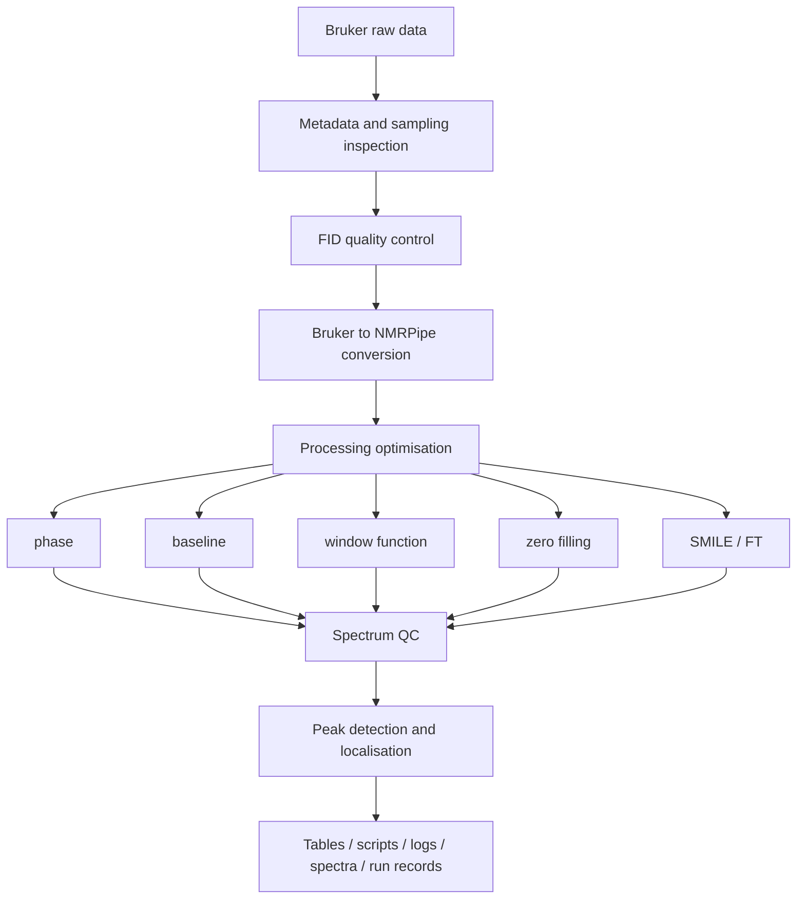

# nmrForge

[](https://github.com/RociferX/nmrforge/actions/workflows/ci.yml)

**An automation, parameter-optimisation and quality-control platform for Bruker multidimensional
NMR data.**

nmrForge reads a Bruker dataset, works out what experiment and what sampling scheme it is,
plans a processing strategy, drives NMRPipe to execute it, and writes down every parameter,
warning and output it produced so that the result can be reproduced and audited.

> The goal is not to be a thin graphical wrapper around NMRPipe. nmrForge tries to *understand*
> the experiment and the sampling scheme first, then generate an explainable processing plan,
> and keep the evidence (quality metrics, resolved parameters, run records) alongside the
> spectrum.

Current development version: **0.9.0** · Status: **active development**
Author: **Xuanfeng Li (李宣锋)** · Source licence: Apache-2.0 (see [LICENSE](LICENSE))
Distribution: source release; the AppImage is deferred and is not part of v0.9.0
Repository: <https://github.com/RociferX/nmrforge>

> **nmrForge is under active development. Interfaces and processing defaults may change before
> v1.0.** Behaviour that is documented here is tested (see the test suite), but the Python/CLI API
> and the processing defaults are not frozen yet.

## What it does

- **Data understanding** - Bruker `acqus`/`acqu2s`/`acqu3s` metadata parsing, logical/physical
  dimension separation, experiment-type classification from pulse program plus nucleus
  combination, and uniform vs. NUS sampling detection.
- **Processing** - Bruker to NMRPipe conversion, automatic and manual phase correction,
  baseline optimisation, apodisation/window-function optimisation, zero filling, conventional
  Fourier transform, and 2D/3D NUS reconstruction with SMILE.
- **Quality control** - FID-level diagnostics (DC offset, bad points, non-finite values,
  anomalous traces), sampling-consistency checks, and spectrum-level quality metrics
  (signal-to-noise, phase quality, baseline quality, artefacts).
- **Peak analysis** - automatic peak detection with parabolic or 2D Gaussian sub-grid
  localisation, plus peak-table import/export in POKY-style tables.
- **Automation with records** - GUI, command line and Python API entry points; batch runs;
  scripts and candidate spectra are kept; each run stores the resolved parameters and the
  software/tool versions that produced it.
- **Viewing** - a standalone 1D/2D/3D spectrum viewer with projections and peak overlays.

## Workflow



## Architecture

```text
GUI / Viewer
    |
Workflow layer: understand -> plan -> process -> optimise -> QC -> artefacts
    |
ProcessingBackend  (NMRPipeBackend is the only production backend)
    |
core: project model, data reading, experiment identification, planning,
      processing primitives, optimisation, QC
```

The `core/`, `backend/`, `workflow/` and `nmrforge_api/` layers are Qt-free, so processing can
run headless on a server while `gui/` and `viewer/` provide the desktop interface.

## Repository layout

| Path | Contents |
| --- | --- |
| [`core/`](core/README.md) | data model, Bruker readers, experiment classification, sampling detection, peak localisation, QC and optimisation primitives (Qt-free) |
| [`backend/`](backend/README.md) | the NMRPipe/SMILE boundary: script generation and subprocess execution |
| [`workflow/`](workflow/README.md) | orchestration - import, stepwise processing, phase routes, peak picking, batch, diagnostics |
| [`gui/`](gui/README.md) | the PySide6 desktop application |
| [`viewer/`](viewer/README.md) | the 1D/2D/3D spectrum viewer, embedded by the GUI |
| [`ui_support/`](ui_support/README.md) | UI helpers shared by the GUI and the viewer |
| [`qtcompat/`](qtcompat/README.md) | the single module that names a Qt binding |
| [`nmrforge_api/`](nmrforge_api/README.md) | the scriptable parameter-study API and its CLI |
| [`config/`](config/README.md) | shipped defaults and machine-local overrides |
| [`presets/`](presets/README.md) | experiment templates; the YAML files are the single source |
| [`tests/`](tests/README.md) | the pytest suite: unit / integration / regression |
| [`examples/`](examples/README.md) | runnable synthetic-dataset and walkthrough scripts |
| [`packaging/`](packaging/README.md) | AppImage build assets (deferred distribution) |
| [`scripts/`](scripts/README.md) | standalone command-line tools and validation scripts |
| [`benchmarks/`](benchmarks/README.md) | the benchmark framework - framework only, no quoted results |
| [`docs/`](docs/README.md) | the documentation index |
| [`.github/`](.github/README.md) | the CI workflow and the contribution templates |

Dependencies run one way: `gui/` and `viewer/` on top, then `workflow/`, then `backend/`, with
`core/` at the bottom. [`tests/test_ownership.py`](tests/test_ownership.py) and
[`tests/test_qt_independence.py`](tests/test_qt_independence.py) enforce the split.

## Requirements

| Requirement | Notes |
| --- | --- |
| Python | 3.12 or newer for the current source release |
| NMRPipe | Required for real processing (conversion, FT, baseline, phase). Not bundled - install it yourself and make sure the executables are on `PATH`, or point nmrForge at the installation directory. |
| SMILE | Required for NUS reconstruction. Ships with NMRPipe and is located the same way. |
| Python packages | See `pyproject.toml`; `pip install -e .` installs them. |
| Display (GUI only) | The main window and viewer need a desktop session. Headless machines can use the Python API or the command line. |

nmrForge never ships, downloads or installs NMRPipe/SMILE for you. It detects them at runtime and
tells you what is missing. See [THIRD_PARTY.md](THIRD_PARTY.md) for the full dependency and
licence inventory.

## Installation

The v0.9.0 release contains source code only. **An AppImage is not included in this release.**
Clone the repository and use an editable install so the repository-root resources remain available:

```bash
git clone https://github.com/RociferX/nmrforge.git
cd nmrforge
python -m venv .venv
source .venv/bin/activate        # Windows: .venv\Scripts\activate
python -m pip install -e ".[test]"
python main.py
```

Real processing additionally requires NMRPipe; SMILE is needed for NUS reconstruction. They are
external programs and are never downloaded or bundled by nmrForge. A plain `pip install .` and a
wheel are not supported because runtime resources live at the repository root.

The AppImage build recipe remains in the repository for future binary work. It would bundle
PySide6/Qt and therefore requires a separate third-party licence and clean-machine release review.
See [APPIMAGE_RELEASE_CHECKLIST.md](APPIMAGE_RELEASE_CHECKLIST.md); do not treat the presence of
the build scripts as an available or approved binary.

## Quick start

**This release is installed from source.** Launch the GUI with `python main.py`. The steps below
also demonstrate what works without NMRPipe installed.

The example only needs a Bruker dataset directory and no NMRPipe to walk through data
understanding and quality control:

```bash
python examples/quickstart.py <bruker_dataset_directory>
```

To create a small synthetic dataset to try it with:

```bash
python examples/make_synthetic_dataset.py --out ./example_data/hsqc_2d --ndim 2 --nuclei 15N,1H
python examples/quickstart.py ./example_data/hsqc_2d
```

The full processing path additionally needs NMRPipe:

```bash
# 1. describe the dataset: experiment type, sampling, dimensions
python -m nmrforge_api init --study ./study --dataset /path/to/bruker/dataset

# 2. build and freeze a reference spectrum (needs NMRPipe)
python -m nmrforge_api reference --study ./study

# 3. pick the reference peak table
python -m nmrforge_api peaks --study ./study

# 4. run a parameter grid
python -m nmrforge_api sweep --study ./study --grid grid.yaml
```

## GUI usage

```bash
python main.py    # source-release GUI entry point; creates/reuses the local venv
```

The main window is organised around a project/experiment/dataset tree on the left, a processing
pipeline for the selected dataset in the middle, and per-scope logs on the right:

1. **Import** a Bruker dataset directory (experiment and sample metadata are filled in
   automatically and can be edited).
2. **Inspect** the detected experiment type, sampling mode and dimension layout.
3. **Process** - automated path (diagnostics, optimisation, final spectrum) or manual path
   (edit the generated script, then run it).
4. **Check quality** - the run report lists spectrum quality, data diagnostics and the resolved
   processing parameters, with warnings for anything that was changed automatically.
5. **Pick peaks** and export peak tables; export the spectrum to UCSF if needed.

The standalone viewer can be opened separately:

```bash
nmrforge-viewer                 # after an editable install
python -m viewer
```

## CLI usage

```bash
python -m nmrforge_api --help
python -m nmrforge_api init       --study DIR --dataset BRUKER_DIR
python -m nmrforge_api reference  --study DIR
python -m nmrforge_api peaks      --study DIR
python -m nmrforge_api sweep      --study DIR --grid grid.yaml
python -m nmrforge_api report     --study DIR
python -m nmrforge_api status     --study DIR
```

## Python API

```python
from nmrforge_api import run_parameter_study

result = run_parameter_study(
    "~/studies/hsqc_params",       # study root (resumable)
    "~/data/bmr12345/1",           # extracted Bruker dataset directory
    axes={"zero_fill": [1, 2, 4], "window.F1.off": [0.35, 0.45, 0.55]},
)
print(result.summary["delta_std_ppm"])
```

The scripting API is documented separately in [docs/external-api/README.md](docs/external-api/README.md);
it is self-contained and does not require the internal management documents.

## Example workflow

`examples/` contains a script that creates a minimal synthetic Bruker dataset and a walkthrough
script that runs data understanding, sampling inspection and FID diagnostics on it:

```bash
python examples/make_synthetic_dataset.py --out ./example_data/hsqc_2d --ndim 2 --nuclei 15N,1H
python examples/quickstart.py ./example_data/hsqc_2d
```

The synthetic dataset contains headers plus a small synthetic FID only; it is not real
spectroscopic data and is not suitable for scientific conclusions.

## Quality control

Automatic behaviour is meant to be visible, not silent:

- FID diagnostics report DC offset, non-finite points, all-zero traces and abnormally
  high-energy traces, with the affected index and the detection rule.
- Where a correction is applied, the affected points and the action taken are written into the
  processing log for that run.
- Spectrum-level QC reports signal-to-noise, phase quality, baseline quality and artefact
  scores, and refuses to silently downgrade a failed run to "success".
- Sampling metadata conflicts (for example, metadata that claims NUS while the sampling list
  actually covers the complete grid) are reported as conflicts rather than silently resolved.

Known gap: these records are written as structured log lines and run parameters today, not yet
as a single machine-readable quality-audit record per run. See
[PUBLIC_RELEASE_AUDIT.md](PUBLIC_RELEASE_AUDIT.md).

## Reproducibility and provenance

Each processing run creates a run record containing the run id, input references, resolved
parameters, referenced scripts, outputs, software version, external tool versions, timestamps and
warnings. The parameter-sweep API additionally writes `manifest.json`, `runs.json`,
`peak_positions.csv` and `uncertainty.csv` into the study directory.

`core.__version__` is the single source of the version number; `pyproject.toml` reads it
dynamically, so the package version and the version written into run records cannot drift apart.

## Limitations

These are deliberate, documented boundaries rather than unfinished features:

- Batch processing is **2D-only**; non-2D datasets are skipped with an explanation.
- SMILE parameter sweeps and re-running by rank are exposed for **2D NUS** only; 3D NUS
  processing works, but the 3D SMILE optimisation UI is hidden.
- Real processing requires an external NMRPipe/SMILE installation; without it only data
  understanding, planning and QC are available.
- The MATLAB-style analysis features that earlier versions contained (HSQC CSP analysis) were
  removed in 2026-09; see the CHANGELOG entry for the 2026-09-12 analysis removal.
- The Python API is not frozen; breaking changes are recorded in [CHANGELOG.md](CHANGELOG.md).

## Documentation

- [Documentation index](docs/README.md)
- [Getting started](docs/getting-started.md) | [Installation](docs/installation.md)
- [GUI guide](docs/gui.md) | [CLI reference](docs/cli.md) | [Python API](docs/python-api.md)
- [Processing model](docs/processing-model.md) | [QC system](docs/qc-system.md) | [Peak picking](docs/peak-picking.md) | [Batch processing](docs/batch-processing.md)
- [External dependencies](docs/external-dependencies.md) | [Troubleshooting](docs/troubleshooting.md) | [FAQ](docs/faq.md)
- [Architecture](docs/architecture.md) | [Scripting API](docs/external-api/README.md) | [Changelog](CHANGELOG.md)

## Citation

Citation metadata is being prepared in [CITATION.cff](CITATION.cff). The author list, author
order and affiliation are not finalised, so please treat the file as a placeholder and cite the
repository URL until a release with a DOI exists.

If you publish work that used the processing or reconstruction engines, cite NMRPipe and SMILE
as well - see [THIRD_PARTY.md](THIRD_PARTY.md).

## Tests

The suite runs without NMRPipe: the engine boundary is mocked, so a clone can be verified on any
machine with Python >= 3.12.

```bash
python -m pip install -e ".[test]"
python -m pytest -q                  # full suite (~1.3k tests)
python -m pytest -m unit             # fast subset (pure logic, seconds)
python -m ruff check .               # static checks
```

CI (GitHub Actions) runs the static checks, the full suite on Python 3.12 and 3.13, and a
release-readiness job; a self-hosted job runs the same suite against a real NMRPipe installation
when one is configured. Test files are flat by design and classified with the `unit` /
`integration` / `regression` markers (`tests/categories.py` is the single source).

## Contributing

See [CONTRIBUTING.md](CONTRIBUTING.md). In short: branch from `master`, keep the test suite green
(`pytest`), keep the linter clean (`ruff check .`), and describe what changed and why in the pull
request.

## Licence

**The source code is released under the Apache License 2.0** ([LICENSE](LICENSE), SPDX
`Apache-2.0`). The copyright holder is recorded there as "Xuanfeng Li (李宣锋)".

**A future AppImage has a separate distribution boundary.** It would bundle PySide6/Qt and other
third-party libraries, so their licences and the applicable LGPL-3.0 distribution requirements
must be satisfied and verified for the exact binary. No AppImage is distributed with v0.9.0.
This does not change the Apache-2.0 terms of nmrForge's own source code.

What this means in practice:

- **using nmrforge from source**: Apache-2.0, including the patent grant, the requirement to keep
  attribution notices, and a statement of changes if you redistribute modified files;
- **a future AppImage**: complete [APPIMAGE_RELEASE_CHECKLIST.md](APPIMAGE_RELEASE_CHECKLIST.md)
  against the final binary before redistribution;
- third-party components keep their own licences; see [THIRD_PARTY.md](THIRD_PARTY.md) and, for
  binaries, `packaging/linux/THIRD_PARTY_LICENSES/NOTICE.md`.

The reasoning behind the split is recorded in [LICENSE_OPTIONS.md](LICENSE_OPTIONS.md). Nothing here
is legal advice.

## 中文简介

nmrForge 面向 Bruker 1D/2D/3D NMR 数据,提供自动化处理、参数优化、质量控制与谱图查看。

核心设计:先理解实验与采样方式,再生成可解释的处理方案,并用质量指标与运行记录保存处理
依据——而不是只做 NMRPipe 的图形界面。

- **数据理解**:acqus/acqu2s/acqu3s 解析、逻辑/物理维度分离、按脉冲程序与核组合判定实验
  类型、uniform/NUS 采样识别;
- **处理**:Bruker → NMRPipe 转换、自动/人工相位、基线、窗函数、填零、常规 FT、2D/3D NUS
  的 SMILE 重构;
- **质量控制**:FID 诊断(直流偏置、坏点、非有限值、异常迹线)、采样一致性校验、谱图质量指标;
- **峰分析**:自动选峰 + 抛物线/2D 高斯亚格点定位,支持 POKY 风格峰表导入导出;
- **三种入口**:GUI、命令行(`python -m nmrforge_api`)、Python API(`nmrforge_api`);
- **独立查看器**:1D/2D/3D 谱图查看、投影与峰位叠加。

安装与快速上手见上文 Installation / Quick start;完整中文文档入口见
[docs/README.md](docs/README.md)。

**源码采用 Apache License 2.0**(SPDX `Apache-2.0`,正文见 [LICENSE](LICENSE)),版权人:
李宣锋(Xuanfeng Li)。当前版本 **0.9.0**,处于活跃开发中:接口与处理默认值在 v1.0 之前仍可能变化。

**v0.9.0 只发布源码,暂不发布 AppImage。**未来 AppImage 会捆绑 Qt/PySide6 与其他第三方库,
必须按最终产物逐项满足相应许可与 LGPL-3.0 分发要求,并完成干净机器验收。预留清单见
[APPIMAGE_RELEASE_CHECKLIST.md](APPIMAGE_RELEASE_CHECKLIST.md)。这不改变本项目源码的
Apache-2.0 条款。

第三方组件各自保留其许可,见 [THIRD_PARTY.md](THIRD_PARTY.md);二进制分发的声明见
`packaging/linux/THIRD_PARTY_LICENSES/NOTICE.md`。选择依据与随之而来的义务记录在
[LICENSE_OPTIONS.md](LICENSE_OPTIONS.md)。以上不构成法律意见。