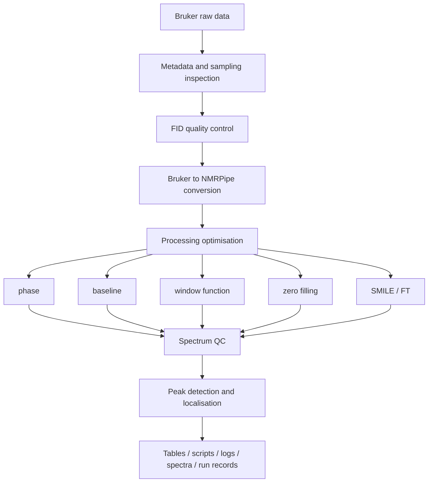

# nmrForge

**An automation, parameter-optimisation and quality-control platform for Bruker multidimensional
NMR data.**

nmrForge reads a Bruker dataset, works out what experiment and what sampling scheme it is,
plans a processing strategy, drives NMRPipe to execute it, and writes down every parameter,
warning and output it produced so that the result can be reproduced and audited.

> The goal is not to be a thin graphical wrapper around NMRPipe. nmrForge tries to *understand*
> the experiment and the sampling scheme first, then generate an explainable processing plan,
> and keep the evidence (quality metrics, resolved parameters, run records) alongside the
> spectrum.

Current development version: **0.2.199** (pre-release; the public API is not frozen yet).

## What it does

- **Data understanding** - Bruker `acqus`/`acqu2s`/`acqu3s` metadata parsing, logical/physical
  dimension separation, experiment-type classification from pulse program plus nucleus
  combination, and uniform vs. NUS sampling detection.
- **Processing** - Bruker to NMRPipe conversion, automatic and manual phase correction,
  baseline optimisation, apodisation/window-function optimisation, zero filling, conventional
  Fourier transform, and 2D/3D NUS reconstruction with SMILE.
- **Quality control** - FID-level diagnostics (DC offset, bad points, non-finite values,
  anomalous traces), sampling-consistency checks, and spectrum-level quality metrics
  (signal-to-noise, phase quality, baseline quality, artefacts).
- **Peak analysis** - automatic peak detection with parabolic or 2D Gaussian sub-grid
  localisation, plus peak-table import/export in POKY-style tables.
- **Automation with records** - GUI, command line and Python API entry points; batch runs;
  scripts and candidate spectra are kept; each run stores the resolved parameters and the
  software/tool versions that produced it.
- **Viewing** - a standalone 1D/2D/3D spectrum viewer with projections and peak overlays.

## Workflow



## Architecture

```text
GUI / Viewer
    |
Workflow layer: understand -> plan -> process -> optimise -> QC -> artefacts
    |
ProcessingBackend  (NMRPipeBackend is the only production backend)
    |
core: project model, data reading, experiment identification, planning,
      processing primitives, optimisation, QC
```

The `core/`, `backend/`, `workflow/` and `nmrforge_api/` layers are Qt-free, so processing can
run headless on a server while `gui/` and `viewer/` provide the desktop interface.

## Requirements

| Requirement | Notes |
| --- | --- |
| Python | 3.12 or newer - only for the developer/source install; the AppImage bundles its own runtime |
| NMRPipe | Required for real processing (conversion, FT, baseline, phase). Not bundled - install it yourself and make sure the executables are on `PATH`, or point nmrForge at the installation directory. |
| SMILE | Required for NUS reconstruction. Ships with NMRPipe and is located the same way. |
| Python packages | See `pyproject.toml`; `pip install -e .` installs them. |
| Display (GUI only) | The main window and viewer need a desktop session. Headless machines can use the Python API or the command line. |

nmrForge never ships, downloads or installs NMRPipe/SMILE for you. It detects them at runtime and
tells you what is missing. See [THIRD_PARTY.md](THIRD_PARTY.md) for the full dependency and
licence inventory.

## Installation

### Users: run the AppImage (recommended)

The supported distribution is a single-file Linux AppImage that bundles the Python runtime, Qt
and all runtime resources, so users do not have to install Python or any Python package:

```bash
chmod +x NMRForge-<version>-x86_64.AppImage
./NMRForge-<version>-x86_64.AppImage
```

You still need NMRPipe (and SMILE, which comes with it) installed on your own machine, because
nmrForge drives it rather than replacing it - see
[external-dependencies.md](docs/external-dependencies.md).

Anything after the first run is handled for you: the AppImage installs its own desktop entry and
icon on first launch. `--remove-desktop` removes them again, `NMRFORGE_NO_DESKTOP=1` skips the
desktop integration, and deleting the AppImage file leaves your project data untouched. If the
system cannot mount AppImages, run it with `--appimage-extract-and-run` or set
`APPIMAGE_EXTRACT_AND_RUN=1`.

Bundled into the AppImage: the application, PyQt6/pyqtgraph/NumPy/SciPy/Matplotlib/nmrglue,
`config/`, `presets/` and the GUI assets. Not bundled: NMRPipe, SMILE and any dataset.

Build one yourself with:

```bash
bash packaging/linux/build_appimage.sh     # needs Python 3.12+, pip and appimagetool
```

### Developers: editable source install

```bash
git clone <this repository>
cd nmrForge
pip install -e ".[test]"     # runtime dependencies + pytest
pip install -e ".[dev]"      # adds ruff
python main.py               # creates and reuses a local nmrforge/ virtual environment
```

A plain `pip install .` is **not** a supported distribution path: the runtime resources
(`config/`, `presets/`, `gui/assets/`) live at the repository root rather than inside a Python
package, so a wheel install cannot locate them. Editable installs and the AppImage are the
supported shapes - see [docs/packaging.md](docs/packaging.md).

## Quick start

**Users:** download or build the AppImage, launch it, and import a Bruker dataset directory in
the GUI. The steps below are the developer/source route and also demonstrate what works without
NMRPipe installed.

The example only needs a Bruker dataset directory and no NMRPipe to walk through data
understanding and quality control:

```bash
python examples/quickstart.py <bruker_dataset_directory>
```

To create a small synthetic dataset to try it with:

```bash
python examples/make_synthetic_dataset.py --out ./example_data/hsqc_2d --ndim 2 --nuclei 15N,1H
python examples/quickstart.py ./example_data/hsqc_2d
```

The full processing path additionally needs NMRPipe:

```bash
# 1. describe the dataset: experiment type, sampling, dimensions
python -m nmrforge_api init --study ./study --dataset /path/to/bruker/dataset

# 2. build and freeze a reference spectrum (needs NMRPipe)
python -m nmrforge_api reference --study ./study

# 3. pick the reference peak table
python -m nmrforge_api peaks --study ./study

# 4. run a parameter grid
python -m nmrforge_api sweep --study ./study --grid grid.yaml
```

## GUI usage

```bash
./NMRForge-<version>-x86_64.AppImage    # recommended, bundles everything
python main.py                         # development entry point (creates the local venv on first run)
```

The main window is organised around a project/experiment/dataset tree on the left, a processing
pipeline for the selected dataset in the middle, and per-scope logs on the right:

1. **Import** a Bruker dataset directory (experiment and sample metadata are filled in
   automatically and can be edited).
2. **Inspect** the detected experiment type, sampling mode and dimension layout.
3. **Process** - automated path (diagnostics, optimisation, final spectrum) or manual path
   (edit the generated script, then run it).
4. **Check quality** - the run report lists spectrum quality, data diagnostics and the resolved
   processing parameters, with warnings for anything that was changed automatically.
5. **Pick peaks** and export peak tables; export the spectrum to UCSF if needed.

The standalone viewer can be opened separately:

```bash
nmrforge-viewer                 # after an editable install
python -m viewer
```

## CLI usage

```bash
python -m nmrforge_api --help
python -m nmrforge_api init       --study DIR --dataset BRUKER_DIR
python -m nmrforge_api reference  --study DIR
python -m nmrforge_api peaks      --study DIR
python -m nmrforge_api sweep      --study DIR --grid grid.yaml
python -m nmrforge_api report     --study DIR
python -m nmrforge_api status     --study DIR
```

## Python API

```python
from nmrforge_api import run_parameter_study

result = run_parameter_study(
    "~/studies/hsqc_params",       # study root (resumable)
    "~/data/bmr12345/1",           # extracted Bruker dataset directory
    axes={"zero_fill": [1, 2, 4], "window.F1.off": [0.35, 0.45, 0.55]},
)
print(result.summary["delta_std_ppm"])
```

The scripting API is documented separately in [docs/external-api/README.md](docs/external-api/README.md);
it is self-contained and does not require the internal management documents.

## Example workflow

`examples/` contains a script that creates a minimal synthetic Bruker dataset and a walkthrough
script that runs data understanding, sampling inspection and FID diagnostics on it:

```bash
python examples/make_synthetic_dataset.py --out ./example_data/hsqc_2d --ndim 2 --nuclei 15N,1H
python examples/quickstart.py ./example_data/hsqc_2d
```

The synthetic dataset contains headers plus a small synthetic FID only; it is not real
spectroscopic data and is not suitable for scientific conclusions.

## Quality control

Automatic behaviour is meant to be visible, not silent:

- FID diagnostics report DC offset, non-finite points, all-zero traces and abnormally
  high-energy traces, with the affected index and the detection rule.
- Where a correction is applied, the affected points and the action taken are written into the
  processing log for that run.
- Spectrum-level QC reports signal-to-noise, phase quality, baseline quality and artefact
  scores, and refuses to silently downgrade a failed run to "success".
- Sampling metadata conflicts (for example, metadata that claims NUS while the sampling list
  actually covers the complete grid) are reported as conflicts rather than silently resolved.

Known gap: these records are written as structured log lines and run parameters today, not yet
as a single machine-readable quality-audit record per run. See
[PUBLIC_RELEASE_AUDIT.md](PUBLIC_RELEASE_AUDIT.md).

## Reproducibility and provenance

Each processing run creates a run record containing the run id, input references, resolved
parameters, referenced scripts, outputs, software version, external tool versions, timestamps and
warnings. The parameter-sweep API additionally writes `manifest.json`, `runs.json`,
`peak_positions.csv` and `uncertainty.csv` into the study directory.

`core.__version__` is the single source of the version number; `pyproject.toml` reads it
dynamically, so the package version and the version written into run records cannot drift apart.

## Limitations

These are deliberate, documented boundaries rather than unfinished features:

- Batch processing is **2D-only**; non-2D datasets are skipped with an explanation.
- SMILE parameter sweeps and re-running by rank are exposed for **2D NUS** only; 3D NUS
  processing works, but the 3D SMILE optimisation UI is hidden.
- Real processing requires an external NMRPipe/SMILE installation; without it only data
  understanding, planning and QC are available.
- The MATLAB-style analysis features that earlier versions contained (HSQC CSP analysis) were
  removed in 2026-09; see the CHANGELOG entry for the 2026-09-12 analysis removal.
- The Python API is not frozen; breaking changes are recorded in [CHANGELOG.md](CHANGELOG.md).

## Documentation

- [Documentation index](docs/README.md)
- [Getting started](docs/getting-started.md) | [Installation](docs/installation.md)
- [GUI guide](docs/gui.md) | [CLI reference](docs/cli.md) | [Python API](docs/python-api.md)
- [Processing model](docs/processing-model.md) | [QC system](docs/qc-system.md) | [Peak picking](docs/peak-picking.md) | [Batch processing](docs/batch-processing.md)
- [External dependencies](docs/external-dependencies.md) | [Troubleshooting](docs/troubleshooting.md) | [FAQ](docs/faq.md)
- [Architecture](docs/architecture.md) | [Scripting API](docs/external-api/README.md) | [Changelog](CHANGELOG.md)

## Citation

Citation metadata is being prepared in [CITATION.cff](CITATION.cff). The author list, author
order and affiliation are not finalised, so please treat the file as a placeholder and cite the
repository URL until a release with a DOI exists.

If you publish work that used the processing or reconstruction engines, cite NMRPipe and SMILE
as well - see [THIRD_PARTY.md](THIRD_PARTY.md).

## Contributing

See [CONTRIBUTING.md](CONTRIBUTING.md). In short: branch from `master`, keep the test suite green
(`pytest`), keep the linter clean (`ruff check .`), and describe what changed and why in the pull
request.

## Licence

**No licence has been chosen yet.** No `LICENSE` file is committed, which means the default
"all rights reserved" applies. The dependency analysis that constrains this choice is in
[LICENSE_OPTIONS.md](LICENSE_OPTIONS.md) and [THIRD_PARTY.md](THIRD_PARTY.md): the GUI depends on
PyQt6, which is distributed under GPL-3.0-only or a commercial licence, so a permissive licence
for the whole project is not currently an open option without migrating the GUI to PySide6.

Publishing this repository is itself a distribution of the program, so it is not possible to avoid
the question by recommending the AppImage: the AppImage only changes how users install it. The
decision has to be made before the repository becomes visible to anyone else. Do not redistribute
this repository before then.

## 中文简介

nmrForge 面向 Bruker 1D/2D/3D NMR 数据,提供自动化处理、参数优化、质量控制与谱图查看。

核心设计:先理解实验与采样方式,再生成可解释的处理方案,并用质量指标与运行记录保存处理
依据——而不是只做 NMRPipe 的图形界面。

- **数据理解**:acqus/acqu2s/acqu3s 解析、逻辑/物理维度分离、按脉冲程序与核组合判定实验
  类型、uniform/NUS 采样识别;
- **处理**:Bruker → NMRPipe 转换、自动/人工相位、基线、窗函数、填零、常规 FT、2D/3D NUS
  的 SMILE 重构;
- **质量控制**:FID 诊断(直流偏置、坏点、非有限值、异常迹线)、采样一致性校验、谱图质量指标;
- **峰分析**:自动选峰 + 抛物线/2D 高斯亚格点定位,支持 POKY 风格峰表导入导出;
- **三种入口**:GUI、命令行(`python -m nmrforge_api`)、Python API(`nmrforge_api`);
- **独立查看器**:1D/2D/3D 谱图查看、投影与峰位叠加。

安装与快速上手见上文 Installation / Quick start;完整中文文档入口见
[docs/README.md](docs/README.md)。

**许可状态:尚未选择许可证**,在决定之前请勿再分发。GUI 依赖 PyQt6(GPL-3.0-only 或商业
许可),因此本项目当前无法整体采用 MIT/BSD/Apache 这类宽松许可证,除非将 GUI 迁移到
PySide6。详见 [LICENSE_OPTIONS.md](LICENSE_OPTIONS.md)。