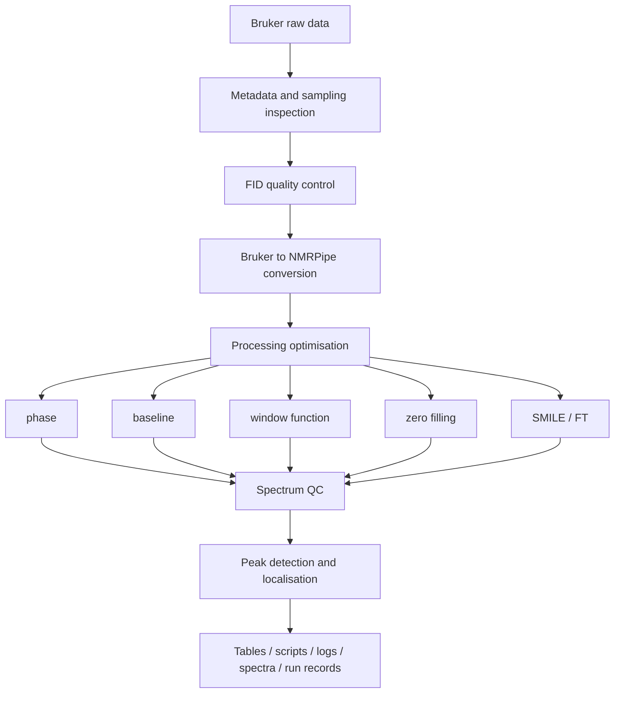

# nmrForge

[](https://github.com/RociferX/nmrforge/actions/workflows/ci.yml)

**An automation, parameter-optimisation and quality-control platform for Bruker multidimensional
NMR data.**

> ### Language
>
> The program, the code comments and this documentation are in English. The desktop interface
> follows the system language, can be pinned for a run with `NMRFORGE_LANG=zh`, or set for
> good in `Settings -> Software settings -> Interface language`; the Chinese
> interface text lives in [`ui_support/locales/zh.json`](ui_support/locales/zh.json) and is
> chosen at run time, from the same code base. A Chinese edition of the **documentation** is in
> [`Chinese_version/`](Chinese_version/README.md).

nmrForge reads a Bruker dataset, works out what experiment and what sampling scheme it is,
plans a processing strategy, drives NMRPipe to execute it, and writes down every parameter,
warning and output it produced so that the result can be reproduced and audited.

> The goal is not to be a thin graphical wrapper around NMRPipe. nmrForge tries to *understand*
> the experiment and the sampling scheme first, then generate an explainable processing plan,
> and keep the evidence (quality metrics, resolved parameters, run records) alongside the
> spectrum.

Current development version: **0.11.0** · Status: **active development**
Author: **Xuanfeng Li** · Source licence: Apache-2.0 (see [LICENSE](LICENSE) and [NOTICE](NOTICE))
Distribution: source plus a Linux AppImage (one artefact; the interface language is switched at run time)
Releases: <https://github.com/RociferX/nmrforge/releases>
Repository: <https://github.com/RociferX/nmrforge>

> **Both tracks - the desktop application and the Python/CLI API (`nmrforge_api`) - are released as
> their first version; the release version is still 0.11.0.** Behaviour documented here is tested
> (see the test suite); processing defaults may still be adjusted before the release version reaches
> 1.0.

> ### Two tracks: the desktop application and the Python/CLI API
>
> - **Track A - the desktop application (mature).** The GUI drives the whole pipeline from a
>   Bruker dataset to processed spectra, peak tables, quality control and provenance records;
>   the Linux AppImages are built from it and it is the recommended path for routine work.
> - **Track B - the Python/CLI API (`nmrforge_api`, first version).** The parameter-study surface
>   (`StudySession`, sweeps, localisation targets, QC records, behaviour digest) is released as its
>   **first version** (`API_VERSION = "1.0"`, since 2026-09-22): names, defaults and the records it
>   writes are managed through `nmrforge_api.compat_manifest()` (`behavior_digest`,
>   `compat_level`, `affected`) and recorded in the release notes. Pin a commit and check the
>   manifest before treating a set of numbers as comparable.
>
> Both tracks live in one repository and both are at their first version; verify the numbers the
> API gives you against your own data.

> ### Support boundary
>
> nmrForge is a single-maintainer research project, not a supported product. Issues and
> questions are answered on a best-effort basis through GitHub; there is no response-time
> or compatibility guarantee, and no support for modified forks beyond this repository's
> own test suite. Scientific validation on real instrument data is still being built up -
> read [Limitations](#limitations) before relying on a processed result.

## What it does

- **Data understanding** - Bruker `acqus`/`acqu2s`/`acqu3s` metadata parsing, logical/physical
  dimension separation, experiment-type classification from pulse program plus nucleus
  combination, and uniform vs. NUS sampling detection.
- **Processing** - Bruker to NMRPipe conversion, automatic and manual phase correction,
  baseline optimisation, apodisation/window-function optimisation, zero filling, conventional
  Fourier transform, and 2D/3D NUS reconstruction with SMILE.
- **Quality control** - FID-level diagnostics (DC offset, bad points, non-finite values,
  anomalous traces), sampling-consistency checks, and spectrum-level quality metrics
  (signal-to-noise, phase quality, baseline quality, artefacts).
- **Peak analysis** - automatic peak detection with parabolic or 2D Gaussian sub-grid
  localisation, plus peak-table import/export in POKY-style tables.
- **Automation with records** - GUI, command line and Python API entry points; batch runs;
  scripts and candidate spectra are kept; each run stores the resolved parameters and the
  software/tool versions that produced it.
- **Viewing** - a standalone 1D/2D/3D spectrum viewer with projections and peak overlays.

## Workflow



## Architecture

```text
GUI / Viewer
    |
Workflow layer: understand -> plan -> process -> optimise -> QC -> artefacts
    |
ProcessingBackend  (NMRPipeBackend is the only production backend)
    |
core: project model, data reading, experiment identification, planning,
      processing primitives, optimisation, QC
```

The `core/`, `backend/`, `workflow/` and `nmrforge_api/` layers are Qt-free, so processing can
run headless on a server while `gui/` and `viewer/` provide the desktop interface.

## Repository layout

| Path | Contents |
| --- | --- |
| [`core/`](core/README.md) | data model, Bruker readers, experiment classification, sampling detection, peak localisation, QC and optimisation primitives (Qt-free) |
| [`backend/`](backend/README.md) | the NMRPipe/SMILE boundary: script generation and subprocess execution |
| [`workflow/`](workflow/README.md) | orchestration - import, stepwise processing, phase routes, peak picking, batch, diagnostics |
| [`gui/`](gui/README.md) | the PySide6 desktop application |
| [`viewer/`](viewer/README.md) | the 1D/2D/3D spectrum viewer, embedded by the GUI |
| [`ui_support/`](ui_support/README.md) | UI helpers shared by the GUI and the viewer |
| [`qtcompat/`](qtcompat/README.md) | the single module that names a Qt binding |
| [`nmrforge_api/`](nmrforge_api/README.md) | the scriptable parameter-study API and its CLI |
| [`nmrforge_data/config/`](nmrforge_data/config/README.md) | shipped defaults and machine-local overrides |
| [`nmrforge_data/presets/`](nmrforge_data/presets/README.md) | experiment templates; the YAML files are the single source |
| [`tests/`](tests/README.md) | the pytest suite: unit / integration / regression |
| [`examples/`](examples/README.md) | runnable synthetic-dataset and walkthrough scripts |
| [`packaging/`](packaging/README.md) | AppImage build assets (shipped with v0.11.0; the release checklist stays in the maintainer's private repository) |
| [`scripts/`](scripts/README.md) | standalone command-line tools and validation scripts |
| [`docs/`](docs/README.md) | the documentation index |
| [`.github/`](.github/) | the CI workflow and the issue/PR templates |

Dependencies run one way: `gui/` and `viewer/` on top, then `workflow/`, then `backend/`, with
`core/` at the bottom. [`tests/test_ownership.py`](tests/test_ownership.py) and
[`tests/test_qt_independence.py`](tests/test_qt_independence.py) enforce the split.

## Requirements

| Requirement | Notes |
| --- | --- |
| Python | 3.12 or newer for the current source release |
| NMRPipe | Required for real processing (conversion, FT, baseline, phase). Not bundled - install it yourself and make sure the executables are on `PATH`, or point nmrForge at the installation directory. |
| SMILE | Required for NUS reconstruction. Ships with NMRPipe and is located the same way. |
| Python packages | See `pyproject.toml`; `pip install -e .` installs them. |
| Display (GUI only) | The main window and viewer need a desktop session. Headless machines can use the Python API or the command line. |

nmrForge never ships, downloads or installs NMRPipe/SMILE for you. It detects them at runtime and
tells you what is missing. See [THIRD_PARTY.md](THIRD_PARTY.md) for the full dependency and
licence inventory.

## Installation

v0.11.0 ships two things: the **Linux AppImage** and the **source**.
The AppImage bundles Python and Qt, so it needs no environment of its own
([releases page](https://github.com/RociferX/nmrforge/releases)); for the source, clone the
repository and use an editable install so the repository-root resources remain available:

```bash
git clone https://github.com/RociferX/nmrforge.git
cd nmrforge
python -m venv .venv
source .venv/bin/activate        # Windows: .venv\Scripts\activate
python -m pip install -e ".[test]"
python main.py
```

Real processing additionally requires NMRPipe; SMILE is needed for NUS reconstruction. They are
external programs and are never downloaded or bundled by nmrForge. `pip install .` and a wheel
are supported since 2026-09-21: the runtime resources ship inside the `nmrforge_data` package
(see [docs/packaging.md](docs/packaging.md)); the editable install above stays the recommended
development path.

The AppImage build recipe is [packaging/linux/build_appimage.sh](packaging/linux/build_appimage.sh):
it builds **one** artefact, and the interface language is decided at run time (`NMRFORGE_LANG`/
`NMRFORGE_LANGUAGE`, then the preference stored in the settings, then the system locale, falling
back to the default language this tree declares in
[`ui_support/locales/default.json`](ui_support/locales/default.json)); `BUILD_INFO.txt` records the
version, the full commit, the default language and the bundled dependency versions. It bundles
PySide6/Qt, which are distributed under LGPL-3.0 with their licence texts and notice inside the
artefact (`./NMRForge-<version>-x86_64.AppImage --licenses`). Every release first completes the
release checklist kept in the maintainer's private repository. Do not treat the build
scripts as an available or approved binary.

## Quick start

**This release is installed from source.** Launch the GUI with `python main.py`. The steps below
also demonstrate what works without NMRPipe installed.

The example only needs a Bruker dataset directory and no NMRPipe to walk through data
understanding and quality control:

```bash
python examples/quickstart.py <bruker_dataset_directory>
```

To create a small synthetic dataset to try it with:

```bash
python examples/make_synthetic_dataset.py --out ./example_data/hsqc_2d --ndim 2 --nuclei 15N,1H
python examples/quickstart.py ./example_data/hsqc_2d
```

The full processing path additionally needs NMRPipe:

```bash
# 1. describe the dataset: experiment type, sampling, dimensions
python -m nmrforge_api init --study ./study --dataset /path/to/bruker/dataset

# 2. build and freeze a reference spectrum (needs NMRPipe)
python -m nmrforge_api reference --study ./study

# 3. pick the reference peak table
python -m nmrforge_api peaks --study ./study

# 4. run a parameter grid
python -m nmrforge_api sweep --study ./study --grid grid.yaml
```

## GUI usage (Track A - mature)

```bash
python main.py    # source-release GUI entry point; creates/reuses the local venv
```

The main window is organised around a project/experiment/dataset tree on the left, a processing
pipeline for the selected dataset in the middle, and per-scope logs on the right:

1. **Import** a Bruker dataset directory (experiment and sample metadata are filled in
   automatically and can be edited).
2. **Inspect** the detected experiment type, sampling mode and dimension layout.
3. **Process** - automated path (diagnostics, optimisation, final spectrum) or manual path
   (edit the generated script, then run it).
4. **Check quality** - the run report lists spectrum quality, data diagnostics and the resolved
   processing parameters, with warnings for anything that was changed automatically.
5. **Pick peaks** and export peak tables; export the spectrum to UCSF if needed.

The standalone viewer can be opened separately:

```bash
nmrforge-viewer                 # after an editable install
python -m viewer
```

## CLI usage (Track B - in flux)

```bash
python -m nmrforge_api --help
python -m nmrforge_api init       --study DIR --dataset BRUKER_DIR
python -m nmrforge_api reference  --study DIR
python -m nmrforge_api peaks      --study DIR
python -m nmrforge_api sweep      --study DIR --grid grid.yaml
python -m nmrforge_api report     --study DIR
python -m nmrforge_api status     --study DIR
```

## Python API (Track B - in flux)

```python
from nmrforge_api import (
    position_uncertainty,
    run_parameter_study,
    uncertainty_summary,
)

result = run_parameter_study(
    "~/studies/hsqc_params",       # study root (resumable)
    "~/data/bmr12345/1",           # extracted Bruker dataset directory
    axes={"zero_fill": [1, 2, 4], "window.F1.off": [0.35, 0.45, 0.55]},
)
print(result.summary["status_counts"])      # what this run did (execution summary)

# Statistics are a **separate** step: pair the same peak across the runs of one
# workflow to get peak-position uncertainty (the CSP detection floor).
# ``StudyResult.summary`` reports execution only and carries no statistics.
by_run = {run.workflow_id: run.measurements for run in result.runs}
print(uncertainty_summary(position_uncertainty(by_run))["delta_std_ppm"])
```

The scripting API is documented separately in [docs/external-api/README.md](docs/external-api/README.md);
it is self-contained and does not require the internal management documents.

## Example workflow

`examples/` contains a script that creates a minimal synthetic Bruker dataset and a walkthrough
script that runs data understanding, sampling inspection and FID diagnostics on it:

```bash
python examples/make_synthetic_dataset.py --out ./example_data/hsqc_2d --ndim 2 --nuclei 15N,1H
python examples/quickstart.py ./example_data/hsqc_2d
```

The synthetic dataset contains headers plus a small synthetic FID only; it is not real
spectroscopic data and is not suitable for scientific conclusions.

## Quality control

Automatic behaviour is meant to be visible, not silent:

- FID diagnostics report DC offset, non-finite points, all-zero traces and abnormally
  high-energy traces, with the affected index and the detection rule.
- Where a correction is applied, the affected points and the action taken are written into the
  processing log for that run.
- Spectrum-level QC reports signal-to-noise, phase quality, baseline quality and artefact
  scores, and refuses to silently downgrade a failed run to "success".
- Sampling metadata conflicts (for example, metadata that claims NUS while the sampling list
  actually covers the complete grid) are reported as conflicts rather than silently resolved.

Known gap: these records are written as structured log lines and run parameters today, not yet
as a single machine-readable quality-audit record per run. See
the maintainer's private release audit.

## Reproducibility and provenance

Each processing run creates a run record containing the run id, input references, resolved
parameters, referenced scripts, outputs, software version, external tool versions, timestamps and
warnings. The parameter-sweep API additionally writes `manifest.json`, `runs.json`,
`peak_positions.csv` and `uncertainty.csv` into the study directory.

`core.__version__` is the single source of the version number; `pyproject.toml` reads it
dynamically, so the package version and the version written into run records cannot drift apart.

## Limitations

These are deliberate, documented boundaries rather than unfinished features:

- Batch processing is **2D-only**; non-2D datasets are skipped with an explanation.
- SMILE parameter sweeps and re-running by rank are exposed for **2D NUS** only; 3D NUS
  processing works, but the 3D SMILE optimisation UI is hidden.
- Real processing requires an external NMRPipe/SMILE installation; without it only data
  understanding, planning and QC are available.
- **The tool can rewrite the project's own copy of the raw data** (never your original
  dataset). When NUS bad points are detected, `ser` and `nuslist` under
  `<project>/<exp>/<data>/raw/` are rewritten in whole rows, with `ser.bak` / `nuslist.bak`
  kept beside them. The write goes to a temporary file and then `os.replace`, which breaks a
  hard or symbolic link, so a linked original dataset is left untouched; when the row layout
  cannot be determined the code falls back to cleaning the generated FID instead. The cleanup
  only runs when bad points are actually found.
- **The published history was restarted** at the snapshot commit. The earlier public history
  carried real sample names and developer-machine paths, so it was replaced rather than
  rewritten; evolution is not traceable through the public commit log by design, and the
  version history lives in the release notes.
- **The lint gate is `ruff check .`.** `ruff format` is advisory: the existing tree is not
  format-clean, so `ruff format --check .` reports many files on purpose and reformatting is
  not part of the contribution flow.
- A local `build/` directory from wheel or AppImage work is git-ignored and never part of the
  repository; do not run the tests from inside it.
- The MATLAB-style analysis features that earlier versions contained (HSQC CSP analysis) were
  removed in 2026-09 (see the release notes for that version).
- The Python API is at its first version (`API_VERSION = "1.0"`); later changes follow the
  `compat_manifest()` classification and are recorded in the
  [release notes](https://github.com/RociferX/nmrforge/releases).

## Documentation

- [Documentation index](docs/README.md)
- [Getting started](docs/getting-started.md) | [Installation](docs/installation.md)
- [GUI guide](docs/gui.md) | [CLI reference](docs/cli.md) | [Python API](docs/python-api.md)
- [Processing model](docs/processing-model.md) | [QC system](docs/qc-system.md) | [Peak picking](docs/peak-picking.md) | [Batch processing](docs/batch-processing.md)
- [External dependencies](docs/external-dependencies.md) | [Troubleshooting](docs/troubleshooting.md) | [FAQ](docs/faq.md)
- [Architecture](docs/architecture.md) | [Release notes](https://github.com/RociferX/nmrforge/releases)

## Citation

[CITATION.cff](CITATION.cff) carries the citation metadata. The author and the repository URL
are confirmed; the affiliation is not, and there is no DOI yet, so cite the repository URL (or the
GitHub Release page of the version you used) until a DOI exists. The file states exactly which
two lines to add once a Zenodo release mints a DOI.

If you publish work that used the processing or reconstruction engines, cite NMRPipe and SMILE
as well - see [THIRD_PARTY.md](THIRD_PARTY.md).

## Evidence

- [Real-data evidence (public data set)](docs/evidence/real-data-comparison.md) - an **external
  truth check** on **one public data set** (the raw Bruker data of BMRB timedomain entry 53374): the
  final spectra with the published deposited chemical shifts overlaid, one-to-one per-peak recovery
  (**84.1%** at the tight tolerance of 1H 0.01 / 15N 0.05 ppm, 93.5% at 0.02/0.10 ppm), the chance
  background under the same convention (2.0%), QC scores and a real-machine repeatability snapshot. The
  criterion lives outside the software instead of comparing it with itself; it is evidence that the
  **automatic processing** is usable, whichever entry point (desktop application, CLI or scripting
  API) drives it.
- [Validation boundary: engineering regression vs scientific validation](docs/external-api/09-limitations-and-roadmap.md)
  section 9.5 - where each kind of check runs, where its artefacts land, and why scientific
  conclusions belong to downstream analysis (including the truth check the maintainer ran).
- **The raw files of that data set are public**: download them by their entry numbers and recompute
  with the commands on the page. The per-run JSON and log files stay on the machine that has
  NMRPipe. Aggregate numbers for other data sets cannot be recomputed from this repository alone;
  the input fingerprints (SHA-256) are listed so that a data owner can re-run them.

## Tests

The suite runs without NMRPipe: the engine boundary is mocked, so a clone can be verified on any
machine with Python >= 3.12.

```bash
python -m pip install -e ".[test]"
python -m pytest -q                  # full suite (~1.3k tests)
python -m pytest -m unit             # fast subset (pure logic; ~45 s, mostly collection)
python -m ruff check .               # static checks
```

CI (GitHub Actions) runs the static checks, the full suite on Python 3.12 and 3.13, and a
release-readiness job. One further self-hosted job (`external-engine`) re-runs that same suite
on a machine that has NMRPipe and publishes the log as an artifact. Be precise about what that
is: the suite never calls the engine, so the job is a drift check on the machine plus a
release-time gate, not an engine test. It is skipped unless a self-hosted runner is registered
and the repository variable `NMRFORGE_SELF_HOSTED_CI` is `true` - with the variable unset a
release tag alone does not run it. Engine-level work is run by hand: `scripts/vm_test.sh` on a
machine that has NMRPipe, and `scripts/vm_realdata_report.py` on laboratory data (its aggregate
report is published as a CI artifact only when `NMRFORGE_REAL_DATA_TARGETS` is configured).
Test files are flat by design and classified with the `unit` / `integration` / `regression`
markers (`tests/categories.py` is the single source).

## Contributing

See [CONTRIBUTING.md](CONTRIBUTING.md). In short: branch from `main`, keep the test suite green
(`pytest`), keep the linter clean (`ruff check .`), and describe what changed and why in the pull
request.

## Licence

**The source code is released under the Apache License 2.0**: [LICENSE](LICENSE) holds the
verbatim Apache-2.0 text (SPDX `Apache-2.0`), and [NOTICE](NOTICE) records the copyright holder
("Xuanfeng Li") and the scope of the licence. The two are split so that licence-detection
tools recognise the repository as Apache-2.0.

**The AppImage has a separate distribution boundary.** It bundles PySide6/Qt and other
third-party libraries, which are distributed under their own licences (LGPL-3.0 among them).
The v0.11.0 AppImage completed the release checklist kept in the maintainer's private repository
(licence texts and notice inside the artefact, replace/relink path, clean-machine acceptance,
recorded SHA-256). Since 2026-09-21 the release carries **one** artefact - the interface language is
switched at run time - and it is built from the released source commit recorded in
`usr/share/doc/NMRForge/BUILD_INFO.txt`. This does not change the Apache-2.0 terms of nmrForge's own
source code.

What this means in practice:

- **using nmrforge from source**: Apache-2.0, including the patent grant, the requirement to keep
  attribution notices, and a statement of changes if you redistribute modified files;
- **the AppImage**: the v0.11.0 artefact completed the release checklist kept in the maintainer's
  private repository; re-check before redistribution;
- third-party components keep their own licences; see [THIRD_PARTY.md](THIRD_PARTY.md) and, for
  binaries, `packaging/linux/THIRD_PARTY_LICENSES/NOTICE.md`.

The reasoning behind the split is recorded in [LICENSE_OPTIONS.md](LICENSE_OPTIONS.md). Nothing here
is legal advice.
