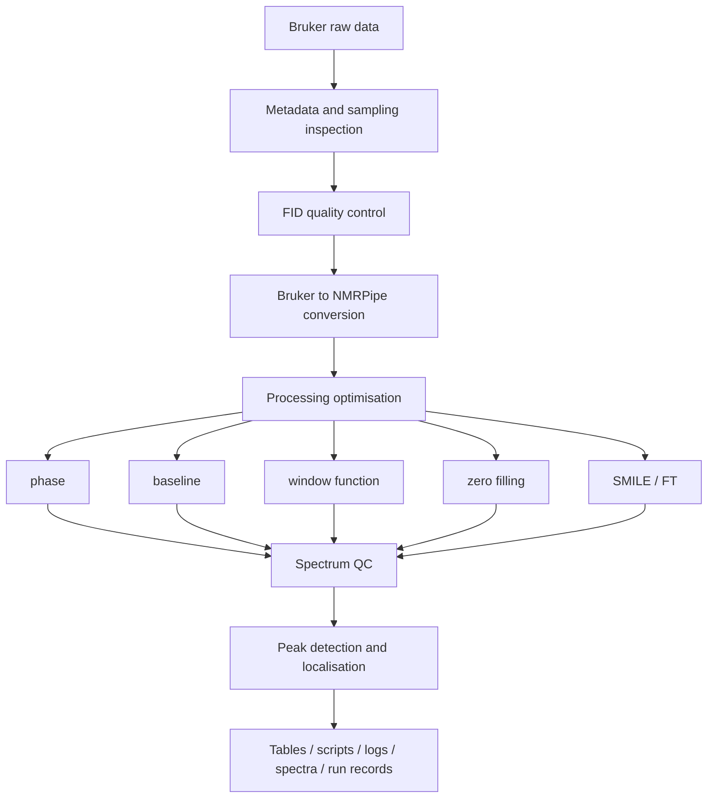

# nmrForge

[](https://github.com/RociferX/nmrforge/actions/workflows/ci.yml)

**An automation, parameter-optimisation and quality-control platform for Bruker multidimensional
NMR data.**

> ### Language
>
> The program, the code comments and this documentation are in English. The desktop interface
> follows the system language, can be pinned for a run with `NMRFORGE_LANG=zh`, or set for
> good in `Settings -> Software settings -> Interface language`; the Chinese
> interface text lives in [`ui_support/locales/zh.json`](ui_support/locales/zh.json) and is
> chosen at run time, from the same code base. A Chinese edition of the **documentation** is in
> [`Chinese_version/`](Chinese_version/README.md).

nmrForge reads a Bruker dataset, works out what experiment and what sampling scheme it is,
plans a processing strategy, drives NMRPipe to execute it, and writes down every parameter,
warning and output it produced so that the result can be reproduced and audited.

> The goal is not to be a thin graphical wrapper around NMRPipe. nmrForge tries to *understand*
> the experiment and the sampling scheme first, then generate an explainable processing plan,
> and keep the evidence (quality metrics, resolved parameters, run records) alongside the
> spectrum.

Source version: **1.0.3** · Release channel: **stable**
Author: **Xuanfeng Li**, University of Science and Technology of China · Source licence: Apache-2.0 (see [LICENSE](LICENSE) and [NOTICE](NOTICE))
Bundled-library licensing and redistribution: [LICENSE_OPTIONS.md](LICENSE_OPTIONS.md).
Distribution: 1.0.3 is source-only; the Linux AppImage remains 1.0.2 (one artefact with runtime language switching)
Releases: <https://github.com/RociferX/nmrforge/releases>
Repository: <https://github.com/RociferX/nmrforge>
Zenodo concept DOI (all archived versions): [10.5281/zenodo.22909415](https://doi.org/10.5281/zenodo.22909415). A version-specific DOI applies only to its archived snapshot.

> This page describes the **1.0.3 source** and its desktop/Python/CLI interfaces
> (`nmrforge_api`, current contract version 1.1 as of 2026-10-03). Published binaries are listed in GitHub Releases.
> Regression coverage is in the test suite; behaviour changes are declared through the compat process
> (`nmrforge_api/compat_declaration.py`: behaviour digests plus the
> `same/additive/behavior_changed/contract_changed` levels) rather than by "defaults may still
> change".

> ### Desktop application and Python/CLI API
>
> The desktop application and `nmrforge_api` are supported interfaces in the same source tree.
> The Python API is versioned separately (`API_VERSION = "1.1"`; current source contract as of 2026-10-03) and exposes a compatibility
> manifest for behaviour and contract changes. A released AppImage is a versioned binary built
> from a specific source revision; newer source updates do not update an existing AppImage.
> The current source API contract does not imply that the existing 1.0.2 AppImage includes v1.1.
>
> Check the manifest and release notes when comparing numerical results across software versions,
> and validate results against the data and experiment at hand.

> ### Support boundary
>
> nmrForge is a single-maintainer research project, not a supported product. Issues and
> questions are answered on a best-effort basis through GitHub; there is no response-time
> or compatibility guarantee, and no support for modified forks beyond this repository's
> own test suite. Scientific validation on real instrument data is still being built up -
> read [Limitations](#limitations) before relying on a processed result.

## What it does

- **Data understanding** - Bruker `acqus`/`acqu2s`/`acqu3s` metadata parsing, logical/physical
  dimension separation, experiment-type classification from pulse program plus nucleus
  combination, and uniform vs. NUS sampling detection.
- **Processing** - Bruker to NMRPipe conversion, automatic and manual phase correction,
  baseline optimisation, apodisation/window-function optimisation, zero filling, conventional
  Fourier transform, and 2D/3D NUS reconstruction with SMILE.
- **Quality control** - FID-level diagnostics (DC offset, bad points, non-finite values,
  anomalous traces), sampling-consistency checks, and spectrum-level quality metrics
  (signal-to-noise, phase quality, baseline quality, artefacts).
- **Peak analysis** - automatic peak detection with three-point parabolic sub-grid localisation,
  plus peak-table import/export in POKY-style tables.
- **Automation with records** - GUI, command line and Python API entry points; batch runs;
  scripts and candidate spectra are kept; each run stores the resolved parameters and the
  software/tool versions that produced it.
- **Viewing** - a standalone 1D/2D/3D spectrum viewer with projections and peak overlays.

## Workflow


```mermaid
flowchart TD
    A[Bruker raw data] --> B[Metadata and sampling inspection]
    B --> C[FID quality control]
    C --> D[Bruker to NMRPipe conversion]
    D --> E[Processing optimisation]
    E --> E1[phase]
    E --> E2[baseline]
    E --> E3[window function]
    E --> E4[zero filling]
    E --> E5[SMILE / FT]
    E1 --> F[Spectrum QC]
    E2 --> F
    E3 --> F
    E4 --> F
    E5 --> F
    F --> G[Peak detection and localisation]
    G --> H[Tables / scripts / logs / spectra / run records]
```

## Architecture

```text
GUI / Viewer
    |
Workflow layer: understand -> plan -> process -> optimise -> QC -> artefacts
    |
ProcessingBackend  (NMRPipeBackend is the only production backend)
    |
core: project model, data reading, experiment identification, planning,
      processing primitives, optimisation, QC
```

The `core/`, `backend/`, `workflow/` and `nmrforge_api/` layers are Qt-free, so processing can
run headless on a server while `gui/` and `viewer/` provide the desktop interface.

## Repository layout

| Path | Contents |
| --- | --- |
| [`core/`](core/README.md) | data model, Bruker readers, experiment classification, sampling detection, peak localisation, QC and optimisation primitives (Qt-free) |
| [`backend/`](backend/README.md) | the NMRPipe/SMILE boundary: script generation and subprocess execution |
| [`workflow/`](workflow/README.md) | orchestration - import, stepwise processing, phase routes, peak picking, batch, diagnostics |
| [`gui/`](gui/README.md) | the PySide6 desktop application |
| [`viewer/`](viewer/README.md) | the 1D/2D/3D spectrum viewer, embedded by the GUI |
| [`ui_support/`](ui_support/README.md) | UI helpers shared by the GUI and the viewer |
| [`qtcompat/`](qtcompat/README.md) | the single module that names a Qt binding |
| [`nmrforge_api/`](nmrforge_api/README.md) | the scriptable parameter-study API and its CLI |
| [`nmrforge_data/config/`](nmrforge_data/config/README.md) | shipped defaults and machine-local overrides |
| [`nmrforge_data/presets/`](nmrforge_data/presets/README.md) | experiment templates; the YAML files are the single source |
| [`tests/`](tests/README.md) | the pytest suite: unit / integration / regression |
| [`examples/`](examples/README.md) | runnable synthetic-dataset and walkthrough scripts |
| [`packaging/`](packaging/README.md) | AppImage build assets |
| [`scripts/`](scripts/README.md) | standalone command-line tools and validation scripts |
| [`docs/`](docs/README.md) | the documentation index |
| [`.github/`](.github/) | the CI workflow and the issue/PR templates |

Dependencies run one way: `gui/` and `viewer/` on top, then `workflow/`, then `backend/`, with
`core/` at the bottom. [`tests/test_ownership.py`](tests/test_ownership.py) and
[`tests/test_qt_independence.py`](tests/test_qt_independence.py) enforce the split.

## Requirements

| Requirement | Notes |
| --- | --- |
| Python | 3.12 or newer for the current source release |
| NMRPipe | Required for real processing (conversion, FT, baseline, phase). Not bundled - install it yourself and make sure the executables are on `PATH`, or point nmrForge at the installation directory. |
| SMILE | Required for NUS reconstruction. Ships with NMRPipe and is located the same way. |
| Python packages | See `pyproject.toml`; `pip install -e .` installs them. |
| Display (GUI only) | The main window and viewer need a desktop session. Headless machines can use the Python API or the command line. |

nmrForge never ships, downloads or installs NMRPipe/SMILE for you. It detects them at runtime and
tells you what is missing. See [THIRD_PARTY.md](THIRD_PARTY.md) for the full dependency and
licence inventory.

## Installation

The repository provides source, and the [releases page](https://github.com/RociferX/nmrforge/releases)
may provide a versioned Linux AppImage. Each AppImage corresponds to its named release and source
revision; source changes do not rebuild it. For the current source tree, clone the repository and
use an editable install:

```bash
git clone https://github.com/RociferX/nmrforge.git
cd nmrforge
python -m venv .venv
source .venv/bin/activate        # Windows: .venv\Scripts\activate
python -m pip install -e ".[test]"
python main.py
```

Real processing additionally requires NMRPipe; SMILE is needed for NUS reconstruction. They are
external programs and are never downloaded or bundled by nmrForge. `pip install .` and a wheel
are supported since 2026-09-21: the runtime resources ship inside the `nmrforge_data` package
(see [docs/packaging.md](docs/packaging.md)); the editable install above stays the recommended
development path.

The AppImage build recipe is [packaging/linux/build_appimage.sh](packaging/linux/build_appimage.sh).
It builds one artefact, and the interface language is decided at run time (`NMRFORGE_LANG`/
`NMRFORGE_LANGUAGE`, then the preference stored in the settings, then the system locale, falling
back to the default language this tree declares in
[`ui_support/locales/default.json`](ui_support/locales/default.json)); `BUILD_INFO.txt` records the
version, the full commit, the default language and the bundled dependency versions. It bundles
PySide6/Qt, which are distributed under LGPL-3.0 with their licence texts and notice inside the
artefact (`./NMRForge-<version>-x86_64.AppImage --licenses`). The build scripts are source
materials; an AppImage is available only when attached to a release.

## Quick start

**This release is installed from source.** Launch the GUI with `python main.py`. The steps below
also demonstrate what works without NMRPipe installed.

The example only needs a Bruker dataset directory and no NMRPipe to walk through data
understanding and quality control:

```bash
python examples/quickstart.py <bruker_dataset_directory>
```

To create a small synthetic dataset to try it with:

```bash
python examples/make_synthetic_dataset.py --out ./example_data/hsqc_2d --ndim 2 --nuclei 15N,1H
python examples/quickstart.py ./example_data/hsqc_2d
```

The full processing path additionally needs NMRPipe:

```bash
# 1. describe the dataset: experiment type, sampling, dimensions
python -m nmrforge_api init --study ./study --dataset /path/to/bruker/dataset

# 2. build and freeze a reference spectrum (needs NMRPipe)
python -m nmrforge_api reference --study ./study

# 3. pick the reference peak table
python -m nmrforge_api peaks --study ./study

# 4. run a parameter grid
python -m nmrforge_api sweep --study ./study --reference ./study --grid grid.yaml
```

## GUI usage (Track A - mature)

```bash
python main.py    # source-release GUI entry point; creates/reuses the local venv
```

The main window is organised around a project/experiment/dataset tree on the left, a processing
pipeline for the selected dataset in the middle, and per-scope logs on the right:

1. **Import** a Bruker dataset directory (experiment and sample metadata are filled in
   automatically and can be edited).
2. **Inspect** the detected experiment type, sampling mode and dimension layout.
3. **Process** - automated path (diagnostics, optimisation, final spectrum) or manual path
   (edit the generated script, then run it).
4. **Check quality** - the run report lists spectrum quality, data diagnostics and the resolved
   processing parameters, with warnings for anything that was changed automatically.
5. **Pick peaks** and export peak tables; export the spectrum to UCSF if needed.

The standalone viewer can be opened separately:

```bash
nmrforge-viewer                 # after an editable install
python -m viewer
```

## CLI usage

```bash
python -m nmrforge_api --help
python -m nmrforge_api init       --study DIR --dataset BRUKER_DIR
python -m nmrforge_api reference  --study DIR
python -m nmrforge_api peaks      --study DIR
python -m nmrforge_api sweep      --study DIR --reference DIR --grid grid.yaml
python -m nmrforge_api report     --study DIR
python -m nmrforge_api status     --study DIR
```

## Python API

```python
from nmrforge_api import run_reference_study, run_combination_study

run_reference_study(
    "~/studies/hsqc_params",       # study root (resumable)
    "~/data/bmr12345/1",           # extracted Bruker dataset directory
)
result = run_combination_study(
    "~/studies/hsqc_params",
    axes={"zero_fill": [1, 2, 4], "window.F1.off": [0.35, 0.45, 0.55]},
)
print(result.summary["status_counts"])      # what this run did (execution summary)

# The API does not match peaks across conditions or spectra and does not calculate statistics.
# Downstream analysis must apply its own matching criteria before statistical analysis;
# independent peak-picking runs are not a CSP detection floor.
```

The scripting API is documented separately in [docs/external-api/README.md](docs/external-api/README.md);
it is self-contained and does not require the internal management documents.

## Example workflow

`examples/` contains a script that creates a minimal synthetic Bruker dataset and a walkthrough
script that runs data understanding, sampling inspection and FID diagnostics on it:

```bash
python examples/make_synthetic_dataset.py --out ./example_data/hsqc_2d --ndim 2 --nuclei 15N,1H
python examples/quickstart.py ./example_data/hsqc_2d
```

The synthetic dataset contains headers plus a small synthetic FID only; it is not real
spectroscopic data and is not suitable for scientific conclusions.

## Quality control

Automatic behaviour is meant to be visible, not silent:

- FID diagnostics report DC offset, non-finite points, all-zero traces and abnormally
  high-energy traces, with the affected index and the detection rule.
- Where a correction is applied, the affected points and the action taken are written into the
  processing log for that run.
- Spectrum-level QC reports signal-to-noise, phase quality, baseline quality and artefact
  scores, and refuses to silently downgrade a failed run to "success".
- Sampling metadata conflicts (for example, metadata that claims NUS while the sampling list
  actually covers the complete grid) are reported as conflicts rather than silently resolved.

Applied QC corrections have an append-only machine-readable audit record (`qc_audit.jsonl`) in
addition to the run log and resolved parameters. The audit records corrections; it is not a
complete per-run snapshot of every QC result.

## Reproducibility and provenance

Each processing run creates a run record containing the run id, input references, resolved
parameters, referenced scripts, outputs, software version, external tool versions, timestamps and
warnings. The parameter-sweep API writes the manifest, workflow/run records and a unified
`peak_table_parabolic.csv`; see [Outputs and records](docs/external-api/06-outputs-and-records.md)
for the current schema and file layout.

`core.__version__` is the single source of the version number; `pyproject.toml` reads it
dynamically, so the package version and the version written into run records cannot drift apart.

## Limitations

These are deliberate, documented boundaries rather than unfinished features:

- Batch processing is **2D-only**; non-2D datasets are skipped with an explanation.
- SMILE parameter sweeps and re-running by rank are exposed for **2D NUS** only; 3D NUS
  processing works, but the 3D SMILE optimisation UI is hidden.
- Real processing requires an external NMRPipe/SMILE installation; without it only data
  understanding, planning and QC are available.
- **The tool can rewrite the project's own copy of the raw data** (never your original
  dataset). When NUS bad points are detected, `ser` and `nuslist` under
  `<project>/<exp>/<data>/raw/` are rewritten in whole rows, with `ser.bak` / `nuslist.bak`
  kept beside them. The write goes to a temporary file and then `os.replace`, which breaks a
  hard or symbolic link, so a linked original dataset is left untouched; when the row layout
  cannot be determined the code falls back to cleaning the generated FID instead. The cleanup
  only runs when bad points are actually found.
- **The published history was restarted** at the snapshot commit. The earlier public history
  carried real sample names and developer-machine paths, so it was replaced rather than
  rewritten; evolution is not traceable through the public commit log by design, and the
  version history lives in the release notes.
- **The lint gate is `ruff check .`.** `ruff format` is advisory: the existing tree is not
  format-clean, so `ruff format --check .` reports many files on purpose and reformatting is
  not part of the contribution flow.
- A local `build/` directory from wheel or AppImage work is git-ignored and never part of the
  repository; do not run the tests from inside it.
- The MATLAB-style analysis features that earlier versions contained (HSQC CSP analysis) were
  removed in 2026-09 (see the release notes for that version).
- The current Python API contract is v1.1 (`API_VERSION = "1.1"`, 2026-10-03); later changes follow the
  `compat_manifest()` classification and are recorded in the
  [release notes](https://github.com/RociferX/nmrforge/releases).

## Documentation

- [Documentation index](docs/README.md)
- [Getting started](docs/getting-started.md) | [Installation](docs/installation.md)
- [GUI guide](docs/gui.md) | [CLI reference](docs/cli.md) | [Python API](docs/python-api.md)
- [Processing model](docs/processing-model.md) | [QC system](docs/qc-system.md) | [Peak picking](docs/peak-picking.md) | [Batch processing](docs/batch-processing.md)
- [External dependencies](docs/external-dependencies.md) | [Troubleshooting](docs/troubleshooting.md) | [FAQ](docs/faq.md)
- [Architecture](docs/architecture.md) | [Release notes](https://github.com/RociferX/nmrforge/releases)

## Citation

[CITATION.cff](CITATION.cff) carries the citation metadata - author: Xuanfeng Li, University of
Science and Technology of China. Since 1.0.0 every release has a DOI: cite
`10.5281/zenodo.22909416` for this version (<https://doi.org/10.5281/zenodo.22909416>) or
`10.5281/zenodo.22909415` for all versions (<https://doi.org/10.5281/zenodo.22909415>). The Zenodo
deposit metadata comes from `.zenodo.json` in the repository, which takes precedence over
`CITATION.cff`.

If you publish work that used the processing or reconstruction engines, cite NMRPipe and SMILE
as well - see [THIRD_PARTY.md](THIRD_PARTY.md).

## Evidence

- [Real-data evidence (public data set)](docs/evidence/real-data-comparison.md) - a dated
  **historical evidence snapshot** from **one public data set** (the raw Bruker data of BMRB
  timedomain entry 53374): the
  final spectra with the published deposited chemical shifts overlaid, one-to-one per-peak recovery
  (**84.1%** at the tight tolerance of 1H 0.01 / 15N 0.05 ppm, 93.5% at 0.02/0.10 ppm), the chance
  background under the same convention (2.0%), QC scores and a real-machine repeatability snapshot. The
  criterion lives outside the software instead of comparing it with itself. These figures describe
  that historical run only; they are not a validation of the current source revision, a guarantee
  for other data, or a scientific conclusion. See the evidence page for its date and scope.

## Tests

The suite uses mocked engine boundaries and can run without NMRPipe on a supported Python
environment. Real-engine behaviour still requires NMRPipe/SMILE and separate validation.

```bash
python -m pip install -e ".[test]"
python -m pytest -q                  # full suite
python -m pytest -m unit             # fast subset (pure logic; ~45 s, mostly collection)
python -m ruff check .               # static checks
```

CI runs the checks configured for the repository. The ordinary test suite does not invoke
NMRPipe or SMILE; test markers are documented in `tests/categories.py`. Do not interpret a green
mocked test suite as real-engine or scientific validation.

## Contributing

See [CONTRIBUTING.md](CONTRIBUTING.md). In short: branch from `main`, keep the test suite green
(`pytest`), keep the linter clean (`ruff check .`), and describe what changed and why in the pull
request.

## Licence

**The source code is released under the Apache License 2.0**: [LICENSE](LICENSE) holds the
verbatim Apache-2.0 text (SPDX `Apache-2.0`), and [NOTICE](NOTICE) records the copyright holder
("Xuanfeng Li") and the scope of the licence. The two are split so that licence-detection
tools recognise the repository as Apache-2.0.

**The AppImage has a separate distribution boundary.** It bundles PySide6/Qt and other
third-party libraries, each under its own licence (including LGPL-3.0 components). A released
AppImage is tied to its release version and source commit; a source checkout may be newer. The
binary's licence notices and provenance are included with the release artefact. This does not
change the Apache-2.0 terms of nmrForge's own source code.

What this means in practice:

- **using nmrforge from source**: Apache-2.0, including the patent grant, the requirement to keep
  attribution notices, and a statement of changes if you redistribute modified files;
- **the AppImage**: check the notices and terms that accompany the specific binary before
  redistribution;
- third-party components keep their own licences; see [THIRD_PARTY.md](THIRD_PARTY.md) and, for
  binaries, `packaging/linux/THIRD_PARTY_LICENSES/NOTICE.md`.

Nothing here is legal advice.
