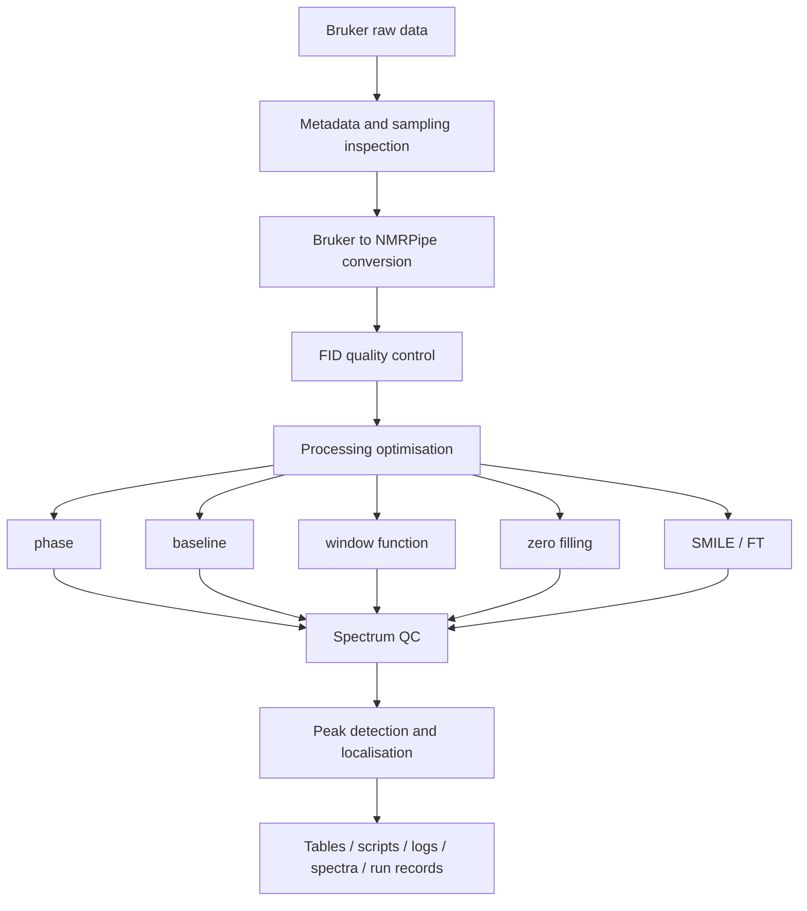

# nmrForge

[](https://github.com/RociferX/nmrforge/actions/workflows/ci.yml)

**An automation, parameter-optimisation and quality-control platform for Bruker multidimensional NMR data.**


nmrForge reads a Bruker dataset, identifies its experiment and sampling scheme, plans a processing
strategy, and drives NMRPipe and SMILE to produce spectra. It brings data inspection, automatic and
manual processing, optimisation, quality control, peak picking and viewing into one workflow, with
the resolved parameters, scripts, warnings and outputs saved alongside the result.

**Software: 1.0.5 · Python/CLI API: 1.1.1 · Target platform: Linux**

**For desktop use on Linux, the simplest option is the AppImage.**
[Download the 1.0.5 AppImage](https://github.com/RociferX/nmrforge/releases/download/v1.0.5/NMRForge-1.0.5-x86_64.AppImage)
and its [checksum file](https://github.com/RociferX/nmrforge/releases/download/v1.0.5/SHA256SUMS-v1.0.5.txt),
then follow [Installation](#installation). No separate Python or Qt setup is needed.
Real spectral processing still requires a separate NMRPipe installation; NUS reconstruction also needs SMILE.

Desktop users can use the AppImage or a source installation; the Python/CLI API uses a source
or package installation. API **v1.1.1** writes the **38-column** peak-table contract. The binary's
`BUILD_INFO.txt` identifies its version, source revision and dependencies.

Author: **Xuanfeng Li**, University of Science and Technology of China.
Source licence: [Apache-2.0](LICENSE), with attribution in [NOTICE](NOTICE).
Repository: [RociferX/nmrforge](https://github.com/RociferX/nmrforge).

> **Language:** the public code comments and documentation are in English, with a
> [Chinese documentation edition](Chinese_version/README.md). The same application supports
> English and Chinese: it follows the system language, accepts `NMRFORGE_LANG=en|zh` for a run,
> and offers a persistent choice in Settings → Software settings → Interface language.

The desktop application and the Qt-free Python/CLI API use the same processing backend. The API
can build references and run explicit parameter combinations or grids, with an independent peak
table for each candidate spectrum. It records processing results; matching peaks across conditions
and statistical inference belong to downstream analysis. See the [API guide](docs/external-api/README.md).

## What it does

- **Data understanding** - Bruker `acqus`/`acqu2s`/`acqu3s` metadata parsing, logical/physical
  dimension separation, experiment-type classification from pulse program plus nucleus
  combination, and uniform vs. NUS sampling detection.
- **Processing** - Bruker to NMRPipe conversion, automatic and manual phase correction,
  baseline optimisation, apodisation/window-function optimisation, zero filling, conventional
  Fourier transform, and 2D/3D NUS reconstruction with SMILE.
- **Quality control** - FID-level diagnostics (DC offset, bad points, non-finite values,
  anomalous traces), sampling-consistency checks, and spectrum-level quality metrics
  (signal-to-noise, phase quality, baseline quality, artefacts).
- **Peak analysis** - automatic peak detection with three-point parabolic sub-grid localisation,
  plus peak-table import/export in POKY-style tables.
- **Automation with records** - GUI, command line and Python API entry points; 2D batch runs;
  scripts and candidate spectra are kept; each run stores the resolved parameters and the
  software/tool versions that produced it.
- **Viewing** - a standalone 1D/2D/3D spectrum viewer with projections and peak overlays.

## Workflow


```mermaid
flowchart TD
    A[Bruker raw data] --> B[Metadata and sampling inspection]
    B --> D[Bruker to NMRPipe conversion]
    D --> C[FID quality control]
    C --> E[Processing optimisation]
    E --> E1[phase]
    E --> E2[baseline]
    E --> E3[window function]
    E --> E4[zero filling]
    E --> E5[SMILE / FT]
    E1 --> F[Spectrum QC]
    E2 --> F
    E3 --> F
    E4 --> F
    E5 --> F
    F --> G[Peak detection and localisation]
    G --> H[Tables / scripts / logs / spectra / run records]
```

## Architecture

```text
GUI / Viewer
    |
Workflow layer: understand -> plan -> process -> optimise -> QC -> artefacts
    |
ProcessingBackend  (NMRPipeBackend is the only production backend)
    |
core: project model, data reading, experiment identification, planning,
      processing primitives, optimisation, QC
```

The `core/`, `backend/`, `workflow/` and `nmrforge_api/` layers are Qt-free, so processing can
run headless on a server while `gui/` and `viewer/` provide the desktop interface.

## Repository layout

| Path | Contents |
| --- | --- |
| [`core/`](core/README.md) | data model, Bruker readers, experiment classification, sampling detection, peak localisation, QC and optimisation primitives (Qt-free) |
| [`backend/`](backend/README.md) | the NMRPipe/SMILE boundary: script generation and subprocess execution |
| [`workflow/`](workflow/README.md) | orchestration - import, stepwise processing, phase routes, peak picking, batch, diagnostics |
| [`gui/`](gui/README.md) | the PySide6 desktop application |
| [`viewer/`](viewer/README.md) | the 1D/2D/3D spectrum viewer, embedded by the GUI |
| [`ui_support/`](ui_support/README.md) | UI helpers shared by the GUI and the viewer |
| [`qtcompat/`](qtcompat/README.md) | the single module that names a Qt binding |
| [`nmrforge_api/`](nmrforge_api/README.md) | the scriptable parameter-study API and its CLI |
| [`nmrforge_data/config/`](nmrforge_data/config/README.md) | shipped defaults and machine-local overrides |
| [`nmrforge_data/presets/`](nmrforge_data/presets/README.md) | experiment templates; the YAML files are the single source |
| [`tests/`](tests/README.md) | the pytest suite: unit / integration / regression |
| [`examples/`](examples/README.md) | runnable synthetic-dataset and walkthrough scripts |
| [`packaging/`](packaging/README.md) | AppImage build assets |
| [`scripts/`](scripts/README.md) | standalone command-line tools and validation scripts |
| [`docs/`](docs/README.md) | the documentation index |
| [`.github/`](.github/) | the CI workflow and the issue/PR templates |

Dependencies run one way: `gui/` and `viewer/` on top, then `workflow/`, then `backend/`, with
`core/` at the bottom. [`tests/test_ownership.py`](tests/test_ownership.py) and
[`tests/test_qt_independence.py`](tests/test_qt_independence.py) enforce the split.

## Requirements

| Requirement | Notes |
| --- | --- |
| Python | 3.12 or newer for the current source release |
| NMRPipe | Required for real processing (conversion, FT, baseline, phase). Not bundled - install it yourself and make sure the executables are on `PATH`, or point nmrForge at the installation directory. |
| SMILE | Required for NUS reconstruction. Ships with NMRPipe and is located the same way. |
| Python packages | See `pyproject.toml`; `pip install -e .` installs them. |
| Display (GUI only) | The main window and viewer need a desktop session. Headless machines can use the Python API or the command line. |

nmrForge never ships, downloads or installs NMRPipe/SMILE for you. It detects them at runtime and
tells you what is missing. See [THIRD_PARTY.md](THIRD_PARTY.md) for the full dependency and
licence inventory.

## Installation

### Linux AppImage — simplest desktop setup

Download `NMRForge-1.0.5-x86_64.AppImage` and `SHA256SUMS-v1.0.5.txt` from the
[1.0.5 release](https://github.com/RociferX/nmrforge/releases/tag/v1.0.5), then run:

```bash
sha256sum -c SHA256SUMS-v1.0.5.txt
chmod +x NMRForge-1.0.5-x86_64.AppImage
./NMRForge-1.0.5-x86_64.AppImage
```

The AppImage bundles Python, Qt and the desktop application, so desktop users can start without
creating a Python environment or installing Python packages. NMRPipe and SMILE remain separate
installations. One AppImage supports both interface languages; its `BUILD_INFO.txt` identifies the
source commit and dependency versions. To view bundled licence notices, use `--licenses`.

### Source installation

Use a source installation for the Python/CLI API or to work with the source code.
Python 3.12 or newer is required. From a Linux terminal:

```bash
git clone https://github.com/RociferX/nmrforge.git
cd nmrforge
python -m venv .venv
source .venv/bin/activate
python -m pip install -e .
python main.py
```

Ordinary `pip install .` and wheel installations also carry the runtime resources. Install
NMRPipe separately for real processing and SMILE for NUS reconstruction; nmrForge does not bundle,
download or install them. See [Installation](docs/installation.md),
[External dependencies](docs/external-dependencies.md) and [Packaging](docs/packaging.md).
The [AppImage build recipe](packaging/linux/build_appimage.sh) is included for maintainers.

## Quick start

To inspect an existing Bruker dataset without running NMRPipe:

```bash
python examples/quickstart.py /path/to/bruker/dataset
```

Or create a small synthetic dataset and inspect its metadata, sampling and time-domain layout:

```bash
python examples/make_synthetic_dataset.py --out ./example_data/hsqc_2d --ndim 2 --nuclei 15N,1H
python examples/quickstart.py ./example_data/hsqc_2d
```

This walkthrough stops before engine-dependent processing. Synthetic data are for software
checks and demonstrations. For real spectra, use the GUI steps below or the Python/CLI API with
NMRPipe installed. The [getting-started guide](docs/getting-started.md) explains engine configuration.

## GUI usage

```bash
python main.py    # source-release GUI entry point; creates/reuses the local venv
```

The main window is organised around a project/experiment/dataset tree on the left, a processing
pipeline for the selected dataset in the middle, and per-scope logs on the right:

1. **Import** a Bruker dataset directory (experiment and sample metadata are filled in
   automatically and can be edited).
2. **Inspect** the detected experiment type, sampling mode and dimension layout.
3. **Process** - automated path (diagnostics, optimisation, final spectrum) or manual path
   (edit the generated script, then run it).
4. **Check quality** - the run report lists spectrum quality, data diagnostics and the resolved
   processing parameters, with warnings for anything that was changed automatically.
5. **Pick peaks** and export peak tables; export the spectrum to UCSF if needed.

The standalone viewer can be opened separately:

```bash
nmrforge-viewer                 # after an editable install
python -m viewer
```

## CLI usage

Register a dataset, build and freeze its reference, pick the reference peaks, then run explicit
parameter combinations. Reference and sweep processing require NMRPipe; NUS also requires SMILE.

```bash
python -m nmrforge_api --help
python -m nmrforge_api init --study ./study --dataset /path/to/bruker/dataset
python -m nmrforge_api reference --study ./study
python -m nmrforge_api peaks --study ./study

cat > combinations.csv <<'CSV'
zero_fill
1
2
4
CSV
python -m nmrforge_api sweep --study ./study --reference ./study --combos combinations.csv
python -m nmrforge_api report --study ./study
python -m nmrforge_api status --study ./study
```

See the [CLI reference](docs/external-api/04-cli-reference.md) for grids, conditions and options.

## Python API

```python
from nmrforge_api import run_reference_study, run_combination_study

run_reference_study(
    "~/studies/hsqc_params",
    datasets={"A": "~/data/bruker/1"},
)
result = run_combination_study(
    "~/studies/hsqc_params",
    combos=[{"zero_fill": 1}, {"zero_fill": 2}, {"zero_fill": 4}],
)
print(result.summary["workflow_ids"])
for run in result.runs:
    print(run.workflow_id, run.condition, run.status)
```

Each condition has its own reference, and each candidate spectrum has an independently detected
peak table. The API does not match peak identities across conditions or calculate downstream
statistics. Reference construction converts the raw inputs; combinations reuse the frozen FID
read-only. Explicit multi-segment import is opt-in with `segmented=True`; missing or incompatible
reference evidence requires rebuilding with `force=True`.

The separately versioned API is currently **v1.1.1**. Use `compat_manifest()` to inspect processing fingerprints and the 38-column table contract.
See the [API guide](docs/external-api/README.md), [Python reference](docs/python-api.md),
and [outputs and records](docs/external-api/06-outputs-and-records.md).

## Example workflow

`examples/` contains a script that creates a minimal synthetic Bruker dataset and a walkthrough
script that runs data understanding, sampling inspection and FID diagnostics on it:

```bash
python examples/make_synthetic_dataset.py --out ./example_data/hsqc_2d --ndim 2 --nuclei 15N,1H
python examples/quickstart.py ./example_data/hsqc_2d
```

The synthetic dataset contains headers plus a small synthetic FID only; it is not real
spectroscopic data and is not suitable for scientific conclusions.

## Quality control

Automatic behaviour is meant to be visible, not silent:

- FID diagnostics report DC offset, non-finite points, all-zero traces and abnormally
  high-energy traces, with the affected index and the detection rule.
- Where a correction is applied, the affected points and the action taken are written into the
  processing log for that run.
- Spectrum-level QC reports signal-to-noise, phase quality, baseline quality and artefact
  scores, and refuses to silently downgrade a failed run to "success".
- Sampling conflicts and unsupported layouts are reported. Missing NUS schedules are not
  guessed from arbitrary files in the dataset directory.

Applied QC corrections have an append-only machine-readable audit record (`qc_audit.jsonl`) in
addition to the run log and resolved parameters. The audit records corrections; it is not a
complete per-run snapshot of every QC result.

## Reproducibility and provenance

Each processing run creates a run record containing the run id, input references, resolved
parameters, referenced scripts, outputs, software version, external tool versions, timestamps and
warnings. The parameter-sweep API writes the manifest, workflow/run records and a unified
`peak_table_parabolic.csv`; see [Outputs and records](docs/external-api/06-outputs-and-records.md)
for the current schema and file layout.

`core.__version__` is the single source of the version number; `pyproject.toml` reads it
dynamically, so the package version and the version written into run records cannot drift apart.

## Limitations

- Processing supports **2D and 3D, uniform and NUS**. Batch processing is **2D-only**.
- SMILE parameter sweeps and re-running by rank are available for **2D NUS**; the 3D NUS
  reconstruction route works, while the 3D SMILE optimisation UI is hidden.
- Real processing requires external NMRPipe, and NUS reconstruction additionally requires SMILE.
  Data inspection and the synthetic walkthrough remain available without these engines.
- Bad-point correction can rewrite the project's copied `ser` and `nuslist` in complete rows,
  with `ser.bak` and `nuslist.bak` retained. Writes use temporary files and replacement so linked
  original inputs remain untouched. If the row layout cannot be determined, correction is applied
  to the generated FID instead. The correction and affected data are logged.
- Automatic peak picking and QC depend on the experiment, signal quality and processing choices.
  Candidate matches in the evidence report are not assigned-peak recovery or a guarantee for other data.
- The Python API performs processing and archiving; it does not provide cross-spectrum peak
  matching, chemical-shift perturbation analysis or statistical inference.
- Linux is the target runtime. Questions and issues can be reported through
  [GitHub](https://github.com/RociferX/nmrforge/issues).

For input, cache and processing boundaries, see the [API limitations](docs/external-api/09-limitations-and-roadmap.md)
and [FAQ](docs/faq.md).

## Documentation

- [Documentation index](docs/README.md)
- [Getting started](docs/getting-started.md) | [Installation](docs/installation.md)
- [GUI guide](docs/gui.md) | [CLI reference](docs/cli.md) | [Python API](docs/python-api.md)
- [Processing model](docs/processing-model.md) | [QC system](docs/qc-system.md) | [Peak picking](docs/peak-picking.md) | [Batch processing](docs/batch-processing.md)
- [External dependencies](docs/external-dependencies.md) | [Troubleshooting](docs/troubleshooting.md) | [FAQ](docs/faq.md)
- [Architecture](docs/architecture.md) | [Release notes](https://github.com/RociferX/nmrforge/releases)

## Citation

[CITATION.cff](CITATION.cff) provides the software citation metadata, including the author,
version and release date. The concept DOI [10.5281/zenodo.22909415](https://doi.org/10.5281/zenodo.22909415)
identifies nmrForge across archived versions. For a specific archived release, use its version DOI
when available and identify the software version or commit used.

If your work uses NMRPipe or SMILE, cite those processing and reconstruction engines as well;
their references are listed in [THIRD_PARTY.md](THIRD_PARTY.md).

## Evidence

The [four-route comparison report](docs/evidence/real-data-comparison.md) presents results obtained
with the current data-processing workflow, including spectra, processing scripts, parameter comparisons,
candidate statistics and limitations for:

| Processing route | Input and reference | Reference-candidate matches |
| --- | --- | --- |
| 2D uniform | BMRB 27493 HSQC; author-supplied Bruker spectrum | 125/126 (99.21%) |
| Controlled 2D NUS | BMRB 27493 uniform raw data downsampled at 75% requested, 68/90 increments (75.56%) actual; corresponding NMRForge uniform result | 123/127 (96.85%) |
| 3D uniform | BMRB 15750 HNCO; full 3D reference rebuilt with the author's scripts | HN 80/84; HC 72/81; NC 64/71 |
| Acquired 3D NUS | BMRB 52533 HNCO, 25% acquired sampling; deposited full 3D reference | HN 89/89; HC 93/93; NC 79/79 |

The report compares main-signal positions, phase residuals, ALT/NEG encoding, resolved sweep
widths and the scripts used by the automatic and reference processing routes.

The 2D NUS example is **controlled artificial downsampling of uniform raw data**, not acquired
NUS, and its reference tests consistency with the corresponding automatic uniform result.
Three-dimensional comparisons crop a common full 3D window before independently matching signed
HN, HC and NC projections. Matching means matched pairs divided by reference candidates;
it is not assigned-peak recovery. Overlap, weak structure and side lobes require visual assessment.

See the full report for methods, results and limitations.

## Tests

The engineering suite uses mocked engine boundaries and does not need NMRPipe or SMILE.
On Linux, install the development extras and run:

```bash
python -m pip install -e ".[dev]"
QT_QPA_PLATFORM=offscreen python -m pytest -q
QT_QPA_PLATFORM=offscreen python -m pytest -m unit
python -m ruff check .
```

CI runs the repository's configured checks. Passing mocked tests establishes covered software
behaviour; real-engine evidence is documented separately and is not comprehensive scientific validation.
Test classifications are recorded in `tests/categories.py`.

## Contributing

See [CONTRIBUTING.md](CONTRIBUTING.md). In short: branch from `main`, keep the test suite green
(`pytest`), keep the linter clean (`ruff check .`), and describe what changed and why in the pull
request.

## Licence

**The source code is released under the Apache License 2.0**: [LICENSE](LICENSE) holds the
verbatim Apache-2.0 text (SPDX `Apache-2.0`), and [NOTICE](NOTICE) records the copyright holder
("Xuanfeng Li") and the scope of the licence. The two are split so that licence-detection
tools recognise the repository as Apache-2.0.

**The AppImage has a separate distribution boundary.** It bundles PySide6/Qt and other
third-party libraries, each under its own licence (including LGPL-3.0 components). A released
AppImage is tied to its release version and source commit; a source checkout may be newer. The
binary's licence notices and provenance are included with the release artefact. This does not
change the Apache-2.0 terms of nmrForge's own source code.

See [LICENSE_OPTIONS.md](LICENSE_OPTIONS.md) for third-party licensing and redistribution notes.

What this means in practice:

- **using nmrforge from source**: Apache-2.0, including the patent grant, the requirement to keep
  attribution notices, and a statement of changes if you redistribute modified files;
- **the AppImage**: check the notices and terms that accompany the specific binary before
  redistribution;
- third-party components keep their own licences; see [THIRD_PARTY.md](THIRD_PARTY.md) and, for
  binaries, `packaging/linux/THIRD_PARTY_LICENSES/NOTICE.md`.

Nothing here is legal advice.
