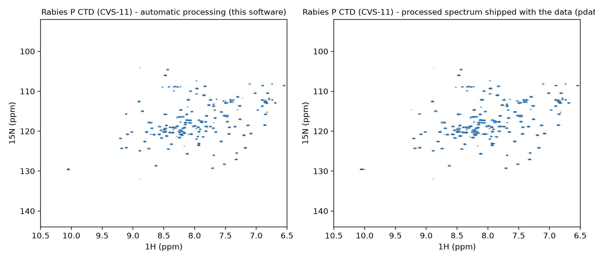
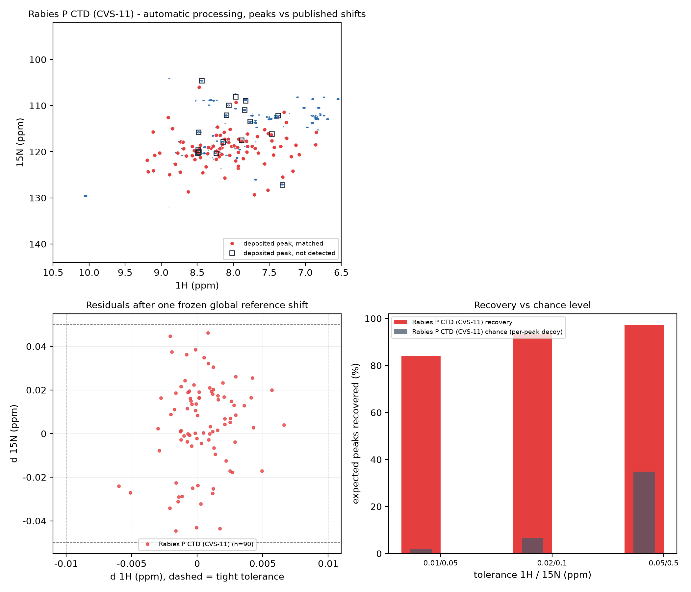

# Real-data evidence (public data)

This page uses **one public data set only**: the raw Bruker data `15n-hsqc` from BMRB timedomain entry
**53374** - the C-terminal domain of the rabies virus P protein (CVS-11 strain). The raw data are
publicly downloadable, so **anyone can recompute these numbers from the same input**; the expected
peak positions come from the **backbone amide chemical shifts deposited with that entry** (the expected
peak table itself is not committed - only its sha256).

## 1. Spectrum comparison: automatic processing vs **the processed spectrum shipped with the data**



The left column is the **automatic processing** result of this software; the right column is the
**processed spectrum shipped with the public data** (Bruker `pdata/1`, distributed with the raw data and
processed by the data provider). Both columns use the **same ppm window** (1H 6.5-10.5 ppm / 15N
92-144 ppm) and the same contour convention (each normalised to its own maximum). **This figure carries no
peak markers** - it is there to judge spectrum quality (lineshape, phase, baseline, artefacts); the
peak-position comparison is the second figure and section 2.

**The two columns are already aligned; nothing is shifted for display.** The 15N projection
cross-correlation peaks at **+0.005 ppm** (correlation 0.9860 without any shift, 0.9863 after it),
the 1H projection at -0.005 ppm, and the intensity centroids differ by +0.04 ppm. The visible
difference between the columns is **peak width and how much weak signal is visible**, not referencing.

**Manual review**: peak positions and peak shapes agree, with no truncation, phase error or obvious
artefact; **the spectrum is usable**. This comparison only says that "the automatically processed
spectrum is on the same level as the one the data provider produced"; the quantitative criterion is
section 2.



Overlaying the **deposited chemical shifts** gives the quantitative reading: the top panel is the
**automatically processed spectrum**, and the expected peaks are drawn in **three tiers** by how well they
line up - **red filled circles = matched inside the tight tolerance (1H 0.01 / 15N 0.05 ppm)**, **amber filled
circles = matched only at the loose tier (0.02 / 0.10 ppm)**, **grey filled circles = matched only at the
coarse tier (0.05 / 0.50 ppm)** - all of them positional shifts rather than missing peaks - and **black
open squares = matched at no tier**. Bottom-left is the calibrated **position residual** scatter (dashed
box = tight tolerance; loose-only peaks are drawn as open circles and coarse-only peaks as crosses, both
outside that box), bottom-right is the **recovery per tolerance** (dark bars = the chance background under
the same convention).

**Data citation (public data - cite the sources together with any number quoted from this page)**:

- **Data**: Biological Magnetic Resonance Data Bank (BMRB) timedomain entry **53374**, data set
  `15n-hsqc` - <https://bmrb.io/data_library/summary/index.php?bmrbId=53374> (the entry page lists the
  recommended citation for that entry).
- **Associated publication**: Rawlinson SM et al., *Conformational dynamics, RNA binding, and phase
  separation regulate the multifunctionality of rabies virus P protein*, Nature Communications (2025),
  doi:10.1038/s41467-025-65223-y.
- **The data bank itself**: *Ulrich EL et al., BioMagResBank, Nucleic Acids Res. 36, D402-D408 (2008),
  doi:10.1093/nar/gkm957*.

## 2. Truth recovery: the result matches **published chemical shifts**

The figure in section 1 is a qualitative comparison; this section gives the numbers. Convention:

- **Matching**: `d = hypot(d1H/tol_H, d15N/tol_N) <= 1`, **one-to-one, greedy, nearest first**; a
  detected peak can satisfy only one expected peak, and an expected peak that gets taken is recorded as
  "not detected"; only expected peaks inside the 1H/15N window the spectrum actually covers enter the
  denominator (peaks outside it cannot be detected at all - for this data set all 107 expected peaks
  fall inside the window).
- **Referencing**: deposited shifts and the spectrum's own referencing differ by a constant; it is
  calibrated **once** by a grid scan with progressively tightened tolerances and then **frozen** (the
  calibration only counts matches and never feeds window or parameter selection).
- **Chance background**: the expected peak table is translated **peak by peak** by >=5 match radii
  (fixed seed, 200 draws) and scored with the same matcher - recovery must always be read next to it.
- **Detection and refinement use the product's own convention**; candidate peaks are not edited and no
  peak is swapped in to make a match.

| | Rabies virus P protein C-terminal domain (CVS-11 strain) |
| --- | --- |
| Data source (public) | BMRB timedomain entry **53374**, data set `15n-hsqc` |
| Input fingerprint (files / bytes / sha256) | 38 / 16,930,169 / `534d74cc...cca6cd` |
| Expected peak table (sha256; rows -> inside the spectrum window) | `ad7006b4...f27d0ec7` (107 -> 107) |
| Final spectrum shape (15N x 1H) | 512 x 1264 |
| Global reference shift (1H / 15N, ppm, frozen after calibration) | -0.067 / -0.088 |
| Detected peaks (12 sigma) | 308 |
| **Expected-peak recovery** (12 sigma, **tight tolerance** 1H 0.01 / 15N 0.05 ppm) | **90 / 107 = 84.1%** |
| Position residual median (1H / 15N, ppm) | 0.0012 / 0.0164 |
| Position residual p90 (1H / 15N, ppm) | 0.0030 / 0.0343 |
| Unmatched detections / not-detected expected peaks | 218 / 17 |

**Stated plainly: on this real HSQC, after one global reference calibration, 84.1% of the deposited
peak positions are matched one-to-one at the tight tolerance** (93.5% at 0.02/0.10 ppm and 97.2% at
0.05/0.50 ppm), with median position residuals in the 0.001-0.02 ppm range, while the chance background
under the same convention is only 2.0% at the tight tolerance.

| Tolerance 1H / 15N (ppm) | Recovery | Chance background (same convention) |
| --- | --- | --- |
| 0.01 / 0.05 | **84.1%** (90 / 107) | 2.0% |
| 0.02 / 0.10 | 93.5% (100 / 107) | 6.7% |
| 0.05 / 0.50 | 97.2% (104 / 107) | 35% |

**About the threshold (read this together with the table)**: this section uses **12 sigma** throughout -
the threshold the reference workflow selects for data like these. The product default of **35 sigma is
the default prepared for strong-signal liquid spectra**: its value is that it stays applicable in more
situations, **not** that it is the yardstick for this data, so this section **does not report a 35 sigma
recovery and does not judge the result by it**. The threshold is the user's choice per sample (the
software does not decide it for you). That 12 sigma applies only to the **peak set the window scorer
looks at** (`workflow/window_optimize.py`); it is a separate constant from the product's peak-picking
default (35 sigma) and the two never override each other.

**Read it in tiers** (same matching, only the tolerance changes; every tier's per-peak status is in the
match CSV):

| Tier | Expected peaks | What it means |
| --- | --- | --- |
| **(1) matched at the tight tolerance** (1H 0.01 / 15N 0.05 ppm) | **90 / 107 = 84.1%** | position lines up precisely |
| **(2) matched only at the loose tier** (0.02 / 0.10 ppm) | **10** | a **positional offset**: the residual is almost entirely in 15N (0.045-0.072 ppm), 1H stays <= 0.005 ppm, and most of those neighbours are strong peaks (SNR 155-588) - **the peak is there, the algorithm did not drop it** |
| **(3) matched only at the coarse tier** (0.05 / 0.50 ppm) | **4** | a larger shift (0.11-0.27 ppm in 15N). **This tier is a classification aid, not a criterion**: the chance background under the same convention is already **35%** |
| **(4) matched at no tier** | **3 / 107 = 2.8%** | attributed one by one below |

The `level` / `nearest_id` / `nearest_distance` columns of the match CSV exist for this table: the CSV
carries **one block per tolerance tier** (`level` = that tier's `tol_H/tol_N`), and `nearest_*` gives the
**closest detection** of every unmatched expected peak together with its distance in tolerance units.

**Those 3 "matched at no tier" peaks, measured one by one** (from the final spectrum's local maxima):

- **GLY82 (box at 1H 8.44 / 15N 104.59): the peak is inside the box but never entered the picked table** -
  its local maximum is **130 sigma (about 12.5% of the spectrum maximum)** and sits only about 10 data
  points from the 15N edge (104.05 ppm), i.e. inside the **detection edge margin** (next bullet).
- **VAL56: the peak was taken by ILE40** under the one-to-one rule - that detection (8.487 / 120.178,
  SNR 340) went to ILE40; the cluster around 8.48-8.49 / 120.0-120.2 carries three deposited positions, so
  the assignment is genuinely ambiguous.
- **SER37: there really is no peak nearby** (local maximum 3 sigma), closer to exchange broadening or a
  weak peak.

**About edge peaks: this is deliberate behaviour of the peak picker, stated here so it cannot be
misread.** The picker **intentionally excludes** maxima within **3x the nuclide line width** of the top and
bottom edges of the spectrum (about 0.63 ppm, i.e. 12 data points, on 15N here) in order to **filter axis
peaks** - truncation/wrap-around residue and a tilting baseline at the edges routinely create spurious
maxima that would otherwise pollute the peak table. The price is that **a real signal peak is occasionally
removed as well**: this data set has exactly one such case (GLY82). Re-running with
`edge_margin_ppm=0.10` gives 309 peaks instead of 308, and the extra one is at **8.436 / 104.594
(SNR 130)**, only 0.003 ppm from the deposited position. **Users should therefore check the top and bottom
edges of their own spectra**: lowering the edge margin (`edge_margin_ppm`) or adding peaks manually near the
edges brings such peaks back.
- **The tight tolerance sits on the data-point resolution**: the 15N axis of the final spectrum has 512
  points over 104.05-132.00 ppm, so **one data point = 0.055 ppm**, while the tight tolerance is 0.05 ppm -
  **smaller than one point**. "Matched" therefore asks for a 15N position within **less than one data
  point**; a peak one point away still sits inside the same blob of contours on the figure (which is why a
  black box can look like it frames a strong peak) and is nonetheless outside this convention. Loosening the
  tolerance to 0.02/0.10 ppm (about 2 points) lifts recovery to 93.5%, so this level is about the threshold,
  not about missing peaks.
- **The reference is not badly calibrated** (a separate scan done while reviewing): sweeping the global
  reference over +/-0.06 ppm around the calibrated value in 0.01 ppm steps gives a best tight-tolerance score
  of 92/107; the 90/107 reported here is what the calibrator itself returns, and its objective is "most
  matches inside the tolerance" rather than "smallest median residual" - the two differ by 2 peaks.

**Why 100% is neither possible nor needed:**

- Of the 115 residues of this protein, the entry deposits **107 backbone amides**; prolines have no
  amide NH and are not in that table to begin with.
- Section 2 answers "how many of these deposited peaks can be found one-to-one in the automatically
  processed spectrum", **not** "how many were processed wrongly".
- **The 218 unmatched detections are not errors**: the deposited assignment covers backbone amides
  only, while the detection list also contains unassigned peaks, side-chain NH2 groups and weak maxima
  near the threshold. They are **not false peaks** and they **do not enter any recovery**.
- Convention and scripts: matching and statistics live in `workflow/truth_benchmark.py`, the machine
  run is `scripts/vm_truth_benchmark.py`, and the figures come from `scripts/vm_truth_figure.py`
  (both figures come from that one script); the reproduction commands are in section 5.

## 3. QC scores (this data set)

Same convention `sign_mode="auto"` (judge "single-sign positive / single-sign negative / both signs"
first, then score); **the automatic spectrum and the processed spectrum shipped with the data are both
cropped to the same 1H window (6.5-10.5 ppm) before scoring**, so the two rows are comparable:

| Spectrum | Overall | Decision | SNR | Phase | Baseline | Artefact |
| --- | --- | --- | --- | --- | --- | --- |
| Automatic processing | 95.7 | accept | 100 | 87.5 | 94.0 | 100 |
| Processed spectrum shipped with the data | 96.0 | accept | 100 | 90.4 | 91.9 | 100 |

Both spectra are accepted and the overall scores differ by 0.3. Automatic processing scores slightly
lower on phase because the **negative-peak mass fraction is high** (0.39, reported by the software in
`reasons`); the spectrum shipped with the data scores slightly lower on baseline. The phase score looks
at the sign distribution of the whole spectrum, while recovery asks whether there is a peak at the
assigned position - the two do not contradict each other. **Always quote the QC score together with its
convention, including the 1H window.**

## 4. Automatic processing parameters

The product writes two scripts: the conversion `process/fid.com` (`bruk2pipe` plus `nusExpand`, which
expands the sampling table, then hands the data to NMRPipe) and the final-spectrum script
`process/d_001_process.com`. This section is the latter **in full** (verbatim from the artefact, with
only the shell line-continuations left out):

| Dimension | Processing chain |
| --- | --- |
| Direct (1H) | `SP -off 0.3 -end 0.98 -pow 1 -c 0.5` -> `ZF -size 4096` -> `FT` -> `PS -p0 300 -p1 0 -di` -> `POLY -ord 2 -auto` -> `EXT -x1 10.5ppm -xn 6.5ppm -sw -round 2` |
| Indirect (15N) | `TP` -> `SP -off 0.45 -end 0.95 -pow 1 -c 0.5` -> `ZF -size 512` -> `FT` -> `PS -p0 272.5 -p1 0 -di` -> `POLY -ord 3 -auto` -> `TP` -> `pipe2xyz -out d_001.ft2 -x` |

Which step decides which parameter (the product's own processing log lists the same provenance):

| Parameter | Final value | Decided by |
| --- | --- | --- |
| Window function `SP -off/-end/-pow/-c` | direct 0.3 / 0.98, indirect 0.45 / 0.95 | **window selection**, scored on the reference spectrum (`workflow/window_optimize.py`) |
| Zero filling `ZF -size` | 4096 (1H) / 512 (15N) | zero-fill candidate rule (auto: from TD and memory) |
| Phase `PS -p0/-p1` | 1H 300 / 15N 272.5 (p1 = 0) | phase optimisation (direct dimension first, then a second search on the indirect one) |
| Baseline `POLY -ord N -auto` | direct 2, indirect 3 | baseline optimisation (`workflow/baseline_optimize.py`: per axis, scored over mode in {off, auto} x order in {1,2,3}; switched off it is a bare `POLY -auto`) |
| 1H display window `EXT` | 10.5 -> 6.5 ppm | the data's own 1H range (measured 1H 6.497-10.502 ppm in the final spectrum) |

**From before the optimisation (the reference script `process/d_001_before_optimize.com`) to the final run
only two things change**: (1) the direct-dimension window, `SP -off 0.45 -end 0.95` -> `SP -off 0.3 -end
0.98`; (2) both baselines, from a bare `POLY -auto` to `POLY -ord 2 -auto` / `POLY -ord 3 -auto`. The
indirect window, zero filling, phase and the 1H window are unchanged.


## 5. Repeatability and reproduction commands

```bash
# repeatability / timing (3 independent repeats per data set, each with a fresh study root)
python scripts/vm_realdata_report.py \
    --dataset <Bruker dataset directory> --tag "Rabies P CTD (CVS-11)" --root <scratch root> --repeats 3

# truth benchmark (section 2; aggregate numbers plus a per-peak match CSV, one block per tier)
nmrforge/bin/python scripts/vm_truth_benchmark.py \
    --dataset <Bruker dataset directory> --expected <expected peak CSV> --tag "Rabies P CTD (CVS-11)" \
    --root <scratch root> --thresholds 12 --json <report JSON> --matches <match CSV>

# both figures of section 1 (--pdata gives the shipped processed-spectrum directory, same order as
# --case)
nmrforge/bin/python scripts/vm_truth_figure.py \
    --case "<tag>,<spectrum.ft2>,<expected CSV>,<match CSV>,<report JSON>" \
    --pdata <pdata/1 directory> \
    --out docs/evidence/truth_recovery_2026-09-22.png \
    --compare-out docs/evidence/spectrum-compare_2026-09-22.png

# QC scores (section 3): score any spectrum under the same convention; --h-window is the window of
# the comparison figure
nmrforge/bin/python scripts/vm_qc_score.py \
    --spectrum <automatic spectrum.ft2 or the shipped pdata/1 directory> --label "<tag>" \
    --h-window 6.5,10.5
```

| | Rabies virus P protein C-terminal domain (CVS-11 strain) |
| --- | --- |
| Software's own classification | HSQC / uniform / 2D |
| Total seconds median / p95 (n=3) | 27.907 / 33.733 s |
| of which "final spectrum (engine)" median | 27.587 s |
| Max main-peak difference across repeats (each method) | 0.000000000 ppm |
| Parabolic vs Gaussian main-peak difference (median) | 0.001351 ppm |
| Main-peak FWHM F1 (15N) / F2 (1H) (median) | 0.2615 / 0.0247 ppm |
| Localisation succeeded / fell back (parabolic, Gaussian) | 3/0, 3/0 |

**The source directory is not rewritten, so the input fingerprint is recomputable.** This data set
carries a `profY.dat`, which the NMRPipe conversion rewrites; measured after the runs, the input
fingerprint is **byte-for-byte identical** to the one before them (38 files / 16,930,169 bytes /
`534d74cc...cca6cd`), so the fingerprint above is not "different every time you run it".

**The software's own classification is worth reading**: this data set ships a `nuslist`, but its
sampling table covers the whole grid (labelled NUS, actually fully sampled); the software therefore
reports `uniform` rather than NUS, and the evidence for that decision is written into the report.

A zero difference across repeats means "same input -> same output"; this is engineering-regression
reproducibility and does **not** claim accuracy on a real system - accuracy is answered by the external
ground-truth criterion in section 2. The timings are only meaningful on this machine with NMRPipe
installed.

## 6. What this shows

- **The automatic spectrum agrees with the spectrum the data provider processed** (left/right columns
  of section 1; 15N projection cross-correlation shift +0.005 ppm), **and the result matches an
  external ground truth**: on this real HSQC, after one global reference calibration, **84.1% of the
  expected peaks taken from the authors' deposited chemical shifts are matched one-to-one** at the tight
  tolerance (93.5% at the medium tolerance), with median position residuals of 0.0012 / 0.0164 ppm,
  while the chance background under the same convention is **2.0%** - the criterion lives outside the
  software instead of comparing it with itself, and the input data are a public BMRB timedomain entry
  you can download yourself.
- **The same input gives the same output**: the main-peak difference across three independent repeats is
  zero (section 5), and both spectra are accepted by QC (section 3).
- **What this comparison is for**: it demonstrates the **effectiveness of the processing program**,
  not a scientific conclusion. What you do with the processed results afterwards is your own
  business and has nothing to do with this software.
- The software's own boundary: processing and records stay self-consistent, and it does not draw
  scientific conclusions for you.
- **Further validation that cannot be published (maintainer statement)**: besides the public data set on
  this page, the maintainer has validated the automatic processing on **a dozen or so data sets that
  cannot be made public yet**, all reaching optimisation results comparable to manual processing. Those
  runs are not part of this repository, so that paragraph is a maintainer statement that cannot be
  recomputed from the snapshot alone; what can be recomputed are the numbers in sections 1-5
  (`scripts/vm_truth_benchmark.py` + `scripts/vm_truth_figure.py` plus the published input hashes).
- **Validation on more data types is being prepared for release**: 3D spectra, other experiment
  types and sampling schemes (and processed spectra from more sources) are being written up and will
  be added here in the same shape as this page - public data plus the scripts that reproduce the
  numbers.
