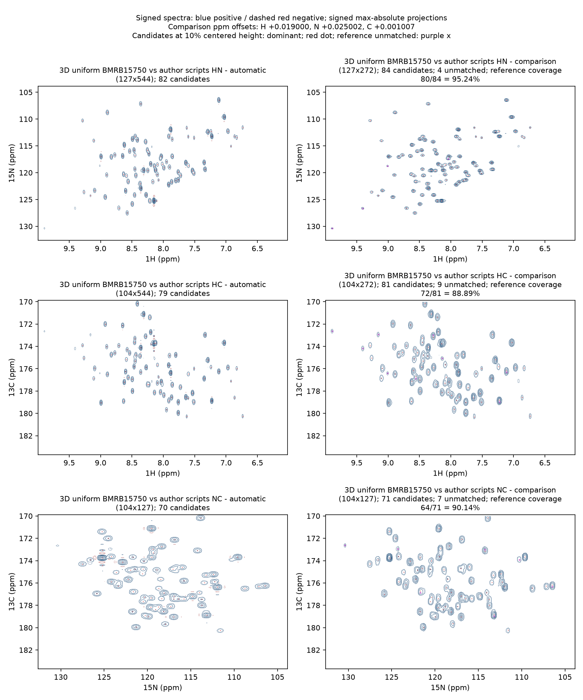
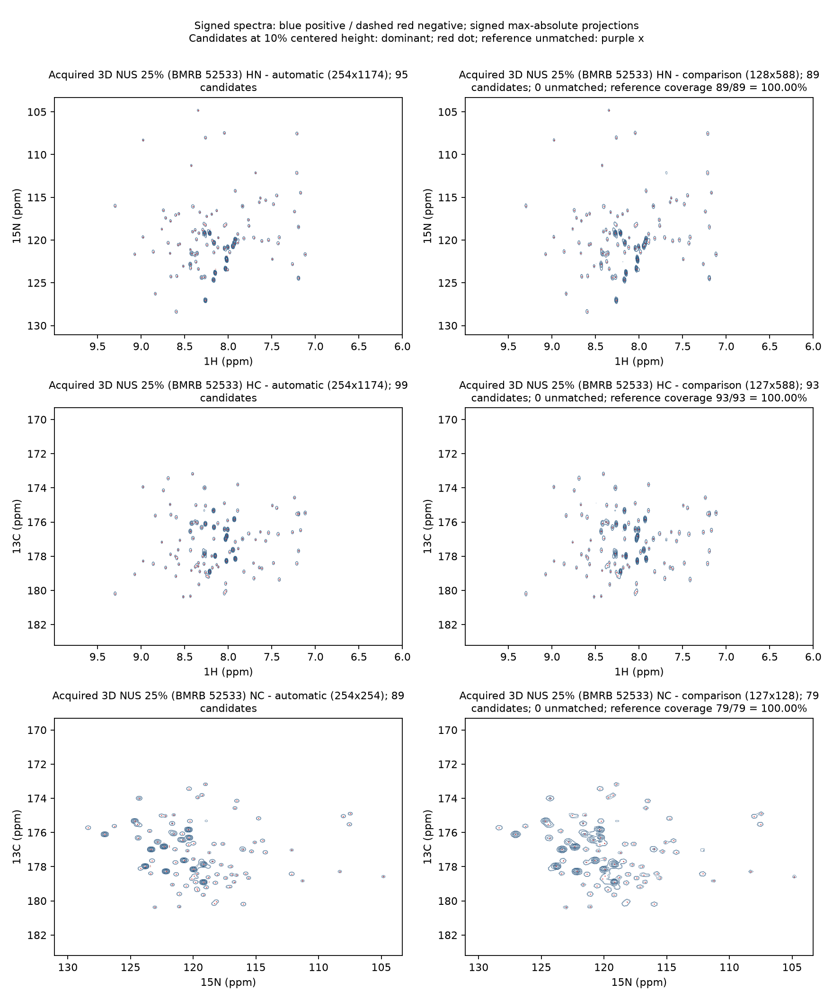

# Four Processing Routes: 2D Spectra and 3D Projection Comparisons

This page presents final spectra obtained with the current data-processing workflow, together with
the methods, results, and limitations.
Four comparisons cover 2D uniform, controlled artificial 2D NUS, 3D uniform, and acquired
3D NUS. The source data for artificial downsampling were acquired, but the downsampling schedule was
not acquired by an instrument as NUS.

## How to read the figures

The left panel in each comparison is the NMRForge final spectrum; the right panel is the reference
spectrum, with its source identified. Blue solid contours are positive and red dashed contours are
negative. Small red filled dots mark candidates selected independently on both sides; purple crosses
mark unmatched candidates on the reference side only. Both panels use a common physical window, and
contours start at 7.5% of each spectrum's own maximum absolute intensity.
For 3D, a common full 3D window is cropped first. Signed maximum-absolute-value H–N, H–C, and N–C
projections are then generated, and peak matching is performed independently on each projection.

**Reference-candidate coverage = matched pairs / candidates in the reference.** This is not recovery
of assigned true peaks, and it does not establish recovery of complete 3D peak identities. Extra
candidates are not automatically false peaks, and unmatched reference candidates are not automatically
noise; weak structure, side lobes, and overlap must be assessed from the figures. Each spectrum is
normalized separately, so absolute intensities cannot be compared directly.

## Data and references

| Route | Data and actual sampling | Reference |
| --- | --- | --- |
| 2D uniform | BMRB 27493, Apo_CBL_0.4mM/2, HSQC; 90 complex increments | Author Bruker `pdata/1` in the same directory |
| 2D NUS | Controlled artificial downsampling of the same BMRB 27493 uniform source; 75% requested, 68/90 = 75.56% actual | Corresponding NMRForge uniform final spectrum |
| 3D uniform | BMRB 15750, 850 MHz HNCO; complete 32×32 complex grid | Complete 3D final spectrum reconstructed from the same raw data with the authors' deposited `fid.com` and `proc.com` |
| 3D NUS | BMRB 52533 HNCO; 441/(42×42) = 25% acquired | Authors' deposited `DomainIV_HNCO.ft3` |

Sources: [BMRB 27493](https://bmrb.io/data_library/summary/?bmrbId=27493) and
[BMRB 15750](https://bmrb.io/data_library/summary/?bmrbId=15750). The references differ in
independence: the artificial 2D comparison shares raw data and software; 15750 independently runs
the authors' conversion and processing scripts; and 52533 uses the deposited final spectrum directly.
The four comparisons do not replace comprehensive independent ground-truth validation.

## Results overview

Across the four comparisons, the main-signal positions and overall spectral patterns agree well.
No clear systematic loss of main signals was observed within the current common windows. Unmatched
candidates mainly involve overlap or shoulders, one-to-one matching constraints, and detection
thresholds. Weak negative lobes retained in the figures are not targets for recovering main signals
in these same-sign spectra. Candidate coverage measures detection and correspondence; an unmatched
candidate does not by itself mean that the signal disappeared during processing.

The processing comparisons also record:

- **Scripts and spectral structure.** Main signals agree
  without copying the authors' final phases or experiment-specific linear-prediction/windowing
  recipes; both NUS reconstructions retain the corresponding main spectral structure.
- **Phase residuals.** After a joint sign-equivalent
  transformation, the H/N/C phase residuals for BMRB 52533 are 0.97°/2.50°/0°. For BMRB 15750,
  N and C residuals are each 2.50°; H must be compared as a phase curve with P1, as detailed below.
- **Acquisition encoding.** Echo–AntiEcho 2D data do not receive
  mechanical ALT/NEG operations; the 15750 carbon dimension correctly uses FT `-alt`; and the 52533
  SMILE encoding and subsequent N-dimension `-alt -neg` and C-dimension `-alt` match the author
  script. The resulting axes and overall signs correspond.
- **Sweep-width resolution.** The 15750 carbon sweep-width
  conflict resolves under the current rule to 3636.364 Hz, matching the author conversion; the raw
  parameter remains unchanged, and the selected value and conflict are auditable.

The authors' experiment-specific processing changes resolution and weak-feature detail;
these differences are examined alongside the corresponding local signals. These conclusions apply to the tested examples and do not replace assigned ground truth or
validation across all experiment types.

## 2D uniform: comparison with the author spectrum


The NMRForge spectrum has 127 candidates and the author spectrum has 126; 125 pairs match:
**125/126 = 99.21%**, with one unmatched reference candidate. The main signal peaks are broadly
similar in position and shape. The weak feature at the purple cross is next to a main peak and looks
more like a separately selected side-lobe candidate. This is a plausible explanation for the
candidate difference; it does not indicate loss of a main signal.

The author spectrum was aligned by fixed whole-axis translations: H +0.072584594 ppm and
N +0.059775701 ppm. The overall spectrum-centre offset is a reference-frame convention, not a
processing-quality judgement. No individual peaks were moved, and the spectrum was not stretched or
rewritten. After alignment, median absolute residuals for matched candidates are H 0.00039 and
N 0.00904 ppm; peak-height correlation is r=0.9751; median equivalent-linewidth ratios
(NMRForge/author) are H 0.95 and N 1.13.

### Processing script / parameter comparison

The reference is read directly from author Bruker `pdata/1`; no author NMRPipe script is used as
this case's reference. Deposited `procs/proc2s` parameters are compared with the actual automatic
final script below. Numerical phase/window/encoding values alone do not establish equivalence
between Bruker and NMRPipe conventions.

| Item | NMRForge automatic processing | Author Bruker reference parameters |
| --- | --- | --- |
| H window / zero fill | SP .45/.98/2/.5; ZF 4096 | WDW=4, SSB=2, LB=GB=0; SI=2048 |
| N window / zero fill | SP .45/.95/1/.5; ZF 512 | WDW=4, SSB=2, LB=GB=0; SI=256 |
| H / N phase P0/P1 | 0°/0°; 265°/0° | PHC0/PHC1: 7.599999°/0°; −2.4°/0° |
| Baseline | H time-domain POLY; H/N frequency-domain POLY ord3 auto | BC_mod: H=6, N=0 (deposited codes) |
| Output | H window 10.5–6.5 ppm, complete 2D FT2 | Deposited Bruker processed spectrum; common-window comparison |


<details>
<summary>Expand actual automatic conversion and final processing scripts</summary>

**Automatic conversion**

```csh
#!/bin/csh

bruk2pipe -verb -in ./ser \
  -bad 0.0 -ext -aswap -AMX -decim 2088 -dspfvs 20 -grpdly 67.9876556396484  \
  -xN              2048  -yN               180  \
  -xT              1024  -yT                90  \
  -xMODE            DQD  -yMODE  Echo-AntiEcho  \
  -xSW         9578.544  -ySW         2187.227  \
  -xOBS         599.503  -yOBS          60.754  \
  -xCAR           4.771  -yCAR         118.077  \
  -xLAB 1H  -yLAB             15N  \
  -ndim               2  -aq2D         Complex  \
| nmrPipe -fn MULT -c 9.76562e-01 \
  -out ./d_001.fid -ov
```

**Automatic final processing**

```csh
#!/bin/csh
# NMRForge processing script
# experiment: d_001
xyz2pipe -in d_001.fid -x \
| nmrPipe -fn POLY -time \
| nmrPipe -fn SP -off 0.45 -end 0.98 -pow 2 -c 0.5 \
| nmrPipe -fn ZF -size 4096 \
| nmrPipe -fn FT \
| nmrPipe -fn PS -p0 0 -p1 0 -di \
| nmrPipe -fn POLY -ord 3 -auto \
| nmrPipe -fn EXT -x1 10.5ppm -xn 6.5ppm -sw -round 2 \
| nmrPipe -fn TP \
| nmrPipe -fn SP -off 0.45 -end 0.95 -pow 1 -c 0.5 \
| nmrPipe -fn ZF -size 512 \
| nmrPipe -fn FT \
| nmrPipe -fn PS -p0 265 -p1 0 -di \
| nmrPipe -fn POLY -ord 3 -auto \
| nmrPipe -fn TP \
| pipe2xyz -out d_001.ft2 -x
```

</details>

Selected author parameters and parameter-file hashes are in the [four-case script record](script-comparisons_20261009.json).

## Controlled artificial 2D NUS: 75% requested, 75.56% actual

The same BMRB 27493 uniform raw `ser` was passed to `scripts/vm_make_evidence_nus.py` with
`--fraction .75 --seed 20261008`. Of 90 complex increments, 68 were retained after integer
rounding, giving **68/90 = 75.5556%**. The requested and actual fractions are recorded separately.
Complete orthogonal increments were selected at random, including the zero and terminal increments;
bytes for retained increments were unchanged. This is **controlled artificial downsampling of
uniform source data**, not acquired NUS, and it does not simulate drift or time-dependent changes
during acquisition.

The new input went through normal import, FID generation, automatic optimization, and a complete
SMILE final run; phase was not manually overridden. The H window is 10.5–6.5 ppm. The right panel
shows the NMRForge uniform final spectrum from the same raw data, not the author Bruker spectrum.
The reference frames are the same, so no additional whole-axis translation was applied.


At a 10% detection threshold, each side has 127 candidates and 123 pairs match: **123/127 =
96.85%**, with four unmatched reference candidates. Median absolute position differences for matched
peaks are H 0.00132 and N 0.00366 ppm; peak-height correlation is r=0.9878; median equivalent-
linewidth ratios (NMRForge/reference) are H 0.90 and N 1.22. Main signal positions and spectral
shapes are similar, with no systematic absence of the main spectral structure. Nearby or weak features
around the four purple crosses, together with candidate splitting and one-to-one matching, can explain
the unmatched candidates; they do not by themselves establish signal loss. An additional weak negative
contour remains visible near N 120 ppm. These weak lobes are not targets for main-signal matching in
this same-sign spectrum and are not counted as “missing peaks” merely because they were not matched.
Exact peak identities still require complete 3D or assignment information.

The automatic workflow took 21.458 s and produced a 256×1028 final spectrum. Final H PS was
173.559°/0°; N `xP0/xP1` in SMILE and final PS were both 85°/0°, with `nSigma=5` and
`maxIter=300`. Lightweight P0 initialization is used before the first 2D NUS reconstruction only
when its confidence gate passes; it does not infer P1. Later stages still refine phase and run the
complete final processing. This initialization is not used for 3D. Hashes of `ser/nuslist` in the
input and imported copy are unchanged. The [construction, processing, and comparison record](controlled-2d-nus75-comparison_20261009.json) contains the actual sample count, seed, hashes, and
all unmatched coordinates. The sampling fraction returned by the reader, 0.75, is a rounded
summary; the actual fraction is 68/90.

### Processing script comparison

The reference is the corresponding NMRForge uniform final spectrum, so this comparison is
**artificial-NUS automatic versus uniform automatic processing**, not an author NUS script comparison.
SP values below mean off/end/pow/c. Phase values require encoding and whole-spectrum sign context.

| Item | Artificial 75% NUS automatic route | Corresponding uniform automatic route |
| --- | --- | --- |
| Input / expansion | 68 complex increments; nusExpand yT=90, sampleCount=68 | Full 90 complex increments; no NUS expansion |
| H window / zero fill | SP .45/.98/1/.5; ZF 4096 | SP .45/.98/2/.5; ZF 4096 |
| H phase / crop | 173.559°/0°; 10.5–6.5 ppm | 0°/0°; same window |
| SMILE | nDim2, xT90, sampleCount68, nSigma5, maxIter300; xP0/P1=85/0 | No SMILE |
| N window / zero fill | SP .45/.9/1/.5; ZF 256 | SP .45/.95/1/.5; ZF 512 |
| N phase / baseline | 85°/0°; POLY ord2 auto | 265°/0°; POLY ord3 auto |
| Final shape | 256×1028 | 512×1028 |

The complete automatic route also includes gated initial P0 estimation and parameter searches.
The scripts below are the actual final scripts, not the entire optimization history.


<details>
<summary>Expand actual NUS and uniform scripts</summary>

**NUS conversion**

```csh
#!/bin/csh

nusExpand.tcl -yT 90 -mode bruker -sampleCount 68 -avg -off 0 \
 -in ./ser -out ./ser_full -sample ./nuslist

bruk2pipe -verb -in ./ser_full \
  -bad 0.0 -ext -aswap -AMX -decim 2088 -dspfvs 20 -grpdly 67.9876556396484  \
  -xN              2048  -yN               180  \
  -xT              1024  -yT                90  \
  -xMODE            DQD  -yMODE  Echo-AntiEcho  \
  -xSW         9578.544  -ySW         2187.227  \
  -xOBS         599.503  -yOBS          60.754  \
  -xCAR           4.771  -yCAR         118.077  \
  -xLAB 1H  -yLAB             15N  \
  -ndim               2  -aq2D         Complex  \
| nmrPipe -fn MULT -c 9.76562e-01 \
  -out ./d_001.fid -ov
```

**NUS final processing**

```csh
#!/bin/csh
# NMRForge 2D NUS SMILE reconstruction (two-stage)
# experiment: d_001
mkdir -p nus2d
# stage 1: direct dim (F2) FT + EXT + POLY, SMILE reconstruct F1
nmrPipe -in d_001.fid \
| nmrPipe -fn POLY -time \
| nmrPipe -fn SP -off 0.45 -end 0.98 -pow 1 -c 0.5 \
| nmrPipe -fn ZF -zf -size 4096 \
| nmrPipe -fn FT \
| nmrPipe -fn EXT -x1 10.5ppm -xn 6.5ppm -sw -round 2 \
| nmrPipe -fn PS -p0 173.559 -p1 -0 -di \
| nmrPipe -fn POLY -ord 3 -auto \
| nmrPipe -fn TP \
| nmrPipe -fn SMILE -nDim 2 \
           -sample nuslist -nThread 2 \
           -sampleCount 68 -nSigma 5 -off 0 0 -report 1 \
           -maxMem 11.3829 \
           -scaling 1 \
           -maxIter 300 \
           -xT 90 \
           -xP0 85 -xP1 0 \
           -thresh 0.95 \
| pipe2xyz -out nus2d/recon.ft1 -x -ov

# stage 2: indirect dim (F1) window + ZF + FT -alt + PS + POLY
nmrPipe -in nus2d/recon.ft1 \
| nmrPipe -fn SP -off 0.45 -end 0.9 -pow 1 -c 0.5 \
| nmrPipe -fn ZF -size 256 \
| nmrPipe -fn FT \
| nmrPipe -fn PS -p0 85 -p1 0 -di \
| nmrPipe -fn POLY -ord 2 -auto \
| nmrPipe -fn TP \
  -out d_001.ft2 -ov
```

**Uniform reference final processing**

```csh
#!/bin/csh
# NMRForge processing script
# experiment: d_001
xyz2pipe -in d_001.fid -x \
| nmrPipe -fn POLY -time \
| nmrPipe -fn SP -off 0.45 -end 0.98 -pow 2 -c 0.5 \
| nmrPipe -fn ZF -size 4096 \
| nmrPipe -fn FT \
| nmrPipe -fn PS -p0 0 -p1 0 -di \
| nmrPipe -fn POLY -ord 3 -auto \
| nmrPipe -fn EXT -x1 10.5ppm -xn 6.5ppm -sw -round 2 \
| nmrPipe -fn TP \
| nmrPipe -fn SP -off 0.45 -end 0.95 -pow 1 -c 0.5 \
| nmrPipe -fn ZF -size 512 \
| nmrPipe -fn FT \
| nmrPipe -fn PS -p0 265 -p1 0 -di \
| nmrPipe -fn POLY -ord 3 -auto \
| nmrPipe -fn TP \
| pipe2xyz -out d_001.ft2 -x
```

</details>

## 3D uniform: BMRB 15750 HNCO and spectrum reconstructed with the authors' scripts

[BMRB 15750](https://bmrb.io/data_library/summary/?bmrbId=15750),
`lkr15_27_hnco_2_7_08.bruker`, provides the 850 MHz Bruker raw HNCO data and the
[author conversion script](https://bmrb.io/ftp/pub/bmrb/entry_directories/bmr15750/timedomain_data/nesgLkR15_bmrb15750/lkr15_27_hnco_2_7_08.bruker/fid.com)
and [author processing script](https://bmrb.io/ftp/pub/bmrb/entry_directories/bmr15750/timedomain_data/nesgLkR15_bmrb15750/lkr15_27_hnco_2_7_08.bruker/proc.com).
`FnTYPE=0`, direct TD=1024, indirect TD=64/64, and FnMODE=6/5 define a 32×32 complex grid with
four quadrature components at each position. The expected size, 32×32×4×1024×4 = 16,777,216 bytes,
exactly matches the raw `ser`, supporting complete uniform acquisition.

The right panel is the complete 3D `hnco.ft3` generated on Linux by running the authors' deposited
`fid.com` and `proc.com` unchanged. Its stored shape is 128×128×274. This is a reference reconstructed
using the authors' scripts, not a deposited precomputed final spectrum or a 2D slice. Script hashes
were unchanged before and after execution. The left panel comes from normal Bruker import, FID
conversion, automatic optimization, and a complete final run; it does not share the author-converted
FID, and phase was not manually overridden. The H window is 10–6 ppm. Automatic processing took
55.800 s and produced a 128×128×548 final spectrum. Raw and imported-copy `ser` hashes are unchanged.

The carbon-dimension raw `SW_h=2500 Hz` conflicts with `SW=17.008620557 ppm ×
SFO1=213.795329497 MHz = 3636.363636 Hz`, a 31.25% difference. The current per-dimension rule uses
the product when the relative disagreement exceeds 1%, and records the conflict; at or below 1% it
uses `SW_h`, and if only one value is available it uses that value. An explicit user override is
retained. Automatic conversion used 3636.364 Hz, matching the author script. The raw parameters were
not rewritten, and metadata alone does not establish the cause of the conflict.

The author spectrum was aligned by fixed whole-axis translations derived from the actual same-nucleus
spectrum-header `automatic CAR − author CAR` differences: H +0.018999577, N +0.025001526, and
C +0.001007080 ppm. These values were fixed before candidate statistics; no per-peak fit or spectrum
modification was applied. The author's carbon command `CS -ls 3.0ppm -sw` also changes coordinate
calibration, so 3 ppm was not added as another reference shift.



The common full 3D window was cropped first, then candidates were detected independently in the
three signed projections:

| Projection | NMRForge / reference candidates | Reference-candidate coverage | Unmatched reference candidates | Median absolute position difference (ppm) |
| --- | --- | --- | --- | --- |
| H–N | 82 / 84 | 80/84 = 95.24% | 4 | H 0.00090; N 0.01684 |
| H–C | 79 / 81 | 72/81 = 88.89% | 9 | H 0.00082; C 0.03196 |
| N–C | 70 / 71 | 64/71 = 90.14% | 7 | N 0.01909; C 0.03073 |

Main signal positions correspond, with no clear systematic loss of main signals observed. The
authors' experiment-specific linear prediction, windowing, and phase scheme provide better detail for
some weak features; the automatic spectrum still retains corresponding local signals, so unmatched
counts at the 10% threshold alone should not be interpreted as lost peaks. The automatic spectrum is
broader in N and narrower in H/C, and differences in weak negative contours and neighbouring features
remain visible.

The 20 unmatched reference-projection candidates (which can repeat across projections and are not
20 independent 3D peaks) were checked for same-sign local responses in the existing automatic
spectrum. For 10, the local maximum was 8.15%–9.94% of that spectrum's maximum peak height, below
the 10% detection threshold. Eight had an automatic candidate within the matching tolerance, but that
candidate had already been assigned to another reference candidate under one-to-one matching. The
remaining two had local responses of about 14.42% and 32.35%, but no independently detected candidate
within tolerance; their identity requires inspection of shoulders, localization, and peak shape.
These observations support that an unmatched candidate does not imply an absent local signal. They
do not certify local responses or overlaps as independent true peaks. The
[local-signal inspection record](bmrb15750-unmatched-local-signal_20261009.json) retains all
positions and normalized heights; processing, thresholds, matching, and final spectra were unchanged.

Matched peak-height correlations for HN/HC/NC are 0.9695/0.9679/0.9652. Median equivalent-linewidth
ratios (NMRForge/reference) are HN H 0.68/N 1.56, HC H 0.69/C 0.75, and NC N 1.58/C 0.72. The
author used linear prediction and different window and phase schemes, so linewidth differences cannot
be attributed to one processing step alone. Automatic H/N/C phases were 15°/0°, 267.5°/0°, and
2.5°/0°; the author's final phases were −1°/43°, −90°/0°, and 0°/0°. These settings and differences
are recorded as observed. They do not constitute separate acquired nonzero-P1 validation or
comprehensive scientific acceptance.

The [raw layout, sweep-width audit, scripts, spectrum headers, and all statistics](3d-uniform-bmrb15750-comparison_20261009.json) are available for inspection.

### Processing script comparison

| Item | NMRForge automatic final script | Deposited author scripts |
| --- | --- | --- |
| H | POLY time; no SP; ZF2048; PS15/0; crop 10–6 ppm | POLY time; SP .5/1/2/.5; ZF auto; two PS steps ending at −1/43; same crop |
| N | SP .3/.98/1/.5; ZF128; FT; PS267.5/0; no LP | LP fb; SP .5/.98/1/1; ZF auto; FT; PS−90/0; frequency-domain POLY |
| C | No SP/LP; ZF128; FT alt; PS2.5/0 | Initial SP/FT; later HT and inverse transforms→LP fb→SP hdr→FT; PS0/0; `CS -ls 3.0ppm -sw`; frequency-domain POLY |
| H/N/C sweep widths | 12755.102 / 2500 / 3636.364 Hz | Same |
| Complete 3D output | 128×128×548 | 128×128×274 |

Both routes convert the original raw data independently. The [detailed script comparison](bmrb15750-script-comparison.md)
covers digital-filter options, CAR, phase, windows, and LP. Actual commands below retain author
comments; comments are not counted as executed operations.


<details>
<summary>Expand actual conversion and processing scripts for both routes</summary>

**Automatic conversion**

```csh
#!/bin/csh

bruk2pipe -verb -in ./ser \
  -bad 0.0 -ext -aswap -AMX -decim 1568 -dspfvs 20 -grpdly 67.9841461181641  \
  -xN              1024  -yN                64  -zN                64  \
  -xT               512  -yT                32  -zT                32  \
  -xMODE            DQD  -yMODE Echo-AntiEcho  -zMODE States-TPPI  \
  -xSW        12755.102  -ySW         2500.000  -zSW 3636.364  \
  -xOBS         850.104  -yOBS          86.150  -zOBS         213.795  \
  -xCAR           4.819  -yCAR         118.125  -zCAR         178.251  \
  -xLAB 1H  -yLAB             15N  -zLAB             13C  \
  -ndim               3  -aq2D         Complex                         \
| nmrPipe -fn MULT -c 1.95312e+00 \
| pipe2xyz -x -out ./fid/test%03d.fid -ov
```

**Author conversion**

```csh
#!/bin/csh

bruk2pipe -in ./ser -bad 0.0 -aswap -DMX -decim 1568 -dspfvs 20 -grpdly 67.9841461181641  \
  -xN              1024  -yN                64  -zN                64  \
  -xT               512  -yT                32  -zT                32  \
  -xMODE            DQD  -yMODE  Echo-AntiEcho  -zMODE    States-TPPI  \
  -xSW        12755.102  -ySW         2500.000  -zSW         3636.364  \
  -xOBS         850.104  -yOBS          86.150  -zOBS         213.795  \
  -xCAR           4.800  -yCAR         118.100  -zCAR         178.250  \
  -xLAB              H1  -yLAB             N15  -zLAB             C13  \
  -ndim               3  -aq2D          States                         \
  -out ./data/test%03d.fid -verb -ov

sleep 5
```

**Automatic final processing**

```csh
#!/bin/csh
# NMRForge processing script
# experiment: d_001
xyz2pipe -in fid/test%03d.fid -x \
| nmrPipe -fn POLY -time \
| nmrPipe -fn ZF -size 2048 \
| nmrPipe -fn FT \
| nmrPipe -fn PS -p0 15 -p1 0 -di \
| nmrPipe -fn EXT -x1 10ppm -xn 6ppm -sw -round 2 \
| nmrPipe -fn TP \
| nmrPipe -fn SP -off 0.3 -end 0.98 -pow 1 -c 0.5 \
| nmrPipe -fn ZF -size 128 \
| nmrPipe -fn FT \
| nmrPipe -fn PS -p0 267.5 -p1 0 -di \
| nmrPipe -fn ZTP \
| nmrPipe -fn ZF -size 128 \
| nmrPipe -fn FT -alt \
| nmrPipe -fn PS -p0 2.5 -p1 0 -di \
| nmrPipe -fn TP \
| pipe2xyz -out d_001.ft3 -x
```

**Author processing**

```csh
#!/bin/csh

xyz2pipe -in  data/test%03d.fid -x  -verb           \
| nmrPipe  -fn POLY -time                           \
| nmrPipe  -fn SP -size 512 -off 0.5 -end 1.00 -pow 2 -c 0.5  \
| nmrPipe  -fn ZF -auto                             \
| nmrPipe  -fn FT                                   \
| nmrPipe  -fn PS -p0  3.0 -p1 0                    \
| nmrPipe  -fn PS -p0 -4  -p1 43.0 -di               \
| nmrPipe  -fn EXT -x1 10.0ppm -xn 6.0ppm -sw       \
| pipe2xyz -out data/test%03d.ft3 -x -ov

xyz2pipe -in data/test%03d.ft3 -z -verb               \
| nmrPipe  -fn SP -off 0.5 -end 0.98 -pow 1 -c 0.5  \
| nmrPipe  -fn ZF -auto                             \
| nmrPipe  -fn FT -alt                              \
| nmrPipe  -fn PS -p0 0.0 -p1 0.0 -di               \
| pipe2xyz -out data/test%03d.ft3 -z -inPlace

xyz2pipe -in data/test%03d.ft3 -y -verb               \
| nmrPipe  -fn LP -fb                               \
| nmrPipe  -fn SP -off 0.5 -end 0.98 -pow 1 -c 1.0  \
| nmrPipe  -fn ZF -auto                             \
| nmrPipe  -fn FT                                   \
| nmrPipe  -fn PS -p0 -90 -p1 0 -di                   \
| nmrPipe  -fn POLY -auto -ord 0                    \
| nmrPipe  -fn TP                                   \
| nmrPipe  -fn POLY -auto -ord 0                    \
| pipe2xyz -out data/test%03d.ft3 -y -inPlace

xyz2pipe -in data/test%03d.ft3 -z -verb               \
| nmrPipe  -fn HT  -auto                            \
| nmrPipe  -fn PS  -inv -hdr                        \
| nmrPipe  -fn FT  -inv                             \
| nmrPipe  -fn ZF  -inv                             \
#| nmrPipe  -fn LP -pred 32 -ord 8                   \
| nmrPipe  -fn LP -fb                               \
| nmrPipe  -fn SP  -hdr                             \
| nmrPipe  -fn ZF  -auto                            \
| nmrPipe  -fn FT                                   \
| nmrPipe  -fn PS  -hdr -di                         \
| nmrPipe  -fn CS  -ls 3.0ppm   -sw                   \
| nmrPipe  -fn POLY -auto -ord 0                    \
| pipe2xyz -out data/test%03d.ft3 -z -inPlace

xyz2pipe -in ./data/test%03d.ft3  -y -verb  \
  > ./hnco.ft3
```

</details>

## Acquired 3D NUS: comparison with the BMRB author's NMRPipe final spectrum

The input is the 800 MHz HNCO experiment for *Bacillus subtilis* DnaA domain IV in
[BMRB 52533](https://bmrb.io/data_library/summary/?bmrbId=52533). The
[original archive](https://bmrb.io/ftp/pub/bmrb/entry_directories/bmr52533/timedomain_data/4.HNCO.zip)
contains the raw `ser/nuslist`, the author's NMRPipe/SMILE script `conv_smile.com`, and the author's
final spectrum `DomainIV_HNCO.ft3`. The deposited final spectrum is read directly on the reference
side, without reoptimizing or rewriting it.

`FnTYPE=2`; the two indirect dimensions with `NusTD=84` convert through States–TPPI to a 42×42
complex grid. The schedule has 441 unique coordinates, for an actual sampling fraction of
**441/1764 = 25%**. The 14,450,688-byte raw `ser` is consistent with 441 complete four-component
quadrature groups. The archive's already expanded `ser_full` was not used as raw input. Downloaded
ZIP members passed CRC checks, and SHA256 hashes were recorded for each; the entire archive was not
claimed to have been checked.



The left panels come from normal import, FID generation, automatic optimization, and a complete final
script. The H window was explicitly set to 10–6 ppm, matching the author's processing window; no
author phase was applied. Both spectra have matching CAR fields and need no additional translation.
The same full 3D common window is cropped first, then candidates are detected independently on each
projection.

| Projection | NMRForge / author candidates | Reference-candidate coverage | Unmatched reference candidates | Median absolute position difference (ppm) |
| --- | --- | --- | --- | --- |
| H–N | 95 / 89 | 89/89 = 100% | 0 | H 0.00033; N 0.00956 |
| H–C | 99 / 93 | 93/93 = 100% | 0 | H 0.00028; C 0.00319 |
| N–C | 89 / 79 | 79/79 = 100% | 0 | N 0.01019; C 0.00335 |

Main signal positions and the overall pattern agree within the common window. The pronounced
nitrogen-dimension dispersive streaks seen in the earlier example are not apparent. Matched
peak-height correlations for HN/HC/NC are 0.9952/0.9945/0.9952. Median equivalent-linewidth ratios
(NMRForge/author) are HN H 0.95/N 0.78, HC H 0.94/C 0.78, and NC N 0.77/C 0.77. The author
spectrum has 128 indirect points and NMRForge has 256; window functions and reconstruction
parameters also differ, so peak shapes and weak features are not identical voxel by voxel. The 100%
values apply only to reference candidates detected in the projections at the current 10% threshold;
they do not prove recovery of every weak or overlapping signal or all 3D peak identities.

The automatic workflow took 200.301 s and produced a 256×256×1176 final spectrum; the author's
final spectrum is 128×128×588. Final direct H phase was 107.969°/0°; N phase was 182.5°/0° in both
SMILE and final PS, and C phase was 0°/0°. The author's H phase is −73°, with N/C at 0°. Adding
180° to H and N together is a joint sign-equivalent transformation; a degree difference on one axis
alone does not establish whole-spectrum inversion. The automatic values are close to, but not
identical with, the author's values. The SMILE log's “11.1% sparsity” uses an extrapolated 63×63
grid as the denominator, not the 25% acquired 42×42 grid. Hashes of source and imported `ser/nuslist`
are unchanged. Final-script phases, grids, spectrum headers, and projection statistics are in the
[acquired 3D record](acquired-3d-bmrb52533-comparison_20261009.json). A single example and software
QC acceptance do not establish comprehensive scientific acceptance.

### Processing script comparison

The reference is the deposited final spectrum. This table compares deposited `conv_smile.com`
with the actual automatic final script; the author script is method provenance, and no new author
rerun replaces the deposited reference. SP values mean off/end/pow/c.

| Item | NMRForge automatic route | Author `conv_smile.com` |
| --- | --- | --- |
| NUS expansion / grid | sampleCount441, explicit yT=zT=42 | sampleCount441; conversion x/y/zT=1024/42/42 |
| H time baseline / window | No POLY time; SP .45/.98/2/.5 | POLY time; SP .4/.98/2/.5 |
| H zero fill / phase / crop | ZF4096; 107.969°/0°; 10–6 ppm | ZF auto; −73°/0°; same window |
| Shared SMILE options | sampleCount441, nSigma5, xAlt/xNeg/yAlt | Same |
| Other explicit SMILE options | nThread2, maxIter1500, xP0/P1=182.5/0, yP0/P1=0/0 | nThread40, xCT42, xQ3=yQ3=2; maxIter and phase not explicit |
| N final processing | ZF256; FT alt neg; PS182.5/0 | ZF auto; FT alt neg; PS0/0 |
| C final processing | ZF256; FT alt; PS0/0 | ZF auto; FT alt; PS0/0 |
| Complete 3D final spectrum | 256×256×1176 | 128×128×588 (deposited reference header) |

Neither final script applies SP in the indirect dimensions. The approximately simultaneous 180°
H and N differences are a joint sign-equivalent case, not evidence of a whole-spectrum sign inversion
from one axis alone. Different explicit options do not establish optimality, and candidate coverage
does not establish complete weak-peak or full 3D peak-identity recovery.


<details>
<summary>Expand actual automatic and deposited author scripts</summary>

**Automatic conversion**

```csh
#!/bin/csh

nusExpand.tcl -zT 42 -yT 42 -mode bruker -sampleCount 441 -avg -off 0 \
 -in ./ser -out ./ser_full -sample ./nuslist

bruk2pipe -verb -in ./ser_full \
  -bad 0.0 -ext -aswap -AMX -decim 1792 -dspfvs 20 -grpdly 67.9841766357422  \
  -xN              2048  -yN                84  -zN                84  \
  -xT              1024  -yT                42  -zT                42  \
  -xMODE            DQD  -yMODE States-TPPI  -zMODE States-TPPI  \
  -xSW        11160.714  -ySW         2269.632  -zSW         2816.901  \
  -xOBS         799.864  -yOBS          81.059  -zOBS         201.160  \
  -xCAR           4.773  -yCAR         117.084  -zCAR         176.207  \
  -xLAB 1H  -yLAB             15N  -zLAB             13C  \
  -ndim               3  -aq2D         Complex  \
| nmrPipe -fn MULT -c 1.95312e+00 \
  -out ./d_001.fid -ov
```

**Automatic final processing**

```csh
#!/bin/csh
# NMRForge 3D NUS SMILE reconstruction
# experiment: d_001
mkdir -p nus3d_1 nus3d_rc
# step 1: direct dim (F3) FT + EXT + PS
xyz2pipe -in d_001.fid -x \
| nmrPipe -fn SP -off 0.45 -end 0.98 -pow 2 -c 0.5 \
| nmrPipe -fn ZF -zf -size 4096 \
| nmrPipe -fn FT \
| nmrPipe -fn EXT -x1 10ppm -xn 6ppm -sw -round 2 \
| nmrPipe -fn PS -p0 107.969 -p1 -0 -di \
| pipe2xyz -out nus3d_1/test%04d.ft1 -z

# step 2: SMILE reconstruct indirect dims (F2/F1)
xyz2pipe -in nus3d_1/test%04d.ft1 -x \
| nmrPipe -fn SMILE -nDim 3 \
           -sample nuslist -nThread 2 \
           -sampleCount 441 -nSigma 5 -off 0 0 -report 1 \
           -maxMem 9.53179 \
           -scaling 1 \
           -maxIter 1500 \
           -xP0 182.5 -xP1 0 \
           -yP0 0 -yP1 0 \
           -xAlt -xNeg \
           -yAlt \
           -thresh 0.95 \
| pipe2xyz -out nus3d_rc/test%04d.ft1 -x

# step 3: indirect dims (F2/F1) window + ZF + FT + PS
xyz2pipe -in nus3d_rc/test%04d.ft1 -x \
| nmrPipe -fn ZF -size 256 \
| nmrPipe -fn FT -alt -neg \
| nmrPipe -fn PS -p0 182.5 -p1 0 -di \
| nmrPipe -fn TP \
| nmrPipe -fn ZF -size 256 \
| nmrPipe -fn FT -alt \
| nmrPipe -fn PS -p0 0 -p1 0 -di \
| nmrPipe -fn TP \
| nmrPipe -fn ZTP \
| pipe2xyz -out d_001.ft3 -x
```

**Author conversion and processing**

```csh
#!/bin/csh

set CONVERSION = y
set PROCESSING_1 = y
set RECONSTRUCTION = y
set PROCESSING_23 = y
set PROJECTIONS = y


if ($CONVERSION == 'y') then

nusExpand.tcl -mode bruker -sampleCount 441 -off 0 \
 -in ./ser -out ./ser_full -sample ./nuslist

bruk2pipe -verb -in ./ser_full \
  -bad 0.0 -ext -aswap -AMX -decim 1792 -dspfvs 20 -grpdly 67.9841766357422  \
  -xN              2048  -yN                84  -zN                84  \
  -xT              1024  -yT                42  -zT                42  \
  -xMODE            DQD  -yMODE    States-TPPI  -zMODE    States-TPPI  \
  -xSW        11160.714  -ySW         2269.632  -zSW         2816.901  \
  -xOBS         799.864  -yOBS          81.059  -zOBS         201.160  \
  -xCAR           4.773  -yCAR         117.084  -zCAR         176.207  \
  -xLAB              HN  -yLAB             15N  -zLAB              CO  \
  -ndim               3  -aq2D         Complex                         \
| nmrPipe -fn MULT -c 1.95312e+00 \
| pipe2xyz -x -out ./fid/test%03d.fid -ov


  echo "Expansion & conversion done..."

endif

if ($PROCESSING_1 == 'y') then

echo "Processing Direct dimension..."

xyz2pipe -in ./fid/test%03d.fid -x                    \
| nmrPipe  -fn POLY -time                             \
| nmrPipe  -fn SP -off 0.4 -end 0.98 -pow 2 -c 0.5    \
| nmrPipe  -fn ZF -auto                         \
| nmrPipe  -fn FT                                     \
| nmrPipe  -fn EXT -x1 10ppm -xn 6ppm -sw -round 2  \
| nmrPipe  -fn PS -p0 -73.0 -p1 0.0 -di                 \
#| nmrPipe  -fn POLY -auto   \
| pipe2xyz -out ft1/test%04d.ft1 -z -verb

echo "Direct dimension processing done..."

endif

if ($RECONSTRUCTION == 'y') then
date
echo "Starting reconstruction..."

xyz2pipe -in ft1/test%04d.ft1 -x                           \
| nmrPipe  -fn SMILE -nDim 3 -sample nuslist -nThread 40   \
           -sampleCount 441 -nSigma 5 -off 0 -report 2		\
           -xCT 42 -xAlt -xNeg -yAlt -xQ3 2 -yQ3 2                                    \
| pipe2xyz -out ft1/rc%04d.ft1 -x

endif

if ($PROCESSING_23 == 'y') then

xyz2pipe -in ft1/rc%04d.ft1 -x                        \
| nmrPipe  -fn ZF -auto                         \
| nmrPipe  -fn FT -alt -neg                                     \
| nmrPipe  -fn PS -p0 0 -p1 0 -di                     \
| nmrPipe  -fn TP                                     \
| nmrPipe  -fn ZF -auto                         \
| nmrPipe  -fn FT -alt                                    \
| nmrPipe  -fn PS -p0 0 -p1 0 -di                     \
| nmrPipe  -fn TP                                     \
| nmrPipe  -fn ZTP                                    \
| pipe2xyz -out ft/DomainIV_HNCO_%03d.ft3 -x

proj3D.tcl -in ft/DomainIV_HNCO_%03d.ft3

endif

xyz2pipe -verb -in ft/DomainIV_HNCO_%03d.ft3 -x  \
|  nmrPipe -ov -out DomainIV_HNCO.ft3
```

</details>

## Automatic phase and encoding checks

Phases are compared modulo 360°. For same-sign multidimensional spectra, jointly adding 180° to H
and N is a sign-equivalent transformation; the comparison does not independently choose the most
favourable 180° difference for each axis. The table reports absolute residuals; original parameters
and signed residuals are in the [phase and encoding record](phase-and-encoding-comparison_20261009.json).

| Case | Comparison basis | Phase difference / check |
| --- | --- | --- |
| 2D uniform 27493 | Author Bruker PHC and automatic NMRPipe PS | Cross-software phase conventions are not mapped to a common angular scale, so no misleading single angle error is reported; the main signals in the final spectra correspond well |
| Artificial 2D NUS, 75% | Corresponding NMRForge uniform, not author spectrum; reference H/N shifted jointly by 180° | H 6.441°; N 0°; P1 is 0° for both |
| 3D uniform 15750, N/C | Author NMRPipe script, modulo 360° | N 2.50°; C 2.50°; P1 is 0° for both |
| 3D uniform 15750, H | Author P0/P1=−1°/43°; automatic 15°/0° | Raw P0 difference 16°, P1 difference 43°; phase-operator residual in the common display window is −2.06° to +9.32°, and +3.61° near 8 ppm |
| Acquired 3D NUS 52533 | Author NMRPipe script; reference H/N shifted jointly by 180° | H 0.969°; N 2.50°; C 0°; P1 is 0° for all |

For the 15750 H comparison, each side's actual PS operations were applied to the same complete H-dimension
Fourier-transformed result. The complex imaginary component was retained, and the rotation difference
was calculated from the complex ratio, then evaluated in the existing common display window using the
recorded CAR shifts. This shows that the automatic zero-order result is close to the author's phase
curve in the displayed region; it does not mean the P0/P1 parameters are equal or claim that all
nonzero-P1 cases are solved.

The phase proximity, encoding agreement, and correspondence of final spectra jointly support the
automatic processing in these examples. A small phase-angle difference alone does not certify that
all peak shapes are optimal.

## Shared methods

- Contours are 7.5%, 10%, 20%, 35%, 50%, 70%, and 90% of each spectrum's maximum absolute intensity,
  retaining positive and negative contours. The 7.5% and 10% contours use 0.25 pt lines; all higher
  contours use 0.4 pt, identically for both signs, to avoid visually thick outer contours. Candidate
  detection thresholds are 10% of the maximum absolute peak height after centering on the median
  baseline, with no additional 35-sigma threshold. Candidate-detection thresholds and contour floors
  are set independently and have different meanings.
- Ordinary candidates are small red filled dots: `marker='.'`, `s=4`, with no outline. Only unmatched
  reference candidates also get a purple cross. Styling does not affect detection or matching.
  Peak picking and three-point parabolic localization reuse the product API and low-level components.
  Same-sign HSQC/HNCO use `dominant`; `both` is not forced, while negative contours remain visible.
- Same-polarity candidates are matched one-to-one by increasing normalized joint distance ≤1 in 2D;
  H/N/C tolerances are 0.02/0.20/0.15 ppm. Matching is performed independently for each projection.
  If the reference has no candidates, coverage is null, not 100%. Without acquisition priors,
  edge candidates are not automatically removed.
- The 2D uniform author spectrum has a constant whole-axis translation: H +0.072584594 and
  N +0.059775701 ppm. It was derived from mutually nearest, same-polarity strong candidates at least
  20% of peak height: 90 initial pairs were pruned to 56 pairs, then component-wise medians were
  iterated. The frozen shift was used for display; no peaks were individually moved, and the spectrum
  was not stretched or rewritten. This is same-spectrum reference calibration, not holdout validation.
  BMRB 15750 uses fixed spectrum-header CAR differences of H +0.018999577, N +0.025001526, and
  C +0.001007080 ppm. See the [anchor list](author-alignment-anchors_20261009.csv). The two NUS
  comparisons have no additional translation.

## Processing record and reproduction

Linux, Python 3.12.13, 16 GB RAM, SMILE 2.0 beta Rev2018.094.15.20. Each input was processed once.
The times below exclude download, detection, and figure generation; they do not establish
repeatability or p95 latency.

| Input | Elapsed time | Stored final-spectrum shape |
| --- | --- | --- |
| 2D uniform | Import, FID generation, and final spectrum: 33.499 s | 512×1028 |
| Artificial 2D NUS, 75% requested / 75.56% actual | Import, FID generation, and final spectrum: 21.458 s | 256×1028 |
| BMRB 15750 3D uniform | Import, FID generation, and final spectrum: 55.800 s; excludes author reference reconstruction | 128×128×548 |
| Acquired 3D HNCO NUS, 25% | Import, FID generation, and final spectrum: 200.301 s | 256×256×1176 |

The 2D uniform raw hashes, elapsed time, and parameters are in the [processing provenance record](uniform-processing-provenance_20261009.json). Its comparison is in the
[statistics JSON](2d-uniform-author-comparison_20261009.json), the [author candidate CSV](author-peaks-10pct_20261009.csv), and [detection parameters](author-peaks-10pct_20261009.json).
For both NUS runs, indirect SMILE phases match final PS, and direct-dimension phase is applied before
reconstruction; parameters and hashes are in the case records. Method references:
[SMILE methods paper](https://pmc.ncbi.nlm.nih.gov/articles/PMC5438302/) and
[SMILE manual](https://spin.niddk.nih.gov/bax-apps/software/SMILE/smile_manual.pdf).
Large raw data, final spectra, and full logs are archived separately; figures and summaries do not
replace the raw data.

After constructing artificial 2D input, use the normal automatic workflow. `RAW_UNIFORM` and
`NEW_RAW` must be separate, non-overlapping directories:

```bash
python scripts/vm_make_evidence_nus.py "$RAW_UNIFORM" "$NEW_RAW" --fraction .75 --seed 20261008
python scripts/vm_realdata_report.py --dataset "$NEW_RAW" --root "$NEW_ROOT" --repeats 1 --ext-lo 10.5 --ext-hi 6.5
```

After obtaining the final spectrum `AUTO` and the corresponding reference `REF`:

```bash
python scripts/vm_projection_report.py --spectrum "$AUTO" --reference "$REF" --pairs all --min-height-fraction .10 --sign-mode dominant --json reports/comparison.json
python scripts/vm_four_path_figure.py --projection all --mark-peaks --peak-height-fraction .10 --peak-marker-size 4 --peak-sign-mode dominant --case "Automatic vs reference,$AUTO,$REF" --out reports/comparison.png
```

For the 2D uniform author comparison, the two commands additionally take
`--reference-shift-h 0.07258459433886566 --reference-shift-n 0.05977570099166485`.
For acquired 3D, use the deposited `DomainIV_HNCO.ft3` as the reference; H window is 10–6 ppm.
For 15750, run the deposited `fid.com` and `proc.com` unchanged in a separate directory to generate
the complete 3D `hnco.ft3` reference; both comparison commands take
`--reference-shift-h 0.018999576568603516 --reference-shift-n 0.02500152587890625 --reference-shift-c 0.001007080078125`.

The 7.5% and 10% contours use 0.25 pt lines; higher contours use 0.4 pt, for both signs.
This display adjustment changes neither spectra nor candidate statistics.
